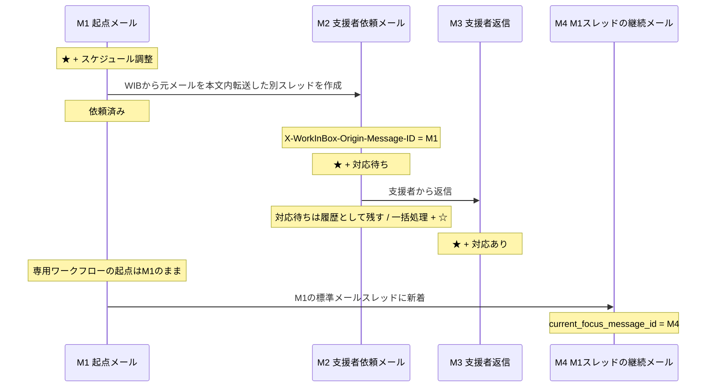

# WorkInBox 設計書

## 概要

WorkInBox は Thunderbird を補完する業務支援システムである。

Thunderbird はメール業務の実行環境、WorkInBox はメールから発生する仕事・判断・待機・参照情報を整理する環境とする。

WorkInBox は独立した TODO / プロジェクト管理ツールや独自メールクライアントを目指さない。利用者に新たな仕事入力を強制せず、既に存在するメールを起点として必要な業務を整理する。

主な対象は次のとおり。

- メール分類
- 締切登録支援
- スケジュール調整支援
- 返信待ち管理
- 通常ワークフロー終了時の Record 保存・再利用

---

## 基本用語

### active メール

本書で **active メール** とは、現在 WorkInBox の作業対象になっているスター付きメールをいう。

`注目` は通常ワークフロータグの固有名であるため、スター一般の意味を「注目」と表現しない。

### relation

**relation** は、WorkInBox が保持するメール同士の業務上の関係をいう。

通常のメールスレッドは `Message-ID` / `In-Reply-To` / `References` で追跡する。標準メールヘッダーだけでは表現できない WorkInBox 固有の関係は SQLite に保存する。

### 元メール

**元メール** は、Record や締切などの WorkInBox データから参照するメールを一般的に表す。本書の `source_message_id` は、そのデータが参照する元メールの Message-ID を意味する。

元メールは専用ワークフローの開始メールに限らず、通常ワークフロー中・終了済み・アーカイブ済みのメールも含む。

### 起点メール

**起点メール** は、専用ワークフローを開始した元メールを表す。

専用ワークフロー中に標準メールスレッド上の着眼点が別のメールへ移っても、起点メール自体は変わらない。

### `X-WorkInBox-Origin-Message-ID`

この節では、次の記号を用いる。

- M1 = 専用ワークフローの起点メール
- M2 = M1 から WIB を起点として作成した新規メール
- M3 = M2 に対する返信

`X-WorkInBox-Origin-Message-ID` は、専用ワークフローで M1 から通常 Reply ではない M2 を作成するときに、M2 がどの M1 から派生したかを示すための WorkInBox 拡張ヘッダーである。

受信済みメールへ後から拡張ヘッダーを追加することは前提にしない。M2 送信後は M1 と M2 の Message-ID の relation を SQLite に永続化し、その後の M3 以降は標準の `In-Reply-To` / `References` と SQLite relation で追跡する。

---

## 基本方針

### Thunderbird を置き換えない

メール本文の作成、返信、送信、転送、アーカイブは Thunderbird の機能を利用する。

通常ワークフローのメール閲覧・処理は Thunderbird で行う。

専用ワークフローに属するメールのやり取りは WIB を起点として行う。専用ワークフロー中のメールは WIB で閲覧し、本文作成・送信が必要な場合は WIB から Thunderbird の機能を利用する。

WIB Web は独自の送信エンジンや独自メールクライアントにはしない。

### 正本を用途ごとに分ける

- メール本文・メール日時・Message-ID 等のメール情報はメールサーバ上のメールを正本とする。
- WorkInBox の内部状態、メール relation、専用ワークフロー状態、Record、正式登録された締切データは SQLite を正本とする。
- WorkInBox の IMAP 作業タグはメールサーバ上の IMAP keyword を正本とする。
- WorkInBox が対象とする IMAP server / account / mailbox は `config.yaml` の `imap` 設定を正本とする。
- Thunderbird に締切を表示するための iCalendar (`.ics`) / `VTODO` は SQLite から生成する派生データとする。

### AI は整理役であり、利用者が修正できる

AI は意味判断、分類、抽出、要約、優先順位付けを支援する。

AI によるワークフロー判定は IMAP タグへ反映するが、利用者は判定結果を変更できる。

`締切あり` と `スケジュール調整` は見逃しコストが高いため再現率を重視して独立判定する。

通常ワークフローは次の 4 種類から判定する。

- `返信必要`
- `見る・検討`
- `注目`
- `何もしなくてよい`

`何もしなくてよい` はタグとして保持せず、専用ワークフローも不要なら `一括処理` + スターなしへ進める。

専用ワークフローのどちらにも該当せず、通常ワークフローも確定できない場合だけ `判定保留` とする。

---

## システム構成

WorkInBox は次の 3 つの主要構成要素からなる。

1. **WIB Web UI + Thunderbird Extension**
2. **TrackingBox**
3. **TriageBox**

```text
WIB Web UI + Thunderbird Extension
  = 利用者判断・ワークフロー進行・待機案件対応・Record管理・Thunderbirdとの接続

TrackingBox
  = 意味・分類・要約・優先順位・再評価

TriageBox
  = 事実・関係・決定的な状態遷移
```

### WIB Web UI + Thunderbird Extension

利用者との接点と Thunderbird との橋渡しを担当する。

主な役割:

- WIB Web と Thunderbird Extension 内ダッシュボードを仕事の出発点として提供する。
- 締切・スケジュール調整などの専用ワークフローを進める。
- 専用ワークフローに属するメールを閲覧し、必要なメール作成・送信を Thunderbird へ接続する。
- `判定保留` を利用者が WIB 上で確定する。
- `返信待ち` の優先順位を確認し、催促・終了などの対応を進める。
- 通常ワークフロー終了時に必要な情報を Record として保存し、後から検索・利用できるようにする。
- WIB から Thunderbird の対象メールや Quick Filter 作業ビューを開く。

Extension 内ダッシュボードは、Thunderbirdが保持する既読・スター・タグから通常作業の件数を計算する。WIBサーバーへ接続できない場合も、Thunderbirdの作業ビュー、メール閲覧・返信、スター・タグ操作、通常ワークフロー終了を継続できる。

AI判定、SQLite、relation、Record、専用ワークフローの状態更新はWIB接続中だけ利用する。ExtensionはWIBの接続状態と最終接続成功日時を表示するが、SQLiteの複製やWIB更新操作のオフラインキューは持たない。

### TrackingBox

スター付きメールについて本文の意味を解釈し、整理する。

主な役割:

- AI 初期ワークフロー判定
- TriageBox が着眼点を移した新着メールの AI 再判定
- `判定保留` の整理支援
- 締切候補抽出
- スケジュール調整支援
- `返信待ち` の要否判定・定期再評価・優先順位付け
- Record の AI 要約支援

TrackingBox や TriageBox が、relation 等の根拠なしに未着眼メールを勝手に active な作業対象へ取り込まない。

### TriageBox

INBOX の未読メールを先に観測し、事実・関係・決定的な状態遷移を扱う。TriageBox は TrackingBox より先に動作する。

主な役割:

- 未読メールの取り込み
- 自分が送信したメールの検出
- `In-Reply-To` / `References` / WorkInBox relation の解析
- `返信待ち` / `対応待ち` への返信検出
- relation に基づく着眼点移動
- 専用ワークフローの relation と Message-ID の保存
- スターなし新着について、決定的処理後に広告等「読む必要がないメール」の AI 判定を補助的に行う

TriageBox はメールを既読にしない。

---

## スターと着眼点

スターは、利用者が「このメールに着眼し、放置せず確認・対応する」と判断したことを表す。どの未着眼メールに新たに着眼するかの起点は利用者が決める。

利用者が Thunderbird でメールを確認してスターを付ける場合、そのメールは原則として既読になっている。

TriageBox は relation に基づいて既存の利用者判断を引き継ぐ場合だけ、新着メールへスターを付けて着眼点を移すことができる。この場合はメールを既読にしないため、`未読 + ★` が TriageBox から TrackingBox への再判定候補になる。

ただし TriageBox が `返信必要` や `対応あり` など決定的な状態まで確定したメールは、通常の AI 再判定対象から除外できる。

専用ワークフローでは、起点メールと現在の着眼点を分けて扱う。SQLite には少なくとも次の概念を持つ。

```text
workflow_origin_message_id = 専用ワークフローの起点メール
current_focus_message_id   = 起点メールの標準メールスレッド上で現在着眼しているメール
```

支援者への依頼メールとその返信は専用ワークフローに関連する別スレッドであり、`current_focus_message_id` を移動させない。

---

## タグ体系

本文では原則として Thunderbird 上の表示名を使用する。IMAP keyword は実装名であり、表示名と混在させない。

### 主な表示名と IMAP keyword

| 表示名 | IMAP keyword | 用途 |
| --- | --- | --- |
| `返信必要` | `wib-answer` | 通常ワークフロー |
| `見る・検討` | `wib-review` | 通常ワークフロー |
| `注目` | 実装時に確定 | 通常ワークフロー |
| `締切あり` | `wib-deadline` | 専用ワークフロー |
| `スケジュール調整` | `wib-schedule` | 専用ワークフロー |
| `返信待ち` | `wib-waiting-reply` | 相手からの応答待ち |
| `対応待ち` | `wib-waiting-action` | 専用ワークフローで支援者の対応待ち |
| `対応あり` | 実装時に確定 | 専用ワークフローで支援者から回答あり |
| `一括処理` | `wib-bulk` | 整理対象 |

`重要` タグは使用しない。後から参照・検索・再利用する価値がある情報は Record として保存する。

### 専用ワークフロータグ

- `締切あり`
- `スケジュール調整`

専用ワークフロータグは互いに独立して判定する。両方付いてよい。また通常ワークフロータグとも共存できる。

専用ワークフロータグが付いた場合、そのワークフローは WIB で進め、利用者が次のいずれかを行うまで終了していない。

1. 完了させる
2. 非該当として解除する

各専用ワークフローの具体的な終了条件は「締切登録支援」「スケジュール調整支援」に記載する。

### 通常ワークフロータグ

- `返信必要`
- `見る・検討`
- `注目`

通常ワークフロータグは互いに排他的とする。専用ワークフロータグとは共存できる。

通常ワークフローは Thunderbird で対象メールを閲覧・処理する。終了方法は「通常ワークフローの終了」で共通定義する。

#### `返信必要`

対象メールの相手に対して返信する必要がある状態を表す。

Thunderbird でメールを閲覧し、返信するか、利用者判断で通常ワークフローを終了する。

#### `見る・検討`

対象メールそのものへの返信は必要ないが、内容を読み、後から残す価値があるかを判断する必要がある状態を表す。

`まだ検討する` という独立した出口は設けない。将来の日時に再判断すべき仕事があるなら、必要に応じて締切として管理する。

`見る・検討` は Record 保存と特に相性のよい通常ワークフローだが、Record は `見る・検討` 専用ではない。

#### `注目`

自分から直ちに返信・処理する必要はないが、そのスレッドの今後の進展を継続して確認する必要がある状態を表す。

Thunderbird でメールを閲覧し、引き続き追う場合は active のまま維持する。もう追う必要がないと利用者が判断した場合は通常ワークフローを終了する。

### 判定状態タグ

- `判定保留`

`判定保留` は **AI 判定済み・専用ワークフロー非該当・通常ワークフローだけ未確定** を表す。単なる「未分類」ではない。

`判定保留` の分類確定は WIB で行う。利用者は WIB 上で対象メールを確認し、`返信必要` / `見る・検討` / `注目` / `何もしなくてよい` のいずれかへ確定する。

AI の対象条件そのものは TrackingBox の節で定義する。

### 専用ワークフロー完了タグ

- `締切登録済み`
- `スケジュール対応済み`

専用ワークフロー完了タグは、その専用ワークフローが完了したことを示す。

`締切登録済み` は締切登録ワークフローの完了であり、実際の業務タスク完了を意味しない。

専用ワークフロー完了後の共通処理は「専用ワークフロー終了時の共通遷移」に記載する。

### 待機・専用ワークフロー状態タグ

- `返信待ち`
- `対応待ち`
- `対応あり`

`返信待ち` は利用者が送信したメールについて相手からの次のアクションを業務上待つ状態を表す。

`対応待ち` は専用ワークフローで支援者へ依頼した作業結果を待つ状態を表す。

`対応あり` は `対応待ち` の依頼に対して支援者から返信が届き、WIB の専用ワークフロー内で利用者が内容を確認・処理すべき状態を表す。TriageBox が relation から決定的に付与するため、通常の AI 分類対象にはしない。

### 履歴タグ

- `依頼済み`

`依頼済み` は専用ワークフローの起点メールに付け、そのワークフローから支援者への依頼を行った履歴を表す。完了状態ではなく、通常は解除しない。

### 整理タグ

- `一括処理`

`一括処理` + スターなしは、現在の active 作業ではなく、Thunderbird でまとめて確認・アーカイブできる対象を表す。

---

## 通常ワークフローの終了

`返信必要` / `見る・検討` / `注目` の通常ワークフローは、着眼点のメールを利用者が閲覧して、終了を判断した時点で次のどちらかへ進む。

### 1. 通常終了

後から WIB で参照・検索・再利用するための Record を残さない場合。

- 元の通常ワークフロータグを残す。
- `一括処理` を付ける。
- スターを外す。
- Thunderbird でアーカイブできる。

```text
返信必要 + ★
  → 返信必要 + 一括処理 + ☆

見る・検討 + ★
  → 見る・検討 + 一括処理 + ☆

注目 + ★
  → 注目 + 一括処理 + ☆
```

この終了操作は Thunderbird Extension から 1 操作で実行できる形を目指す。ボタン配置等は実装時に決める。

### 2. Record に保存して終了

そのメールやスレッドから、後から参照・検索・再利用したい情報を残す場合。

- Record を作成する。
- 元の通常ワークフロータグを残す。
- `一括処理` は付けない。
- スターを外す。
- Thunderbird でアーカイブできる。

Record 保存終了は `見る・検討` に限定しない。`返信必要` のやり取りが完了した後や、`注目` の追跡を終了した後でも Record を作成できる。

この終了操作も Thunderbird Extension から 1 操作で実行できる形を目指す。ボタン配置等は実装時に決める。

通常終了と Record 保存終了の違いは、終了後に WIB で構造化した参照情報を残すかどうかである。

---

## Record（WIB 保存情報）

Record は、通常ワークフロー終了時に、そのメールやスレッドから後で参照・検索・再利用したい情報を WIB に残すためのデータである。

Record はメールそのものを複製しない。元メールへの参照を持ち、メール本体はメールサーバを正本とする。

最小の概念データは次とする。

```text
Record
- id
- source_message_id
- source_account
- title
- summary
- note
- created_at
- updated_at
```

- `source_message_id` は Record の元メールの正式な識別子とする。
- `title` は元件名または AI 生成タイトルを利用者が選べる。
- `summary` は AI が自動生成する。
- `note` は利用者が自由に編集できる。
- Record からは元メールに由来する関連メールを確認できる構造を目指す。
- 締切は `deadline -> source_message_id` で元メールに関連付け、Record への直接 relation を必須にしない。

Record 保存後の元メールは active な仕事として残さない。元の通常ワークフロータグは、どのワークフローから保存されたかをメール側で残すため保持する。

---

## 締切

正式登録された締切は、メールの現在の active 状態とは独立して存在する WorkInBox のデータであり、SQLite を正本とする。

締切は少なくとも元メールの Message-ID を保持する。

```text
deadline
- source_message_id
- ...締切日時・内容等
```

締切の元メールは、現在も通常ワークフロー中の場合もあれば、すでに通常終了・Record 保存終了・一括処理・アーカイブ済みの場合もある。

したがって、締切一覧・締切詳細からは常に元メールを参照できるようにする。締切が active であることと、元メールが INBOX に存在することは同義ではない。

Thunderbirdの読み取り専用VTODOからは、元メールを直接開く `mid:` リンクとは別に、WIBの締切詳細へ進めるようにする。正式登録後のタイトル・期限・メモはWIB側で修正し、SQLiteへ保存した内容を再生成するVTODOへ反映する。Thunderbirdから締切データを直接編集する双方向同期は行わない。

Record と締切は別のデータである。Record が存在しなくても締切は元メールの `source_message_id` を使って参照できる。

---

## 元メール参照と Message-ID 検索

Message-ID を元メールの正式な識別子とする。

WIB から元メールを開く機能は、通常の active メール、Record、締切などから共通して利用する。

### active メール

通常の active メールは INBOX を対象に Message-ID で検索する。

### Record・締切の元メール

Record または締切の元メールは INBOX にあるとは限らず、Archive に移動済みの場合がある。

Archive フォルダは元メールの送信年月から決定できる前提とし、元メールを開くときは概念的に次の順で検索する。

```text
1. INBOX
2. 元メールの送信年月に対応する Archive フォルダ
```

Record は `source_message_id`、締切は `deadline -> source_message_id` を使ってこの検索を行う。

任意のフォルダをアカウント全体から広域探索することを通常経路にはしない。具体的な Archive フォルダ名・計算規則は設定・実装時に確定する。

---

## 利用者フロー: WIB を仕事の出発点にする

利用者は原則として WIB Web または Thunderbird Extension 内のダッシュボードから仕事を始める。

```text
WIB ダッシュボード
  ↓
まだ着眼判断していないメールを確認
  ↓
Thunderbird でメールを確認し、必要なものにスターを付ける
  ↓
TriageBox / TrackingBox が整理
  ↓
WIB ダッシュボードで全体を確認
  ↓
仕事の種類に応じて WIB または Thunderbird で処理
```

WIBサーバーへ接続できない場合、Extension内ダッシュボードはThunderbird現在値を表示し、通常のメール整理を継続する。専用ワークフロー等のWIB必須機能は理由付きで無効化し、接続復旧後に再び利用可能にする。

### 着眼判断

ダッシュボードでは少なくとも次の件数を把握できるようにする。

- スターが付いておらず、`一括処理` も付いていない未読メール数
- スターが付いておらず、`一括処理` も付いていない既読メール数

利用者はこれらから Thunderbird の未着眼確認用 Quick Filter 作業ビューへ進み、新たに着眼すべきメールにスターを付ける。

### 通常ワークフロー

`返信必要` / `見る・検討` / `注目` は Thunderbird でメールを閲覧・処理する。

終了時は「通常終了」または「Record に保存して終了」のどちらかを選ぶ。

### 専用ワークフロー

`締切あり` / `スケジュール調整` は WIB で進める。

専用ワークフローに属するメールの閲覧も WIB を起点とし、本文作成・送信が必要なときだけ Thunderbird の機能を利用する。これにより、WIB がワークフローの文脈を保ったまま完了・非該当を判断できる。

### 判定保留

`判定保留` は WIB で対象メールを確認し、通常ワークフローを確定する。Thunderbird 上で個別にタグを付け直すことを標準フローにはしない。

### 待機

`返信待ち` は WIB で優先順位・経過を確認する。催促メール等の本文作成・送信は Thunderbird の機能を利用する。

`対応待ち` / `対応あり` は専用ワークフローの一部として WIB で扱う。

---

## Thunderbird の役割と Quick Filter

Thunderbird は次を担当する。

- 未着眼メールの確認とスター付与
- 通常ワークフローのメール閲覧・返信・処理
- メール本文作成
- メール送信・返信・転送
- アーカイブ
- WIB 専用 Quick Filter 作業ビュー
- Archive 等の任意フォルダに対する Quick Filter
- WorkInBox が提供する締切情報の閲覧
- Extension内ダッシュボードでの通常作業件数の集計と作業ビューへの入口

WIB から Thunderbird のメールを開く表示形式（タブ / 独立ウィンドウ等）は実装時に決める。

### WIB 専用 Quick Filter 作業ビュー

Quick Filter は表示名を基準に説明し、内部の IMAP keyword は上記対応表を参照する。

未着眼メールの確認とスター付与のため、少なくとも次の入口を用意する。

- **未着眼・未読**: スターなし AND 未読 AND `一括処理` なし
- **未着眼・既読**: スターなし AND 既読 AND `一括処理` なし

具体的に Thunderbird Quick Filter / Extension でどの条件を組み合わせて実装するかは実装時に決めるが、ダッシュボードからこの確認作業へ直接進めるようにする。

active 作業ビューは原則「対象タグ AND スター付き」とする。

- `返信必要`
- `見る・検討`
- `注目`
- 必要に応じてその他の Thunderbird 作業対象

`一括処理` は `一括処理 AND スターなし` とする。

Record 保存終了した元メールはスターがないため active 作業ビューには出ない。元の通常ワークフロータグは保持するため、Archive 側でそのタグを使って参照することはできる。

専用ワークフローは WIB を主な入口とするため、Quick Filter は補助的なビューとして扱う。

---

## TrackingBox

TrackingBox はスター付きメールについて AI による意味分類を担当する。

### 初期判定

利用者が Thunderbird で確認してスターを付けたメールは原則既読である。

次のような状態を AI 初期判定前とする。

```text
既読 + ★
AND 専用ワークフロータグなし
AND 通常ワークフロータグなし
AND 判定保留なし
AND 決定的な待機・専用ワークフロー状態タグなし
```

初期判定では次の順で意味判断する。

1. `締切あり` の必要性を独立判定する。
2. `スケジュール調整` の必要性を独立判定する。
3. 通常ワークフローを `返信必要` / `見る・検討` / `注目` / `何もしなくてよい` から判定する。
4. 専用フローなし + `何もしなくてよい` → `一括処理` + スターなし。
5. 専用フローなし + 通常ワークフロー判断不能 → `判定保留`。

### TriageBox 後の再判定

TriageBox が relation から新着へ着眼点を移した場合、その新着は `未読 + ★` になる。

TriageBox が本文の意味分類をしていないメールは、TrackingBox が改めて AI 判定する。旧メールの通常ワークフロータグをそのままコピーして新着の意味とみなさない。

一方、TriageBox が決定的に意味を確定した次のようなメールは、その確定状態を優先し通常の AI 再判定を行わない。

- `返信待ち` への返信として `返信必要` が付いたメール
- `対応待ち` への返信として `対応あり` が付いたメール

### AI に渡す本文

AI 判定ではメール本文を単純に先頭 X 文字で切り出さない。

概念的に次の順で前処理する。

```text
メール本文
  ↓
引用された過去メール部分を機械的に除去
  ↓
可能な範囲で今回新たに書かれた本文を抽出
  ↓
文字数上限を適用
  ↓
AI 判定
```

典型的な `>` 引用、返信区切り、Original Message 等を機械的に除去する。署名除去も可能な範囲で行ってよい。

具体的な引用除去アルゴリズムと文字数上限は実装時に決める。引用除去が完全であることは前提にしない。

TrackingBox は `返信待ち` について、送信後の要否判定、定期的な再評価、優先順位付けも担当する。

---

## TriageBox の判定原則

TriageBox の対象は INBOX の未読メールであり、TrackingBox より先に動作する。

判定では relation 等の決定的な事実を、広告判定より先に扱う。

概念的な順序は次のとおり。

1. 自分が送信したメールか。
2. `X-WorkInBox-Origin-Message-ID` を持つ専用ワークフロー由来の新規メールか。
3. `In-Reply-To` / `References` から既存メールへの返信か。
4. `返信待ち` / `対応待ち` 等の決定的な状態遷移に該当するか。
5. 既存の着眼点を新着へ移すべき relation があるか。
6. どれにも該当しない新規受信メールか。
7. スターなし新着について必要なら広告等「読む必要がないメール」の AI 判定を行う。

他者発の返信では直接 `In-Reply-To` を優先し、必要に応じて `References` を新しいものから確認する。

### `返信待ち` への返信

`返信待ち` への返信を受けた場合は、TriageBox が決定的に処理する。

- 旧送信メールを `返信待ち` から外し、原則 `一括処理 + ☆` とする。
- 新しい返信に `返信必要 + ★` を付ける。
- 新しい返信は通常の AI 再判定対象にしない。

### `対応待ち` への返信

`対応待ち` は専用ワークフロー内の支援者依頼である。

- 旧依頼メールは `対応待ち` を履歴として残しつつ `一括処理 + ☆` とする。
- 支援者からの返信に `対応あり + ★` を付ける。
- 支援者返信は専用ワークフロー内で WIB が扱い、通常の AI 再判定対象にしない。

### その他の既存着眼メールへの返信

`締切あり`、`スケジュール調整`、`返信必要`、`見る・検討`、`注目`、`判定保留` 等の既存メールに標準メールスレッド上の新着返信が来た場合、TriageBox は relation に基づいて新着へ着眼点を移すことができる。

このとき旧メールの通常ワークフロータグを新着へそのままコピーしない。新着は未読のままスター付きとなり、TrackingBox が本文を再判定する。

専用ワークフローが起点メール M1 に存在する場合、そのワークフロー自体は M1 を起点として維持し、標準スレッド上の新着 M4 を `current_focus_message_id` として記録できる。

---

## 締切登録支援

締切登録支援は専用ワークフローであり、WIB で進める。

1 通のメールから 0 件以上の締切候補を抽出する。利用者は候補ごとに次を行える。

- 登録しない
- 修正する
- 登録する
- AI 候補とは別に締切を追加する

すべての候補について利用者判断が終わり、1 件以上登録された場合に `締切登録済み` を付けて専用ワークフローを完了する。

全候補を却下し、登録すべき締切がないと利用者が判断した場合は `締切あり` を外して **非該当として終了**し、`締切登録済み` は付けない。

候補が複数または誤検出されていても、利用者はメール全体を `締切なし` と一度で判断できる。この操作は未確定候補をすべて却下して非該当終了する。正式登録済みの締切が存在する場合は利用できない。

正式登録された締切のデータ構造・元メール参照は「締切」「元メール参照と Message-ID 検索」に従う。

---

## スケジュール調整支援

スケジュール調整支援は専用ワークフローであり、WIB で進める。

専用ワークフロー中のメールは WIB で閲覧し、メール本文の作成・送信が必要な場合は WIB から Thunderbird の機能を利用する。

### 自分で対応

専用ワークフローの起点メール M1 について、利用者自身が予定確認・入力・調整を行う。

完了した場合は M1 の専用ワークフローを `スケジュール対応済み` とする。スケジュール調整自体が不要だった場合は `スケジュール調整` を外して非該当として終了する。

### 支援者へ依頼



支援者依頼メール M2 には `X-WorkInBox-Origin-Message-ID` で M1 の Message-ID を入れる。

WIB から支援者への別スレッドのメール M2（M1を本文内転送）の作成が成立した時点で、起点メール M1 に `依頼済み` を付ける。

自分宛て/Cc の M2 を TriageBox が同期で確認した時点で、M2 に `対応待ち + ★` を付け、M1 と M2 の relation を SQLite に保存する。

支援者返信 M3 は `In-Reply-To` / `References` から M2 を特定し、SQLite relation から M1 の専用ワークフローに到達する。M3 自体に `X-WorkInBox-Origin-Message-ID` がなくてもよい。

M3 は M1 の標準メールスレッドの継続ではないため、M3 到着で `current_focus_message_id` を M3 へ移さない。

一方、M1 の標準メールスレッドに継続メール M4 が届いた場合は `current_focus_message_id = M4` とできる。

支援者への追加質問や完了時のお礼メールも WIB を起点として行う。WIB が専用ワークフロー内の送信であることを把握しているため、完了時のお礼メールを通常の `返信待ち` として扱わない等の決定的処理ができる。

利用者が支援作業を完了したと判断した時点で `スケジュール対応済み` とし、その後は共通の専用ワークフロー終了判定を行う。

---

## 専用ワークフローのメール relation

`X-WorkInBox-Origin-Message-ID` は、専用ワークフローで起点メール M1 から標準 Reply ではない新規メール M2 を作成した場合に M1 と M2 を結ぶために利用する。

現時点で、このヘッダーを一般的なすべての派生メールへ拡張することは前提にしない。

```text
専用ワークフロー:
M1 起点メール ──X-WorkInBox-Origin-Message-ID──> M2 支援者依頼メール

標準メールスレッド:
M2 ──In-Reply-To / References──> M3 支援者返信 → ...

起点メール側の標準メールスレッド:
M1 ──In-Reply-To / References──> M4 → ...
```

SQLite は少なくとも M1 と M2 の Message-ID relation を保持する。M2 以降の返信は標準メールヘッダーで追跡し、必要な relation を永続化する。

M2/M3 の支援者スレッドと M1/M4 の起点メール側スレッドは別の会話として扱う。

---

## 専用ワークフロー終了時の共通遷移

専用ワークフローは、利用者が **完了** または **非該当として解除** した時点で終了する。

専用ワークフローを終了した直後に、メール全体の残作業を評価する。

```text
他の専用ワークフローが未終了
  → 専用ワークフローを継続

専用ワークフローがすべて終了
AND 通常ワークフローあり
  → 確定済みの通常ワークフローへ進む

専用ワークフローがすべて終了
AND 通常ワークフローなし
  → 一括処理 + ☆
```

通常ワークフローは `返信必要` / `見る・検討` / `注目` のいずれでも同じ原則で扱うため、専用ワークフロー完了処理側で個別に列挙しない。

専用ワークフローを終了したことだけを理由に、確定済み通常ワークフローを自動的に別分類へ変更しない。

---

## ダッシュボード

ダッシュボードは単なる件数表示ではなく、**WorkInBox の仕事の出発点・コントロールセンター** とする。

主な表示・操作候補:

- スターなし・`一括処理` なし未読メール数
- スターなし・`一括処理` なし既読メール数
- AI 判定待ち / `判定保留`
- 未完了の `締切あり`
- 未完了の `スケジュール調整`
- スケジュール調整の支援者依頼スレッド（`対応待ち` / `対応あり`）
- `返信必要`
- active な `見る・検討`
- active な `注目`
- `返信待ち`
- `一括処理`
- 今日 / 7 日以内の正式締切
- Record
- TrackingBox 実行
- TriageBox 実行
- 同期状態 / 最終実行状態
- 設定

遷移先は仕事の種類に応じて分ける。

```text
着眼判断
  → Thunderbird の未着眼確認用 Quick Filter

WIB 内で進める
  判定保留
  締切
  スケジュール調整
  支援者依頼スレッドの確認・継続
  返信待ち
  Record の検索・閲覧

Thunderbird で進める
  返信必要
  見る・検討
  注目
  一括処理
  通常ワークフローの対象メール閲覧・返信
```

通常ワークフローを終了するときに Record を残す場合は WIB の Record 作成へ進む。

スケジュール調整等の専用ワークフローでメール作成・送信が必要な場合は、WIB の文脈から Thunderbird の機能を利用する。

ダッシュボードの最終レイアウトや優先順位表示の細部は実装時に決める。

---

## 関連文書

- `docs/development_working_agreement.md`
- `docs/workinbox_components_and_waiting_review_2026-08-13.md`
- `docs/triagebox_decision_flow.md`
- `docs/schedule_reply_workflow_2026-08-12.md`
- `docs/deadline_support_discussion_2026-08-10.md`
- `docs/design_notes_tags_and_external_intake.md`
- `docs/thunderbird_bridge.md`
- `docs/roadmap.md`
