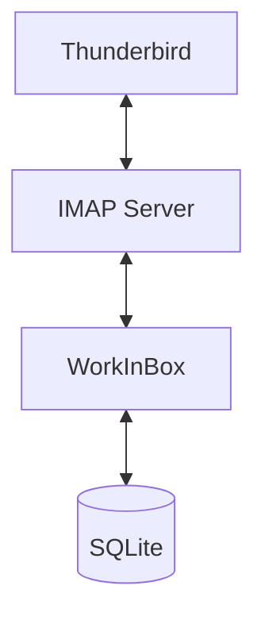
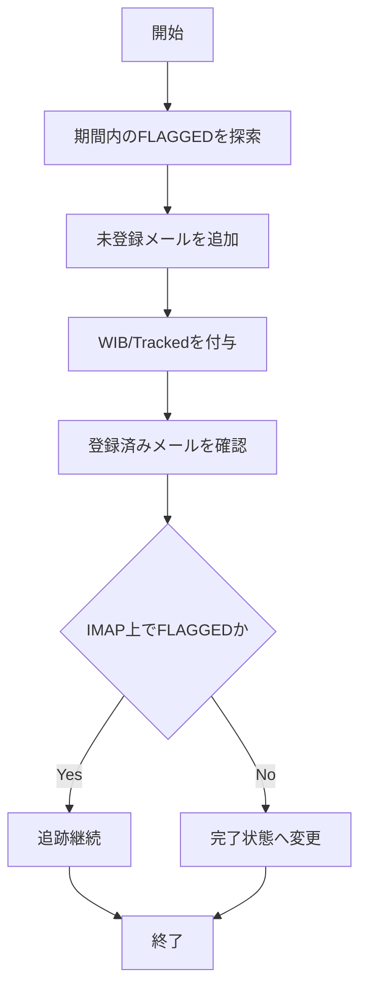
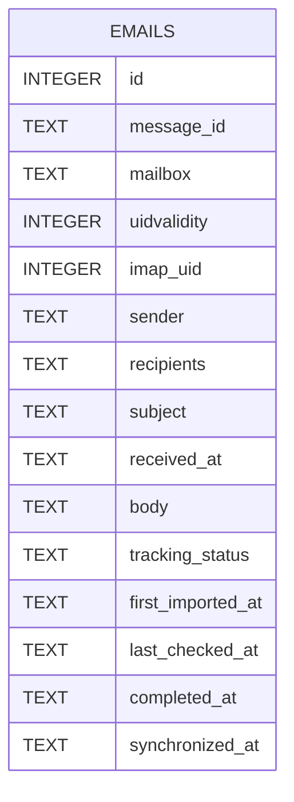
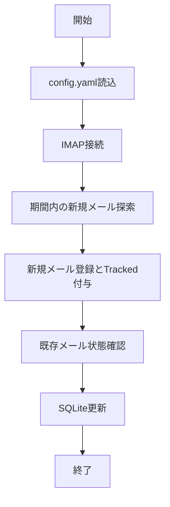

# WorkInBox v0.1 設計書

## 1. 目的

WorkInBox は、利用者が「後で対応する必要がある」と判断したメールを収集し、現在取り組むべき仕事を管理するための基盤を提供する。

Version 0.1 では Thunderbird のスター付きメールのみを対象とする。

AIによる分析、分類、締切抽出は行わない。

---

## 2. スコープ

### 対象

- Thunderbird のスター付きメール
- IMAP メールボックス
- IMAPキーワード `WIB/Tracked`
- SQLite データベース
- 期間を限定した新規メール探索
- 取り込み済みメールの継続追跡
- WorkInBoxからのスター解除

### 対象外

- AI分析
- メール分類
- 締切抽出
- Teams 連携
- Slack 連携
- 通知機能
- リマインダー連携
- Web UI
- Electron UI
- メール削除
- メール移動
- 既読状態の変更

---

## 3. システム構成



---

## 4. 基本方針

### 4.1 タスクの手入力を要求しない

利用者は新たなタスクを手入力しない。

Thunderbirdでスターを付けることを、WorkInBoxへの仕事登録操作とする。

### 4.2 現在の仕事に専念する

WorkInBoxは、IMAP上のすべてのスター付きメールを無条件に取り込まない。

新規探索では、設定された期間内に受信したスター付きメールだけを対象とする。

一度取り込んだメールは、受信日時が探索期間外になっても、完了するまで追跡を継続する。

### 4.3 IMAPとSQLiteの役割

メール本文、ヘッダー、標準IMAPフラグおよびIMAPキーワードは、IMAPサーバ上の情報を基準とする。

WorkInBoxは、管理対象として取り込んだメールにIMAPキーワード `WIB/Tracked` を付与する。

SQLiteは、管理対象メールの表示、検索、同期状態、取得日時および将来の解析結果を保持するローカル台帳とする。

SQLiteが失われた場合は、`WIB/Tracked` を付与されたメールから管理対象を復元できるものとする。

### 4.4 限定的なIMAP書き込み

WorkInBoxは、次の変更だけをIMAPサーバへ行う。

- `WIB/Tracked` キーワードの付与
- 完了操作に伴う `\Flagged` の解除

次の操作は禁止する。

- メール削除
- メール移動
- 本文変更
- 既読・未読変更
- WorkInBox管理外のフラグ・タグ変更

### 4.5 メールを識別する情報

メールの論理的な識別には `Message-ID` を使用する。

IMAP上の操作には、次の組み合わせを使用する。

- mailbox
- UIDVALIDITY
- UID

UIDが無効になった場合は、`Message-ID` を用いてメールを再検索する。

---

## 5. 利用シナリオ

### 5.1 要対応メールの登録

利用者はThunderbirdで、後で対応する必要があるメールにスターを付ける。

### 5.2 新規取り込み

WorkInBoxを実行すると、設定期間内のスター付きメールを探索する。

未登録メールをSQLiteへ追加し、IMAP上のメールへ `WIB/Tracked` を付与する。

### 5.3 継続追跡

一度取り込んだメールは、探索期間を過ぎても追跡を継続する。

Thunderbirdでスターが解除された場合、次回同期時に完了状態として記録し、通常の一覧から除外する。

### 5.4 WorkInBoxからの完了

WorkInBoxでメールを完了にすると、IMAP上の `\Flagged` を解除する。

IMAP更新に成功した後、SQLite上の状態を完了へ変更する。

### 5.5 復元

SQLiteを失った場合、IMAP上の `WIB/Tracked` 付きメールを走査して台帳を再構築する。

通常の復元対象は、`WIB/Tracked` が付いたメールとする。

タグが利用できない場合の救済手段として、指定日以降を走査する日付指定復元を将来追加できるものとする。

---

## 6. 設定ファイル

ファイル名:

```text
config.yaml
```

例:

```yaml
imap:
  host: mail.example.jp
  port: 993
  username: user@example.jp
  password: secret
  mailbox: INBOX
  tracking_keyword: WIB/Tracked
  allow_flag_updates: true
  allow_keyword_updates: true

sync:
  new_message_lookback_days: 90

database:
  path: data/workinbox.db
```

### 6.1 new_message_lookback_days

新規メールを探索する受信日の範囲を日数で指定する。

この値は、新規探索にだけ適用する。

すでにSQLiteへ登録されているメールの追跡には適用しない。

---

## 7. 実装環境

### 実装言語

Python 3.14

### 動作環境

- macOS
- Python 3.14

### 利用ライブラリ

標準ライブラリ:

- sqlite3
- imaplib
- email
- logging
- datetime

外部ライブラリ:

- PyYAML

---

## 8. ディレクトリ構成

```text
WorkInBox/
├── config.yaml
├── data/
│   └── workinbox.db
├── src/
│   └── workinbox/
│       ├── __init__.py
│       ├── main.py
│       ├── config.py
│       ├── database.py
│       ├── imap_client.py
│       └── models.py
├── logs/
└── docs/
    └── design_v0_1.md
```

---

## 9. メール取得仕様

### 9.1 接続方式

IMAP4 over SSL

### 9.2 対象フォルダ

```text
INBOX
```

### 9.3 新規探索条件

```text
FLAGGED
かつ
受信日が new_message_lookback_days の範囲内
```

### 9.4 既存追跡条件

SQLiteに登録済みのメールは、受信日に関係なくIMAP上の状態を確認する。

### 9.5 復元条件

```text
KEYWORD WIB/Tracked
```

復元時にアクティブな仕事だけを戻す場合は、さらに `FLAGGED` を条件へ加える。

### 9.6 取得項目

- Message-ID
- mailbox
- UIDVALIDITY
- UID
- Subject
- From
- To
- Date
- Body
- IMAP flags
- IMAP keywords

### 9.7 添付ファイル

取得しない。

### 9.8 本文

優先順位:

1. text/plain
2. text/html

text/plain が存在する場合は text/plain を採用する。

メール取得には、既読状態を変更しない `BODY.PEEK[]` を使用する。

---

## 10. 同期仕様

### 10.1 概要

同期処理を、次の2種類に分ける。

1. 新規探索
2. 既存追跡

同期完了後のSQLiteは、IMAP上のスター付きメール全件とは一致しない。

SQLiteのアクティブ一覧は、次の集合と一致する。

```text
期間内に新規取り込みしたスター付きメール
+
過去に取り込み済みで現在もスター付きのメール
```

### 10.2 同期フロー



### 10.3 新規メール

次の条件をすべて満たすメールを追加する。

- `\Flagged` が付いている
- 受信日が探索期間内である
- SQLiteに同じ `Message-ID` が存在しない

追加後に `WIB/Tracked` を付与する。

### 10.4 既存メール

SQLiteに登録済みのメールは、探索期間に関係なく追跡する。

確認項目:

- IMAP上にメールが存在するか
- `\Flagged` が付いているか
- UIDVALIDITYが変化していないか
- UIDが有効か

### 10.5 スプール側でスターが解除された場合

IMAP上で `\Flagged` が解除された場合、SQLiteレコードを物理削除しない。

次の状態へ変更する。

```text
tracking_status = completed
```

通常の仕事一覧からは除外する。

### 10.6 WorkInBox側で完了した場合

処理順序:

1. UIDを使ってIMAP上の `\Flagged` を解除する
2. IMAP更新結果を確認する
3. 成功した場合だけSQLiteを完了状態へ変更する

IMAP更新に失敗した場合、SQLite上ではアクティブ状態を維持し、エラーを記録する。

### 10.7 メールが見つからない場合

即時に完了または削除とはみなさない。

次の状態へ変更する。

```text
tracking_status = missing
```

UIDVALIDITYおよびUIDを確認し、必要に応じて `Message-ID` で再検索する。

---

## 11. 復元仕様

### 11.1 通常復元

IMAP上で `WIB/Tracked` が付いたメールを全期間検索する。

取得したメールからSQLiteを再構築する。

スター付きメールは `active`、スターなしメールは `completed` として復元する。

### 11.2 日付指定復元

IMAPキーワードが利用できない場合、または緊急時の救済手段として、指定日以降のメールを走査する方式を将来提供できる。

例:

```bash
workinbox restore --since 2026-04-01
```

日付指定復元では、過去にWorkInBoxへ取り込まれていなかったメールも候補に含まれるため、通常復元より精度が低い。

### 11.3 DBバックアップ

SQLiteには、IMAPタグだけでは復元できない同期履歴や将来の解析結果が保存される。

そのため、IMAPタグによる復元とは別に、SQLiteファイルのバックアップを推奨する。

---

## 12. データモデル



---

## 13. データベース

SQLite を利用する。

ファイル名:

```text
workinbox.db
```

### emails

```sql
CREATE TABLE emails (
    id INTEGER PRIMARY KEY AUTOINCREMENT,
    message_id TEXT NOT NULL UNIQUE,
    mailbox TEXT NOT NULL,
    uidvalidity INTEGER NOT NULL,
    imap_uid INTEGER NOT NULL,
    sender TEXT NOT NULL,
    recipients TEXT,
    subject TEXT,
    received_at TEXT,
    body TEXT,
    tracking_status TEXT NOT NULL DEFAULT 'active',
    first_imported_at TEXT NOT NULL,
    last_checked_at TEXT NOT NULL,
    completed_at TEXT,
    synchronized_at TEXT NOT NULL
);
```

`tracking_status` は次の値を取る。

- active
- completed
- missing
- error

---

## 14. 処理フロー



---

## 15. ログ出力

標準出力へ出力する。

例:

```text
INFO Connecting IMAP server
INFO Found 12 new flagged candidates within 90 days
INFO Added 3 messages
INFO Added WIB/Tracked to 3 messages
INFO Checked 18 tracked messages
INFO Completed 2 messages
INFO Synchronization completed
```

---

## 16. エラー処理

### IMAP接続失敗

```text
ERROR IMAP connection failed
```

を出力して終了する。

### SQLiteエラー

```text
ERROR Database error
```

を出力して終了する。

### IMAPキーワード付与失敗

SQLiteへの新規登録を確定せず、エラーを記録する。

### スター解除失敗

SQLiteを完了状態へ変更せず、アクティブ状態を維持する。

---

## 17. 完了条件

以下をすべて満たした場合、Version 0.1 は完成とする。

- IMAP接続できる
- 設定期間内の `FLAGGED` メールを取得できる
- SQLiteへ保存できる
- `Message-ID` による重複排除ができる
- mailbox、UIDVALIDITY、UIDを保存できる
- 新規取り込みメールへ `WIB/Tracked` を付与できる
- 取り込み済みメールを期間外でも追跡できる
- IMAP側のスター解除を完了状態として反映できる
- WorkInBoxからスターを解除できる
- 完了メールを通常一覧から除外できる
- `WIB/Tracked` からSQLiteを復元できる
- メール削除、移動、既読変更を行わない
