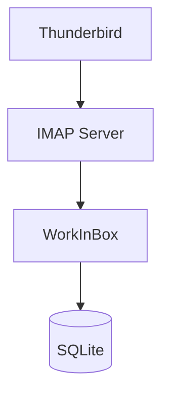
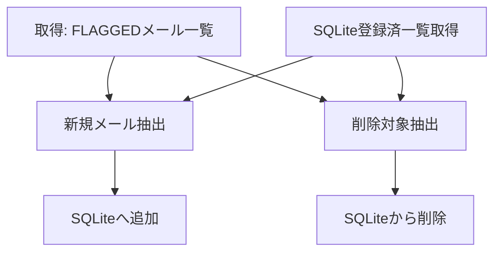
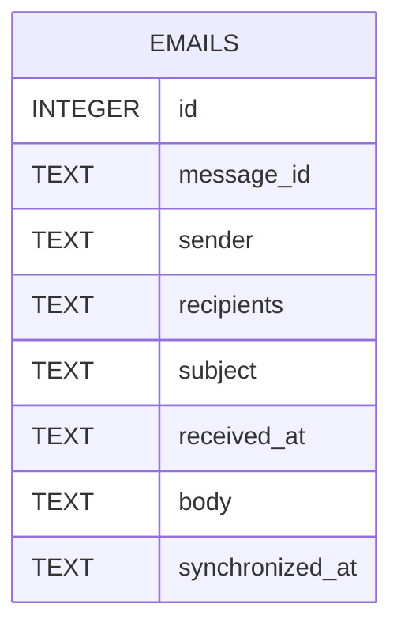
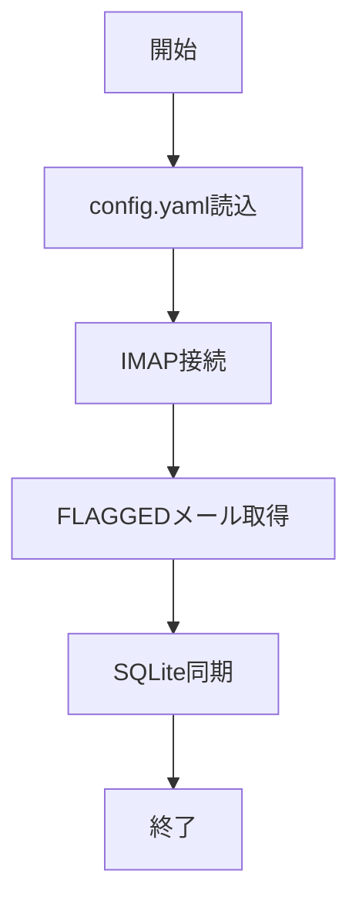

# WorkInBox v0.1 設計書

## 1. 目的

WorkInBox は、利用者が「後で対応する必要がある」と判断したメールを収集し、
管理するための基盤を提供する。

Version 0.1 では Thunderbird のスター付きメールのみを対象とする。

AIによる分析、分類、締切抽出は行わない。

---

## 2. スコープ

### 対象

- Thunderbird のスター付きメール
- IMAP メールボックス
- SQLite データベース

### 対象外

- AI分析
- 締切抽出
- Teams 連携
- Slack 連携
- 通知機能
- リマインダー連携
- Web UI
- Electron UI

---

## 3. システム構成



---

## 4. 基本方針

### 4.1 タスクの手入力を要求しない

利用者は新たなタスク入力を行わない。

### 4.2 メールを正本とする

IMAP サーバ上のメールを正本とする。

SQLite はキャッシュである。

### 4.3 読み取り専用

WorkInBox は IMAP サーバの状態を変更してはならない。

禁止事項:

- メール削除
- メール移動
- フラグ変更
- 既読変更
- タグ変更

---

## 5. 利用シナリオ

### 5.1 メール受信

利用者は Thunderbird でメールを読む。

### 5.2 要対応メール

後で対応する必要があるメールにスターを付与する。

### 5.3 同期

WorkInBox を実行する。

スター付きメールが SQLite に同期される。

### 5.4 完了

利用者が Thunderbird 上でスターを解除する。

次回同期時に WorkInBox から削除される。

---

## 6. 設定ファイル

ファイル名:

```text
config.yaml
```

例:

```yaml
imap:
  host: mail.example.jp
  port: 993
  username: user@example.jp
  password: secret
  mailbox: INBOX

database:
  path: data/workinbox.db
```

---

## 7. メール取得仕様

### 接続方式

IMAP4 over SSL

### 対象フォルダ

```text
INBOX
```

### 検索条件

```text
FLAGGED
```

### 取得項目

- Message-ID
- Subject
- From
- To
- Date
- Body

### 添付ファイル

取得しない。

### 本文

優先順位:

1. text/plain
2. text/html

text/plain が存在する場合は text/plain を採用する。

---

## 8. 同期仕様

### 概要

同期完了後、

SQLite の内容は IMAP 上のスター付きメールと一致していること。

### 同期フロー



### 初回実行

- FLAGGED メール全件取得
- SQLiteへ保存

### 2回目以降

#### 新規メール

SQLite に存在しない Message-ID

```text
追加
```

#### 既存メール

SQLite に同じ Message-ID が存在

```text
変更なし
```

#### スター解除

SQLite に存在するが
IMAP 上で FLAGGED ではない

```text
削除
```

---

## 9. データモデル



---

## 10. データベース

SQLite を利用する。

ファイル名:

```text
workinbox.db
```

### emails

```sql
CREATE TABLE emails (
    id INTEGER PRIMARY KEY AUTOINCREMENT,

    message_id TEXT NOT NULL UNIQUE,

    sender TEXT NOT NULL,

    recipients TEXT,

    subject TEXT,

    received_at TEXT,

    body TEXT,

    synchronized_at TEXT NOT NULL
);
```

---

## 11. ディレクトリ構成

```text
WorkInBox/

├── config.yaml

├── data/
│   └── workinbox.db

├── src/
│   ├── main.py
│   ├── imap_client.py
│   ├── database.py
│   └── models.py

├── logs/

└── docs/
    └── design_v0_1.md
```

---

## 12. 処理フロー



---

## 13. ログ出力

標準出力へ出力する。

例:

```text
INFO Connecting IMAP server

INFO Found 84 flagged messages

INFO Added 3 messages

INFO Removed 2 messages

INFO Synchronization completed
```

---

## 14. エラー処理

### IMAP接続失敗

```text
ERROR IMAP connection failed
```

を出力して終了する。

### SQLiteエラー

```text
ERROR Database error
```

を出力して終了する。

---

## 15. 完了条件

以下をすべて満たした場合、
Version 0.1 は完成とする。

- IMAP接続できる
- FLAGGEDメール取得できる
- SQLite保存できる
- Message-ID重複排除できる
- スター解除されたメールを削除できる
- SQLiteとIMAPの内容が一致する
- IMAPサーバ状態を変更しない
