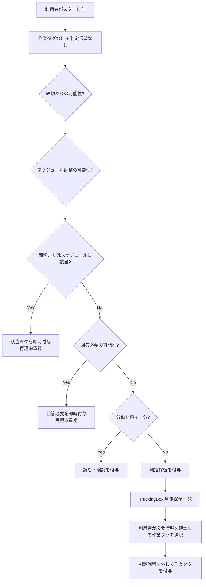
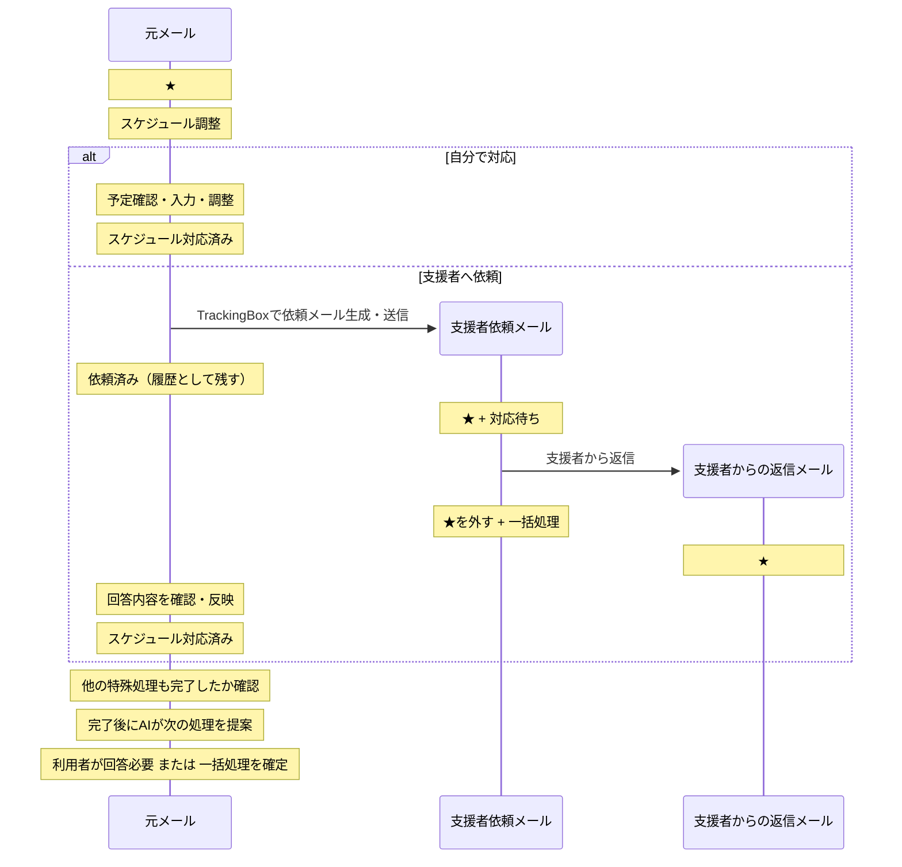
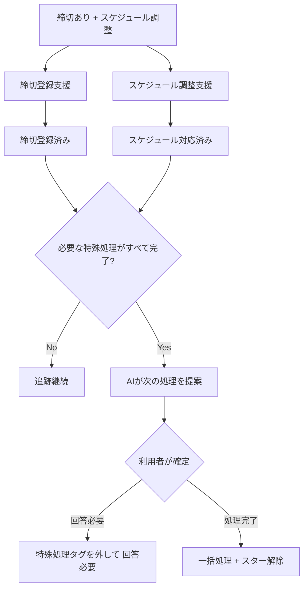

# WorkInBox 設計書

## 概要

WorkInBox は Thunderbird を補完するための業務支援システムである。

Thunderbird のメール運用を変更せず、

- メール分類
- 締切管理
- スケジュール調整支援
- 待機案件管理

を行う。

Thunderbird は業務実行環境であり、WorkInBox は業務整理環境である。

WorkInBox はタスク管理ツールではない。

利用者に新たなタスク入力を要求せず、既に存在するメールから発生する仕事を整理することを目的とする。

---

## 基本方針

### Thunderbird を置き換えない

メールの閲覧、送信、返信、アーカイブは Thunderbird で行う。

### メールを正本とする

メールサーバ上のメールを正本とする。

WorkInBox は補助情報のみを管理する。

### AI は整理役である

AI は分類や抽出を支援する。

AI による初期作業タグ判定は自動で IMAP タグへ反映するが、最終的な判断・修正は利用者が行う。

特に `締切あり`・`スケジュール調整`・`回答必要` は、重要な対応の見逃しを減らすため再現率を重視して判定する。

通常の曖昧さは重要側へ倒して判定するが、本文欠損、強い文脈依存、添付依存など、分類に必要な材料自体が不足している場合は `判定保留` とし、利用者の確認対象として残す。

---

## メール管理の考え方

WorkInBox は案件を直接管理しない。

利用者が現在注目すべきメールを管理する。

返信や対応により新しいメールが到着した場合、着目点は新しいメールへ移る。

その結果、過去のメールは「一括処理」の対象となる。

---

## システム構成

WorkInBox は以下の 2 つの機能から構成される。

### TrackingBox

スター付きメールを対象とする。

主な役割:

- タグ付け支援
- 締切登録支援
- スケジュール調整支援
- 支援者への依頼メール作成支援

現時点では、TrackingBox の対象となるスターは利用者が Thunderbird 上で付与することを前提とする。

したがって、スターが付いている時点で「このメールは放置せず、何らかの形で確認・対応する価値がある」という利用者判断が一段入っている。

### TriageBox

未読メールを対象とする。

主な役割:

- 広告メール判定
- 自分が送信したメールの検出
- 返信メールの検出
- 返信待ち案件の追跡
- 対応待ち案件の追跡

TriageBox はメールを既読にしない。

将来 TriageBox がスター付与まで自動化する場合は、「非スパムならすべて TrackingBox 対象」とせず、TrackingBox へ送るべきメールかどうかの入口判定を別途設計する。

---

## タグ体系

### 作業タグ

- 締切あり
- スケジュール調整
- 回答必要
- 読む・検討

#### 作業タグの重複ルール

作業タグはすべて自由に重複するものではない。

- `締切あり` と `スケジュール調整` は重複可能。
- `回答必要` は、`締切あり`・`スケジュール調整`・`読む・検討` とは重複させない。
- `読む・検討` は、`締切あり`・`スケジュール調整`・`回答必要` とは重複させない。

したがって、初期分類として許可する作業タグの組み合わせは原則として以下である。

- `締切あり`
- `スケジュール調整`
- `締切あり` + `スケジュール調整`
- `回答必要`
- `読む・検討`

`締切あり` または `スケジュール調整` が付いたメールは、必要な特殊処理を完了した後で、次の処理へ遷移する。

### 判定状態タグ

- 判定保留
  - AI がメールの作業内容を分類するために必要な材料が不足している場合に用いる例外的なタグ。
  - 通常の曖昧さに対するフォールバックではない。
  - `締切あり`・`スケジュール調整`・`回答必要` は再現率重視で判定し、通常の迷いは重要側へ倒す。
  - 本文欠損、強い文脈依存、添付を見ないと判断不能など、入力情報だけでは分類そのものが困難な場合に `判定保留` とする。
  - `読む・検討` の代替ではなく、利用者による分類確認が必要な状態を表す。
  - `判定保留` は作業タグとは重複させない。
  - 利用者が適切な作業タグを付けた時点で `判定保留` を外す。
  - `判定保留` のメールは後回しの通常作業ではなく、分類確認が必要なメールとして明示的に表示する。

### 処理完了タグ

- 締切登録済み
  - `締切あり` メールについて、WorkInBox で締切登録処理が完了したことを示す。
- スケジュール対応済み
  - `スケジュール調整` メールについて、必要なスケジュール対応が完了したことを示す。
  - 支援者へ依頼せず利用者自身で調整を完了した場合にも付与する。

処理完了タグは、対応する作業タグを消す代わりではなく、その作業が完了したかどうかを示す。

### 待機タグ

- 返信待ち
  - 利用者が送信したメールに対して、相手からの返信を待っている状態を表す。
- 対応待ち
  - 支援者へ依頼した作業に対して、対応結果を待っている状態を表す。
  - 対象メールは利用者が送信した支援者への依頼メール（利用者を CC として送信したメール）である。

### 履歴タグ

- 依頼済み
  - 元メールについて、支援者へ作業依頼を送信したことを示す。
  - `依頼済み` は完了状態ではなく、依頼を行った履歴である。
  - 通常は解除しない。
  - 支援者への依頼後もスケジュール調整自体が完了するまでは `スケジュール対応済み` を付けない。

### 終了タグ

- 一括処理
  - 一括処理タグが付いていて、スターが付いていないメールは Thunderbird にてアーカイブの対象となる。
  - ただし、スターが付いているメールは特例処理が必要なメールである。

---

## Thunderbird の役割

Thunderbird は以下を担当する。

- メール閲覧
- メール送信
- メール返信
- アーカイブ

## Thunderbird での利用者の運用フロー

### A. INBOX 内のスターなしメール

1. 未読メールをざっと読んで振り分ける。
   - 対応が必要そうなメールはスターを付ける。TrackingBox の対象となる。
   - それ以外のメールはアーカイブする。
2. 既読かつタグなしのメールも、可能であれば同様に振り分ける。
3. `一括処理` タグ付きメールは、目を通した上でアーカイブする。
   - 対応が必要な場合は再びスターを付ける。

### B. INBOX 内のスター付きメール

1. `判定保留` タグ付きメールは、TrackingBox の `判定保留` 一覧で利用者が内容を確認し、適切な作業タグへ分類する。
2. `締切あり` / `スケジュール調整` タグ付きメールは、TrackingBox の特殊処理を完了させる。
3. `回答必要` タグ付きメールは、必要な回答作業を行う。
   - 催促メールが `回答必要` と判断された場合は `返信待ち` に付け替える。
   - 支援者からの回答メールは、必要な処理後にアーカイブする。
   - 返信が必要な場合はそのメールを対象に返信する。
   - 返信が不要な場合はアーカイブする。
4. `読む・検討` タグ付きメールは、内容を読んで必要な作業を行う。
   - 返信が必要になった場合は返信する。
   - 対応が完了した場合はアーカイブする。
5. `返信待ち` タグ付きかつ受信後 7 日以上のメールについては、必要に応じて催促する。

`読む・検討` は現時点では IMAP の作業タグとして扱う。要約、滞留日数、再確認日、完了状態などを WorkInBox 側で別管理する専用キューへの拡張は、実運用での滞留状況を見た上で将来バージョンで検討する。

---

## TrackingBox

### 対象

- INBOX 内のスター付きメール

### 基本動作

TrackingBox は利用者が現在注目すべきメールを整理する。

作業タグも `判定保留` も付いていないスター付きメールについて AI によるタグ付け支援を行い、その結果を IMAP タグへ自動反映する。

初期分類では重要な対応の見逃しを防ぐことを優先し、`締切あり`・`スケジュール調整`・`回答必要` は再現率を重視する。

その後、必要に応じて締切登録支援とスケジュール調整支援を行う。

### 処理

#### タグ付け支援

作業タグも `判定保留` も付いていないスター付きメールについて、AI は以下の順序で判定する。

前提として、スターは利用者が「何らかの確認・対応が必要」と判断して付けているため、AI はメール自体を追跡対象にする価値があるかどうかを再判定しない。

1. `締切あり` の可能性を判定する。
   - 見逃しコストが高いため再現率を重視する。
   - 明確に該当する場合だけでなく、合理的に該当する可能性がある場合も `締切あり` 側へ倒す。
2. `スケジュール調整` の可能性を独立して判定する。
   - 見逃しコストが高いため再現率を重視する。
   - `締切あり` と同時に付与してよい。
3. 1 または 2 のどちらかが該当する場合は、その結果を IMAP の作業タグとして直ちに付与する。
   - この場合、`回答必要` と `読む・検討` は付与しない。
4. `締切あり` と `スケジュール調整` のどちらにも該当しない場合、`回答必要` の可能性を判定する。
   - `回答必要` も、重要な返信・回答の見逃しを減らすため再現率を重視する。
5. `回答必要` の可能性があると判断した場合は `回答必要` を直ちに付与する。
6. `締切あり`・`スケジュール調整`・`回答必要` のいずれにも該当しないと判断できた場合は `読む・検討` を付与する。
   - `読む・検討` は「AI が迷ったため入れるタグ」ではなく、他の重要作業タグに該当しないスター付きメールの残余カテゴリである。
7. 本文欠損、強い文脈依存、添付依存などにより、そもそも 1〜6 を判断するための材料が不足している場合に限り `判定保留` を付与する。

AI の結果について、タグ付与前の利用者確認は必須としない。

`締切あり`、`スケジュール調整`、`回答必要` は後続の利用者作業・判断の中で誤判定を修正できるため、初期分類では偽陽性をある程度許容して見逃しを減らす。

`判定保留` は通常の曖昧さに対する安全弁ではなく、分類材料そのものが不足する例外ケースに限定する。

すでに作業タグまたは `判定保留` が付いているメールについては、通常は AI による自動再分類を行わない。

#### 判定保留の確認・再分類

`判定保留` の解消は Thunderbird 上で個別に探して行うのではなく、TrackingBox の Web UI 上で行う。

TrackingBox に `判定保留` メールだけを集めた一覧を用意する。

この一覧は active メールのうち `判定保留` が付いたメールを対象とし、通常の `読む・検討` 一覧とは分離する。

利用者は `判定保留` 一覧から対象メールを確認し、必要に応じて Thunderbird で本文全体や添付などを確認した上で、次のいずれかへ分類する。

- `締切あり`
- `スケジュール調整`
- `締切あり` + `スケジュール調整`
- `回答必要`
- `読む・検討`

分類を確定したら、WorkInBox は IMAP 上で `判定保留` を外し、選択された作業タグを付与する。

`判定保留` 一覧は「AI の分類結果を承認する画面」ではなく、「AI が分類材料不足で分類できなかったメールを利用者が分類するための作業画面」とする。

判定保留メールは放置されないよう、TrackingBox の画面上で件数を常に確認できるようにする。

#### 締切登録支援

対象:

- `締切あり` が付いている
- `締切登録済み` が付いていない

処理:

1. WorkInBox が締切候補を抽出する。
2. 利用者が確認・修正して締切を登録する。
3. 登録が完了したら `締切登録済み` を付ける。

締切登録の完了だけを理由に、直ちに `回答必要` や `一括処理` へ遷移しない。

`スケジュール調整` も付いている場合は、スケジュール対応が完了するまで元メールの特殊処理は継続する。

#### スケジュール調整支援

対象:

- `スケジュール調整` が付いている
- `スケジュール対応済み` が付いていない

利用者は、状況に応じて以下のいずれかで処理する。

##### 自分で対応する

利用者自身で予定確認、日程調整、予定入力などを行う。

必要なスケジュール対応が完了したら `スケジュール対応済み` を付ける。

支援者への依頼を行っていないため、`依頼済み` は付けない。

##### 支援者へ依頼する

1. WorkInBox が支援者への依頼メール作成を支援する。
2. 依頼メールを送信したら、元メールに `依頼済み` を付ける。
3. 支援者への依頼メールにはスターを付け、`対応待ち` を付ける。
4. 支援者からの回答を待つ。
5. 支援者から回答があり、必要な確認・反映が完了した時点で、元メールに `スケジュール対応済み` を付ける。

`依頼済み` は依頼履歴であり、`スケジュール対応済み` の代わりにはならない。

#### 特殊処理完了判定

`締切あり` と `スケジュール調整` は重複する可能性があるため、WorkInBox は各処理を独立して完了判定する。

- `締切あり` が付いている場合は `締切登録済み` が必要。
- `スケジュール調整` が付いている場合は `スケジュール対応済み` が必要。

必要なすべての処理完了タグが揃うまでは、元メールを通常作業へ遷移させない。

例:

- `締切あり` + `締切登録済み` → 締切処理完了
- `スケジュール調整` + `スケジュール対応済み` → スケジュール処理完了
- `締切あり` + `スケジュール調整` + `締切登録済み` → スケジュール処理未完了
- `締切あり` + `スケジュール調整` + `締切登録済み` + `スケジュール対応済み` → 特殊処理すべて完了

#### 特殊処理完了後の遷移

必要な特殊処理がすべて完了したら、WorkInBox は元メールの内容を再度 AI に確認させ、次の処理を利用者へ提案する。

主な提案先:

- `回答必要`
- `一括処理`

この段階の AI は自動確定を行わない。

利用者が AI の提案を確認し、次の処理を確定する。

- 回答が必要 → 特殊処理用の作業タグを外し、`回答必要` を付ける。
- 回答不要で処理完了 → `一括処理` を付け、スターを外す。

`締切あり` と `スケジュール調整` の両方が付いている場合も、必要なすべての特殊処理が完了した後に一度だけ次の処理を提案する。

初期分類では再現率を優先し、特殊処理後は実際の作業結果も踏まえた上で AI が次の処理を提案し、利用者が最終決定する二段階構成とする。

`回答必要` と `読む・検討` は、`締切あり` / `スケジュール調整` と同時には保持しない。

特殊処理後に回答は不要だが、まだ内容確認や検討が必要なケースが実運用で必要になった場合は、将来 `読む・検討` への遷移も追加検討する。

---

## TriageBox

### 対象

- INBOX 内の未読メール

### 基本動作

TriageBox は未読メールを監視する。

新しい未読メールが到着した際に、

- 広告メールか
- 自分が送信したメールか
- 既存案件への返信メールか

を判定する。

判定結果に応じて、必要であれば既存メールのタグを更新する。

現時点では TrackingBox のスター付与は利用者が行う。将来 TriageBox が自動でスターを付ける場合は、非スパムメールを無条件ですべて TrackingBox に流さず、利用者の確認・対応が必要なメールかどうかを入口で判定する設計を追加する。

### 処理

#### スパムメール判定

- スパムメールと判定されたものは `一括処理` を付ける。

#### 返信待ち案件への返信判定

新しい未読メールが `返信待ち` タグ付きメールへの返信であると判定された場合、

- 元メールのスターを外す
- 元メールに `一括処理` を付ける
- 新しいメールにスターを付ける

さらに、

- 差出人が自分の場合は `返信待ち` を付ける
- 差出人が自分以外の場合は `回答必要` を付ける

#### 対応待ち案件への返信判定

新しい未読メールが `対応待ち` タグ付きメールへの返信であると判定された場合、

- 元の支援者依頼メールのスターを外す
- 元の支援者依頼メールに `一括処理` を付ける
- 新しい返信メールにスターを付ける

その後、支援者からの回答内容を元メールへ反映し、必要なスケジュール対応が完了した時点で、対応する `依頼済み` 元メールに `スケジュール対応済み` を付ける。

元メールに `締切あり` も付いている場合は、`締切登録済み` も揃うまで通常作業へ遷移させない。

#### 支援者依頼メール判定

新しい未読メールが支援者への依頼メール（利用者を CC として送信したメール）であると判定された場合、

- スターを付ける
- `対応待ち` を付ける

---

## メールワークフロー

### AI タグ判定

### スケジュール調整

### 締切あり + スケジュール調整

---

## ダッシュボード

ダッシュボードは利用者が毎朝最初に確認する画面である。

現在抱えている仕事の状況を集約表示する。

- `判定保留` のメール件数
  - 件数から TrackingBox の `判定保留` 一覧へ移動できるようにする。
- `締切あり` のメール件数
  - そのうち `締切登録済み` でない件数
- `スケジュール調整` のメール件数
  - そのうち `依頼済み` の件数
  - そのうち `スケジュール対応済み` でない件数
- `回答必要` のメール件数
- `読む・検討` のメール件数
- `返信待ち` のメール件数
  - そのうち受信後 7 日以上経過した件数
- `対応待ち` のメール件数
  - そのうち受信後 7 日以上経過した件数
- `一括処理` のメール件数
- 7 日以内の締切件数
  - そのうち今日が締切の件数
- 今日の予定

### `読む・検討` の将来拡張

`読む・検討` が実運用で滞留する場合は、将来バージョンで WorkInBox 側に専用の処理キューを設けることを検討する。

候補となる補助情報:

- AI による要約
- 作成日 / 経過日数
- 最終確認日
- Active / Completed 状態
- 再確認日の設定

現時点ではこれらを必須とせず、`読む・検討` は IMAP タグとして扱う。

### `一括処理` タグ付きメールについて

通常は `一括処理` メールはスターが外される。

スターが付いている場合は、利用者がアーカイブせず保留した特別対応が必要なメールとして扱う。

---

## 締切管理

締切はメールタグとは別に WorkInBox の補助情報として管理する。

- 締切情報には Active / Completed の状態を持たせる。
- メールの `締切あり` は締切処理が必要であることを示す。
- `締切登録済み` は締切情報の登録処理が完了したことを示す。
- 将来的には VTODO 等との連携を検討する。
