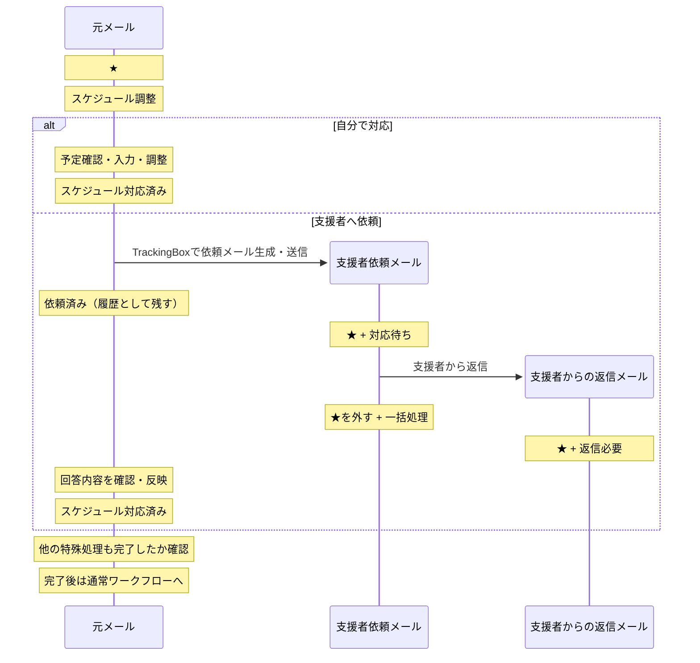

# WorkInBox 設計書

## 概要

WorkInBox は Thunderbird を補完する業務支援システムである。

Thunderbird はメール業務の実行環境、WorkInBox はメールから発生する仕事・判断・待機・参照情報を整理する環境とする。

WorkInBox は独立した TODO / プロジェクト管理ツールや独自メールクライアントを目指さない。利用者に新たな仕事入力を強制せず、既に存在するメールを起点として必要な業務を整理する。

主な対象は次のとおり。

- メール分類
- 締切登録支援
- スケジュール調整支援
- 返信待ち管理
- `見る・検討` メールから残す価値のある情報の保存・再利用

---

## 基本方針

### Thunderbird を置き換えない

メールの閲覧、本文作成、返信、送信、転送、アーカイブは Thunderbird で行う。

WIB Web はメール本文を編集・送信する独自メールクライアントにはしない。

WorkInBox は分類、専用ワークフロー、待機案件整理、優先順位、保存情報、Thunderbird との橋渡しを担当する。

### 正本を用途ごとに分ける

- メール本文・メール日時・Message-ID 等のメール情報はメールサーバ上のメールを正本とする。
- WorkInBox の内部状態、メール relation、保存情報、正式登録された締切データは SQLite を正本とする。
- WorkInBox の IMAP 作業タグはメールサーバ上の IMAP keyword を正本とする。
- WorkInBox が対象とする IMAP server / account / mailbox は `config.yaml` の `imap` 設定を正本とする。
- Thunderbird に締切を表示するための iCalendar (`.ics`) / `VTODO` は SQLite から生成する派生データとする。

### AI は整理役である

AI は意味判断、分類、抽出、要約、優先順位付けを支援する。

AI による初期ワークフロー判定は IMAP タグへ反映するが、利用者は結果を変更できる。

`締切あり` と `スケジュール調整` は見逃しコストが高いため再現率を重視して独立判定する。

通常フローは次の 4 種類として判定する。

- `返信必要`
- `見る・検討`
- `注目`
- `何もしなくてよい`

`何もしなくてよい` はタグとして保持せず、専用ワークフローも不要なら `一括処理` + スターなしへ進める。

専用ワークフローのどちらにも該当せず、通常フローも確定できない場合だけ `判定保留` とする。

---

## メール管理の考え方

WorkInBox は案件そのものを直接管理しない。

スターは、利用者が「このメールに着眼し、放置せず確認・対応する」と判断したことを表す。どのメールに新たに着眼するかの起点は利用者が決める。

TriageBox が relation に基づいて既存の利用者判断を引き継ぐ場合だけ、旧メールから新しいメールへ着眼点を決定的に移すことができる。

`一括処理` + スターなしは「現在の作業対象ではなく、Thunderbird で確認後にアーカイブしてよい候補」を表す。

ただし `見る・検討` から WIB に情報を保存したメールは、後から Thunderbird の Archive フォルダでも再発見できるよう、`見る・検討` タグを参照用に残したままスターを外してアーカイブしてよい。この状態は active な `見る・検討` 作業ではない。

---

## システム構成

WorkInBox は次の 3 つの主要構成要素からなる。

1. **WIB Web UI + Thunderbird Extension**
2. **TrackingBox**
3. **TriageBox**

```text
WIB Web UI + Thunderbird Extension
  = 利用者判断・ワークフロー進行・待機案件対応・保存情報管理・Thunderbirdとの接続

TrackingBox
  = 意味・分類・要約・優先順位・再評価

TriageBox
  = 事実・関係・決定的な状態遷移
```

### WIB Web UI + Thunderbird Extension

利用者との接点と Thunderbird との橋渡しを担当する。

主な役割:

- ダッシュボードを仕事の出発点として提供する。
- 締切・スケジュール調整などの専用ワークフローを進める。
- `判定保留` を利用者が確定する。
- `返信待ち` の優先順位を確認し、催促・終了などの対応を進める。
- `見る・検討` から残す情報を WIB に保存し、後から検索・利用できるようにする。
- WIB から Thunderbird の対象メールを開く。
- Thunderbird 側で必要な Quick Filter 作業ビューを開く。
- WIB が意味を知っている送信メールへ relation や用途を示す拡張ヘッダーを付ける。

メール本文の作成・返信・送信は Thunderbird の標準機能を使用する。

### TrackingBox

現在注目しているメールの意味を解釈し、整理する。

主な役割:

- AI 初期ワークフロー判定
- `判定保留` の整理支援
- 締切候補抽出
- スケジュール調整支援
- `返信待ち` の要否判定・定期再評価・優先順位付け
- `見る・検討` から WIB に保存する情報の AI 要約支援

TrackingBox の通常の入口は利用者が付与したスターである。TrackingBox や TriageBox が未着眼メールを勝手に active な作業対象へ取り込まない。

### TriageBox

新しく観測したメールについて事実・関係・決定的な状態遷移を扱う。

主な役割:

- 未読メールの取り込み
- 自分が送信したメールの検出
- 返信メールの検出
- `In-Reply-To` / `References` / WorkInBox relation の解析
- `返信待ち` / `対応待ち` への返信検出
- relation に基づく着眼点移動
- 旧着眼点への `一括処理` 付与とスター解除
- `X-WorkInBox-Origin-Message-ID` 等から派生メールと起点メールの relation を保存する

TriageBox はメールを既読にしない。

---

## タグ体系

### 参照タグ

- `重要`

`重要` は作業状態ではなく、後から参照する価値があるメールを示す。スターや他のタグとは独立し、アーカイブ後も保持してよい。

### 専用ワークフロータグ

- `締切あり`
- `スケジュール調整`

専用ワークフロータグは互いに独立して判定する。両方付いてよい。

### 通常ワークフロータグ

- `返信必要`
- `見る・検討`
- `注目`

通常ワークフロータグは排他的とする。

#### `返信必要`

元メールの相手に対して返信する必要がある状態を表す。

実際の返信本文作成・送信は Thunderbird で行う。

#### `見る・検討`

元メールそのものへの返信は必要ないが、内容を読み、後から残す価値があるかを判断する必要がある状態を表す。

`見る・検討` の active な作業の出口は原則として次の 2 つだけとする。

1. **WIB に保存する**
2. **一括処理にする**

`まだ検討する` という独立した出口は設けない。将来の日時に再判断すべき仕事があるなら、必要に応じて締切として管理する。

`見る・検討` を読んだ結果、元メールへの返信が必要と分かった場合は、利用者が分類を `返信必要` に変更する。

#### `注目`

自分から直ちに返信・処理する必要はないが、そのスレッドの今後の進展を継続して確認する必要がある状態を表す。

### 判定状態タグ

- `判定保留`

スターが付いていて、専用ワークフロータグ、通常ワークフロータグ、`判定保留` のいずれも付いていないメールは **AI 初期判定前** を表す。

`判定保留` は **AI 初期判定済み・専用ワークフロー非該当・通常フローだけ未確定** を表す。

したがって `判定保留` は「未分類」ではなく AI の判断状態マーカーである。

利用者は WIB 上で次のいずれかに確定する。

- `返信必要`
- `見る・検討`
- `何もしなくてよい` → `一括処理` + スターなし

### 処理完了タグ

- `締切登録済み`
- `スケジュール対応済み`

処理完了タグを付けた瞬間に、メール全体の残作業を決定的に評価する。

- 他の専用ワークフローが未完了 → スター維持
- 専用ワークフローがすべて完了 + `返信必要` → スター維持して返信へ
- 専用ワークフローがすべて完了 + `見る・検討` → スター維持して `見る・検討` へ
- 専用ワークフローがすべて完了 + 通常ワークフローなし → `一括処理` + スターなし

`締切登録済み` は締切登録ワークフローの完了であり、実際の業務タスク完了を意味しない。

### 待機タグ

- `返信待ち`
- `対応待ち`

`返信待ち` は利用者が送信したメールについて相手からの次のアクションを業務上待つ状態を表す。

`対応待ち` は支援者へ依頼した作業結果を待つ状態を表す。

### 履歴タグ

- `依頼済み`

支援者へ依頼した履歴を表す。完了状態ではなく、通常は解除しない。

### 整理タグ

- `一括処理`

`一括処理` + スターなしは Thunderbird で確認後にまとめてアーカイブする対象とする。

---

## `見る・検討` と WIB 保存情報

### 基本フロー

```text
見る・検討 + ★
      ↓
Thunderbird でメールを読む
      ↓
┌────────────────┬────────────────┐
│ WIB に保存する  │ 一括処理にする │
└────────────────┴────────────────┘
```

### 一括処理にする

後から WIB で参照・検索・追跡する価値がないと判断した場合。

- `見る・検討` を active 作業として終了する。
- `一括処理` を付ける。
- スターを外す。
- Thunderbird でアーカイブする。

この場合、通常は `見る・検討` タグも外してよい。

### WIB に保存する

後から参照・検索・再利用する価値があると判断した場合、メールそのものを複製するのではなく、元メールへの参照を持つ **WIB 保存情報** を SQLite に作成する。

初期データモデルは少なくとも次を持つ方向とする。

```text
saved_information
- id
- source_message_id
- source_account
- source_folder_hint
- title
- summary
- note
- created_at
- updated_at
```

`summary` は AI が作成支援してよい。`note` は利用者が追記・修正できる。

保存後の元メールは active な仕事として残さない。

- スターを外す。
- `一括処理` は付けない。
- `見る・検討` タグは参照用に残してよい。
- Thunderbird でアーカイブする。

これにより、Archive フォルダを選択して Thunderbird の Quick Filter で `見る・検討` を指定すれば、WIB に保存した元メール群をメール側からも参照できる。

`見る・検討` + スターなしは active 作業ではなく、保存済みメールを Thunderbird 側から再発見するための参照状態として扱う。

### WIB 保存情報からできること

WIB 保存情報はメールの代替ではなく、メールへ付帯する再利用可能な情報とする。

少なくとも将来次の操作へつなげられる構造にする。

- タイトル・AI要約・利用者メモのキーワード検索
- 元メールを Thunderbird で開く
- 元メールを確認して Thunderbird から返信する
- 元メールを起点として Thunderbird で新しいメールを作る
- 締切を追加・関連付ける
- 元メールから派生した送信メール・返信スレッドを確認する

WIB 保存情報を作成した時点で、これらすべての次アクションを決定する必要はない。必要になった時点で保存情報から新たな仕事を開始する。

---

## 元メール参照と Message-ID 検索

### 通常の active メール

通常の active 作業メールは INBOX に存在することを前提とし、INBOX 内を対象に Message-ID で高速検索する。

### WIB 保存情報の元メール

WIB に保存した情報の元メールは既に Archive 等へ移動している可能性があるため、INBOX 前提では検索できない。

WIB 保存情報では次を保持する。

```text
source_message_id    = 正式な識別子
source_account       = 対象アカウント
source_folder_hint   = 最後に確認したフォルダのヒント
```

`source_message_id` を正本の識別子とし、`source_folder_hint` は高速化のためのキャッシュとして扱う。メール移動により folder は変わり得るが Message-ID は変えない。

元メールを開くときは概念的に次の順で解決する。

```text
1. source_folder_hint で検索
       ↓ 見つからない
2. Archive 等の有力候補フォルダを検索
       ↓ 見つからない
3. 対象アカウント全体から Message-ID を検索
```

対象が見つかった場合は folder hint を更新してよい。

したがって WIB → Thunderbird の Message-ID 検索は、次の 2 モードを共通基盤として持つ。

```text
active メール
  → INBOX 前提の高速検索

保存済み元メール
  → folder hint 優先 + 広域フォールバック検索
```

---

## Thunderbird の役割

Thunderbird は次を担当する。

- メール閲覧
- メール本文作成
- メール送信・返信・転送
- アーカイブ
- WIB 専用 Quick Filter 作業ビュー
- Archive 等の任意フォルダに対する Quick Filter
- WorkInBox が提供する締切情報の閲覧

WIB から元メールを開く場合、可能な限り対象メールそのものを直接表示する。

メールを WIB から開く表示先は独立したメッセージウィンドウを利用できる。メール処理はその Thunderbird 画面から標準機能で行う。

### WIB 専用 Quick Filter 作業ビュー

active 作業ビューは次を基本とする。

- `返信必要` = `wib-answer` AND スター付き
- `締切あり` = `wib-deadline` AND スター付き
- `スケジュール調整` = `wib-schedule` AND スター付き
- `見る・検討` = `wib-review` AND スター付き
- `返信待ち` = `wib-waiting-reply` AND スター付き
- `対応待ち` = `wib-waiting-action` AND スター付き
- `一括処理` = `wib-bulk` AND スターなし

スターは「現在注目すべきメール」を表すため、保存済みの `見る・検討` メールは active な `WIB:見る・検討` には出ない。

一方、利用者が Archive フォルダを選択して `wib-review` を Quick Filter すれば、保存済みの元メールを Thunderbird 側から一覧できる。

---

## Thunderbird での利用者フロー

### INBOX のスターなしメール

1. メールを確認する。
2. 新たに着眼すべきメールは利用者がスターを付ける。
3. それ以外はアーカイブする。
4. `一括処理` + スターなしはまとめて確認・アーカイブできる。

### INBOX のスター付きメール

1. AI 初期判定前なら TrackingBox が判定する。
2. `判定保留` は WIB で利用者が通常フローを確定する。
3. `締切あり` は WIB の締切ワークフローを進める。
4. `スケジュール調整` は WIB のスケジュールワークフローを進める。
5. `返信必要` は Thunderbird で元メールを開き返信する。
6. `見る・検討` は Thunderbird で読み、`WIB に保存` または `一括処理` を選ぶ。
7. `返信待ち` は WIB で優先順位・経過を確認し、必要なら Thunderbird で催促等を行う。
8. `対応待ち` は Thunderbird / WIB から支援者の対応状況を確認する。

---

## TrackingBox

### 初期判定対象

```text
スター付き
AND 専用ワークフロータグなし
AND 通常ワークフロータグなし
AND 判定保留なし
```

この状態を AI 初期判定前とする。

初期判定では次の順で意味判断する。

1. `締切あり` の必要性を独立判定する。
2. `スケジュール調整` の必要性を独立判定する。
3. 通常フローを `返信必要` / `見る・検討` / `何もしなくてよい` から判定する。
4. 専用フローなし + `何もしなくてよい` → `一括処理` + スターなし。
5. 専用フローなし + 通常フロー判断不能 → `判定保留`。

TrackingBox は `返信待ち` について、送信直後の要否判定、定期的な再評価、優先順位付けも担当する。

---

## 締切登録支援

正式登録された締切データは SQLite を正本とする。

1 通のメールから 0 件以上の締切候補を抽出する。候補ごとに `pending` / `registered` / `rejected` を管理する。

利用者は候補ごとに次を行える。

- 登録しない
- 修正する
- 登録する
- AI候補とは別に締切を追加する

すべての候補について利用者判断が終わり、1 件以上登録された場合に `締切登録済み` を付ける。

全候補を却下し、登録すべき締切がないと利用者が判断した場合は `締切あり` を外し、`締切登録済み` は付けない。

締切は Message-ID 等で起点メールと関連付ける。WIB 保存情報から後日新たな締切を作る場合も、保存情報と元メール参照をたどれるように関連付ける。

---

## スケジュール調整支援

### 自分で対応

元メール M1 を起点に、利用者自身が予定確認・入力・調整を行う。完了時に `スケジュール対応済み` を付ける。

### 支援者へ依頼



支援者依頼メールには既存の `X-WorkInBox-Origin-Message-ID` を利用して起点 M1 を関連付ける。

自分宛て/Cc の依頼メールを TriageBox が同期で確認した時点で、M1 に `依頼済み`、M2 に `対応待ち + ★` を付ける。送信直後に元メールを先行変更しない。

支援者返信 M3 が届いたら、M2 は `対応待ち` を履歴として残しつつ `一括処理 + ☆`、M3 は `返信必要 + ★` とする。M3 に `スケジュール調整` は付けない。

利用者が支援作業を終了すると判断した時点で M1 に `スケジュール対応済み` を付け、その後は共通の専用ワークフロー完了判定を行う。

---

## 派生メール relation

`X-WorkInBox-Origin-Message-ID` はスケジュール支援だけに閉じず、WIB が元メールを起点に作成した派生メールを表す共通 relation として利用できる。

概念上は次の 2 種類の関係を分ける。

```text
WorkInBox の業務 relation:
M1 元メール ──X-WorkInBox-Origin-Message-ID──> M2 派生送信メール

標準メールスレッド:
M2 ──In-Reply-To / References──> M3 → M4 ...
```

M1 と M2 の宛先・会話が異なる場合、M2 を M1 への通常 Reply として扱わない。

WIB 保存情報から後日「元メールを起点に新しいメールを送る」場合も、この relation を利用して M1 と派生送信メールを関連付けられる。

派生送信メールが相手からの応答を業務上必要とする場合は `返信待ち + ★` とし、TrackingBox の管理対象とする。

---

## 専用ワークフロー完了時の共通遷移

`締切登録済み` または `スケジュール対応済み` を付けた直後に必ずメール全体を評価する。

```text
他の専用ワークフロー未完了
  → ★維持

専用ワークフロー全完了 + 返信必要
  → ★維持、Thunderbirdで返信

専用ワークフロー全完了 + 見る・検討
  → ★維持、見る・検討の二択へ

専用ワークフロー全完了 + 通常フローなし
  → 一括処理 + ☆
```

専用ワークフロー完了後に AI が通常フローを再分類することは原則としない。初期判定で確定した通常ワークフローを使う。

---

## TriageBox の判定原則

TriageBox の対象は主に INBOX の未読メールである。

判定では relation を広告判定より先に扱う。

- 自分が送信したメールか
- `X-WorkInBox-Origin-Message-ID` を持つ WIB 派生メールか
- 既存メールへの返信か
- 新規受信メールか

他者発の返信では直接 `In-Reply-To` を優先し、必要に応じて `References` を新しいものから確認する。

`返信待ち` への返信を受けた場合、旧送信メールを待機対象から外して原則 `一括処理 + ☆`、新しい返信を `返信必要 + ★` とする。

`対応待ち` への返信では、依頼メールの `対応待ち` を履歴として残したうえで `一括処理 + ☆`、新しい返信を `返信必要 + ★` とする。

---

## ダッシュボード

ダッシュボードは単なる件数表示ではなく、**WorkInBox の仕事の出発点・コントロールセンター** とする。

利用者が現在抱えている状態を把握し、必要な作業へ直接進めるようにする。

主な表示・操作候補:

- `判定保留`
- 未完了の `締切あり`
- 未完了の `スケジュール調整`
- `返信必要`
- active な `見る・検討`
- `返信待ち`
- `対応待ち`
- `一括処理`
- 今日 / 7 日以内の正式締切
- WIB に保存した情報
- TrackingBox 実行
- TriageBox 実行
- 同期状態 / 最終実行状態
- 設定

遷移先は仕事の種類に応じて分ける。

```text
WIB 内で進める
  判定保留
  締切
  スケジュール調整
  返信待ち
  保存情報の検索・閲覧

Thunderbird で進める
  返信必要
  見る・検討
  対応待ち
  一括処理
  元メールの閲覧・返信・新規派生メール作成
```

`見る・検討` は Thunderbird で実際にメールを読み、その結果として `WIB に保存` または `一括処理` を選ぶ。

---

## 関連文書

- `docs/workinbox_components_and_waiting_review_2026-08-13.md`
- `docs/triagebox_decision_flow.md`
- `docs/schedule_reply_workflow_2026-08-12.md`
- `docs/deadline_support_discussion_2026-08-10.md`
- `docs/design_notes_tags_and_external_intake.md`
- `docs/thunderbird_bridge.md`
- `docs/roadmap.md`