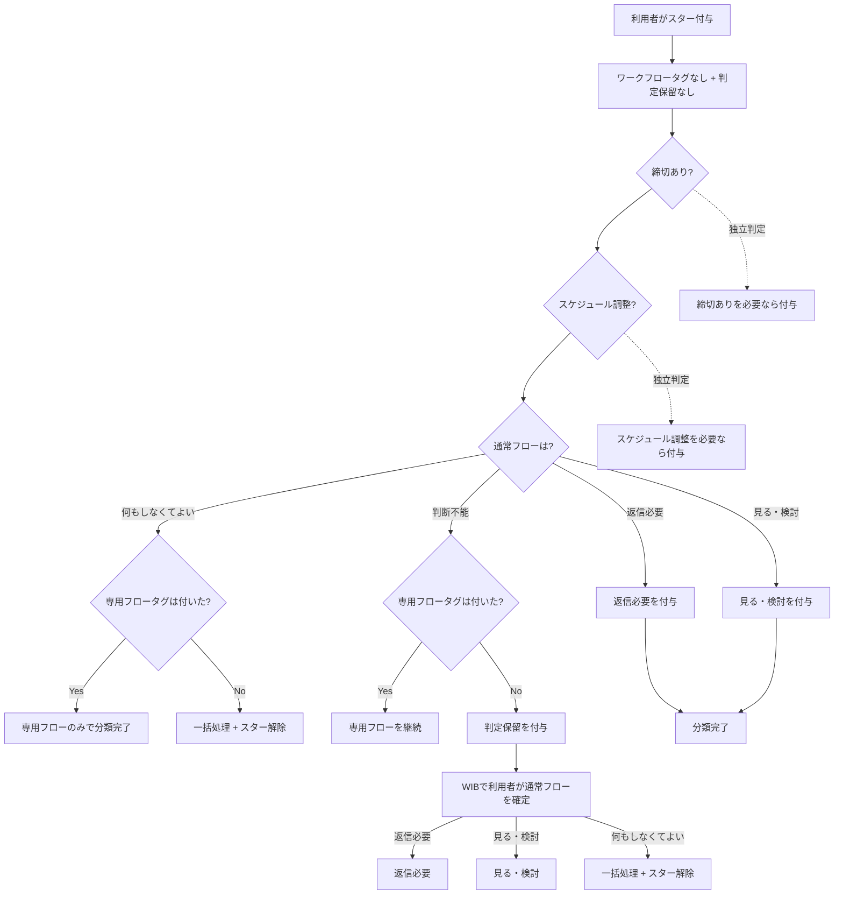
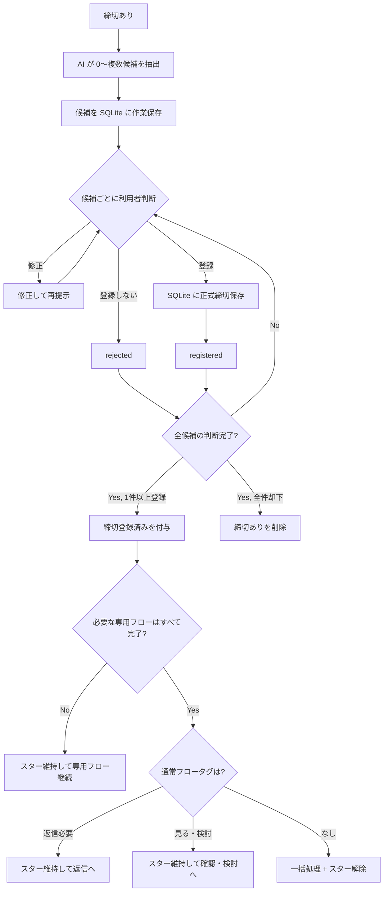
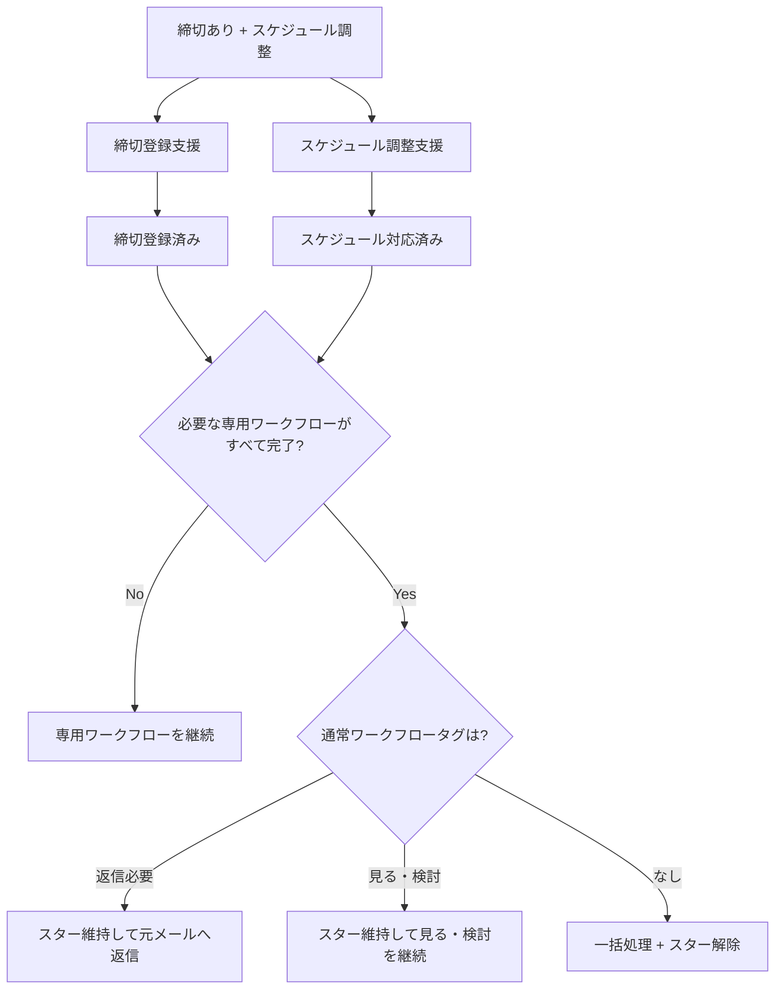

# WorkInBox 設計書

## 概要

WorkInBox は Thunderbird を補完するための業務支援システムである。

Thunderbird のメール運用を変更せず、

- メール分類
- 締切登録支援
- スケジュール調整支援
- 待機案件管理

を行う。

Thunderbird は業務実行環境であり、WorkInBox は業務整理環境である。

WorkInBox は独立した TODO / プロジェクト管理ツールを目指さない。

利用者に新たな仕事入力を強制せず、既に存在するメールから発生する仕事を整理することを目的とする。

---

## 基本方針

### Thunderbird を置き換えない

メールの閲覧、送信、返信、アーカイブは Thunderbird で行う。

WorkInBox は分類、締切登録支援、スケジュール調整支援、待機状態整理などを担当する。

### 正本を用途ごとに分ける

- メール本文・メール日時・Message-ID 等のメール情報はメールサーバ上のメールを正本とする。
- WorkInBox の内部状態と正式登録された締切データは SQLite を正本とする。
- WorkInBox の IMAP 作業タグはメールサーバ上の IMAP keyword を正本とする。
- WorkInBox が対象とする IMAP server / account / mailbox は `config.yaml` の `imap` 設定を正本とする。
- 締切を Thunderbird に表示するための iCalendar (`.ics`) / `VTODO` は SQLite から生成する派生データとする。

### AI は整理役である

AI は分類や抽出を支援する。

AI による初期ワークフロータグ判定は自動で IMAP タグへ反映するが、最終的な判断・修正は利用者が行う。

特に `締切あり`・`スケジュール調整` は、重要な専用対応の見逃しを減らすため再現率を重視して判定する。

専用ワークフローに該当しないメールについては、通常フローとして `返信必要`、`見る・検討`、`何もしなくてよい` のいずれかを判定する。

`何もしなくてよい` と判断できたメールは `一括処理` を付けてスターを外し、整理対象へ進める。

専用ワークフローのいずれにも該当せず、かつ通常フローを `返信必要`、`見る・検討`、`何もしなくてよい` のいずれにも確定できない場合だけ `判定保留` とし、利用者が分類を確定する。

---

## メール管理の考え方

WorkInBox は案件を直接管理しない。

利用者が現在注目すべきメールを管理する。

スターは、利用者が「このメールに着眼し、放置せず確認・対応する」と判断したことを表す。どのメールに着眼するかの起点は利用者が決める。

返信や対応により新しいメールが到着した場合、着眼点は新しいメールへ移る。

TriageBox が着眼点を旧メールから新しいメールへ移した場合、原則として旧着眼点へ `一括処理` を付け、スターを外す。新しい着眼点には次の作業を表すタグとスターを付ける。

`一括処理` + スターなしは「現在の作業対象ではなく、Thunderbird で確認後にアーカイブしてよい候補」を表す。利用者がまだ終わっていないと判断した場合はスターを付け直し、アーカイブ対象から外す。

ただし、未完了の専用ワークフローの起点として残す必要があるメールは、会話上の着眼点が移ってもスターを維持し、`一括処理` にしない場合がある。

締切についてはメールとは独立した正式データを SQLite に保持し、締切と起点メールを Message-ID 等の安定した識別情報で関連付ける。

メールスレッド全体や案件をまとめる Context は将来拡張とする。

---

## システム構成

WorkInBox は次の 3 つの主要構成要素からなる。

1. **WIB Web UI + Thunderbird Extension**
2. **TrackingBox**
3. **TriageBox**

基本的な責務分担は次のとおりである。

```text
WIB Web UI + Thunderbird Extension
  = 利用者判断・ワークフロー操作・Thunderbird との接続

TrackingBox
  = 意味・分類・優先順位・再評価

TriageBox
  = 事実・関係・決定的な状態遷移
```

### WIB Web UI + Thunderbird Extension

利用者との接点と Thunderbird との橋渡しを担当する。

主な役割:

- 専用ワークフローの画面表示と利用者操作
- `判定保留` や `返信待ち` など、利用者判断が必要な状態の表示・変更
- `返信待ち` の優先順位表示と定期レビュー
- WIB から Thunderbird の対象メールを開く
- Thunderbird 側で必要な Quick Filter 作業ビューを開く
- WIB が意味を知っている送信メールへ、必要に応じて relation や用途を示す拡張ヘッダーを付ける

WIB Web はメール本文を編集・送信する独自メールクライアントにはしない。メール本文の作成、返信、送信は Thunderbird の標準機能を使う。

### TrackingBox

主に、現在注目しているメールについて意味を解釈し、整理する。

主な役割:

- 初期ワークフロータグの AI 判定
- `判定保留` の整理支援
- 締切登録支援
- スケジュール調整支援
- 支援者への依頼メール作成支援
- 送信後のメールについて `返信待ち` が本当に必要かを AI で判定する
- `返信待ち` を定期的に再評価する
- `返信待ち` の優先順位を計算し WIB 上で提示する

TrackingBox は、単にタグを付けるだけでなく、現在注目すべきメールの意味と順番を整理する。

TrackingBox の対象となるスターは、利用者が Thunderbird 上で付与する。スターは利用者による着眼の判断を表し、TrackingBox や TriageBox が未着眼メールを自動的に作業対象へ取り込むための入口にはしない。

### TriageBox

主に、新しく観測したメールについて事実・関係・決定的な状態遷移を扱う。

主な役割:

- 未読メールの取り込み
- 広告メール判定
- 自分が送信したメールの検出
- 返信メールの検出
- `In-Reply-To` / `References` / relation による前後関係の確認
- `返信待ち` / `対応待ち` への返信検出
- relation に基づく着眼点移動
- 旧着眼点への `一括処理` 付与とスター解除など、relation から決定できる状態遷移

TriageBox はメールを既読にしない。

TriageBox が新たな着眼点へスターを付けるのは、利用者がすでに着眼したメールから relation に基づいて着眼点を移すなど、既存の利用者判断を引き継ぐ決定的な状態遷移の場合に限る。未着眼メールについて新たに着眼するかどうかは利用者が判断する。

---

## タグ体系

### 参照タグ

- `重要`

`重要` は作業状態ではなく、後から参照する価値があるメールを示す。スターや他のタグとは独立し、アーカイブ後も保持してよい。

### 専用ワークフロータグ

- `締切あり`
- `スケジュール調整`

専用ワークフロータグは、そのメールを起点として対応する専用ワークフローを開始する必要があることを表す。

`締切あり` と `スケジュール調整` は互いに独立して判定する。両方付いてよく、片方だけ付いてもよく、どちらも付かなくてもよい。

したがって専用ワークフロータグだけを見ると、初期状態は次の 4 種類である。

- どちらも付かない
- `締切あり`
- `スケジュール調整`
- `締切あり` + `スケジュール調整`

専用ワークフローが進むにつれて、処理完了タグ、待機タグ、履歴タグ、整理タグが付与される。

### 通常ワークフロータグ

- `返信必要`
- `見る・検討`

通常ワークフロータグは、そのメールについて行う通常の作業を表す。

`返信必要` と `見る・検討` は排他的であり、同じメールに両方を付けない。片方だけ付いてもよく、どちらも付かなくてもよい。

したがって通常ワークフロータグだけを見ると、初期状態は次の 3 種類である。

- どちらも付かない
- `返信必要`
- `見る・検討`

通常ワークフロータグがどちらも付かないこと自体は正常な状態である。たとえば専用ワークフローだけが必要なメールや、専用ワークフローにも通常ワークフローにも該当せず `何もしなくてよい` と判断できたメールがある。

`何もしなくてよい` は新しい通常ワークフロータグとしては持たず、専用ワークフローも不要であることを確認したうえで `一括処理` + スターなしへ進める。

通常ワークフロータグは専用ワークフロータグとは独立している。このため、たとえば `返信必要` + `締切あり`、`返信必要` + `スケジュール調整`、`返信必要` + `締切あり` + `スケジュール調整` を認める。

通常ワークフローが進むにつれて、待機タグ、整理タグが付与される。

### 判定状態タグ

- `判定保留`

`判定保留` は、`締切あり` と `スケジュール調整` のどちらにも該当せず、かつ通常フローを `返信必要`、`見る・検討`、`何もしなくてよい` のいずれにも確定できない場合に付与する。

`締切あり`・`スケジュール調整` は見逃しを減らすため再現率を重視して先に判定する。このため `判定保留` の利用者確認では、原則として専用ワークフローを再分類するのではなく、通常フローを確定する。

利用者は WIB 上で `判定保留` のメールを確認し、次のいずれかに分類する。

- `返信必要`
- `見る・検討`
- `何もしなくてよい` → `一括処理` を付けてスターを外す

`判定保留` と、専用ワークフロータグまたは通常ワークフロータグを同時に付けることは認めない。

利用者が分類を確定した時点で `判定保留` を外す。

### 処理完了タグ

- `締切登録済み`
  - `締切あり` メールについて、必要な締切候補すべての判断を終え、1 件以上を SQLite に正式登録したことを示す。
- `スケジュール対応済み`
  - `スケジュール調整` メールについて、必要なスケジュール対応が完了したことを示す。

処理完了タグは、対応する専用ワークフロータグを消す代わりではなく、その専用ワークフローが完了したことを示す。

処理完了タグを付与したときは、そのメールに必要な専用ワークフローがすべて完了したかを確認する。

- 他の専用ワークフローがまだ未完了の場合は、専用ワークフロー起点としてスターを維持する。
- 必要な専用ワークフローがすべて完了し、`返信必要` が付いている場合はスターを維持し、返信作業へ進める。
- 必要な専用ワークフローがすべて完了し、`見る・検討` が付いている場合はスターを維持し、確認・検討作業へ進める。
- 必要な専用ワークフローがすべて完了し、`返信必要` も `見る・検討` も付いていない場合は `一括処理` を付けてスターを外す。

### 待機タグ

- `返信待ち`
- `対応待ち`

`返信待ち` は利用者が送信したメールに対して相手からの返信を待つ状態、`対応待ち` は支援者へ依頼した作業の結果を待つ状態を表す。

### 履歴タグ

- `依頼済み`

元メールについて、支援者へ作業依頼を送信し、その依頼メールを TriageBox が同期で確認した履歴を示す。完了状態ではなく、通常は解除しない。

### 整理タグ

- `一括処理`

`一括処理` は現在の作業対象から外れたメールをアーカイブ候補として示す。

TriageBox が relation に基づいて着眼点を新しいメールへ移した場合、原則として旧着眼点へ `一括処理` を付けてスターを外す。

`一括処理` が付いていてスターが付いていないメールは Thunderbird で一括アーカイブする対象とする。利用者がまだ処理継続が必要と判断した場合はスターを付け直す。

---

## Thunderbird の役割

Thunderbird は以下を担当する。

- メール閲覧
- メール送信
- メール返信
- アーカイブ
- WorkInBox が提供する締切情報の閲覧
- WIB 専用 Quick Filter 作業ビューで現在注目すべきメールを一覧処理する

専用ワークフローそのものは WIB で進める。Thunderbird は、専用ワークフローの途中で必要になる元メールの確認、依頼メールや返信メールの送信、待機状態の確認、最終的なアーカイブを担当する。

WorkInBox 由来の締切の追加・修正・削除は WorkInBox で行い、Thunderbird はメール業務の実行と締切情報の参照に使う。

### WIB 専用 Quick Filter 作業ビュー

通常利用中の INBOX タブの Quick Filter 状態を壊さないため、WIB 専用のメールタブを使用する。

WIB 作業ビューが対象とする IMAP account / mailbox は `config.yaml` の `imap` 設定を正本とする。利用者が Thunderbird Extension 側で同じ対象アカウントを選択・保存する必要はない。

作業ビューを開く際、Extension は WIB Web から `host` / `port` / `username` / `mailbox` を取得し、Thunderbird 内の対応する IMAP アカウントを自動解決する。解決できない場合や複数候補になる場合は、別アカウントへ自動フォールバックしない。

WIB 専用タブは作業ビュー間で再利用し、タブを閉じた場合だけ次回利用時に再作成する。

作業ビューは次の 7 種類を基本とする。

- `返信必要` = `wib-answer` AND スター付き
- `締切あり` = `wib-deadline` AND スター付き
- `スケジュール調整` = `wib-schedule` AND スター付き
- `見る・検討` = `wib-review` AND スター付き
- `返信待ち` = `wib-waiting-reply` AND スター付き
- `対応待ち` = `wib-waiting-action` AND スター付き
- `一括処理` = `wib-bulk` AND スターなし

ビューを切り替えると同じ専用タブの Quick Filter 条件を変更し、タブ名も `WIB:返信必要`、`WIB:締切あり` のように現在のビューへ追随させる。

スターは「現在注目すべきメール」を示す。ワークフロータグが履歴として残っていても、同期や TriageBox によりスターが外れれば、そのメールは `タグ AND スター付き` の作業ビューから自然に外れる。

`WIB:一括処理` は例外的にスターなしを対象とし、利用者が確認後にまとめてアーカイブするために使う。まだ終わっていないメールはスターを付け直してこのビューから外す。

Thunderbird 固有の実装詳細は `docs/thunderbird_bridge.md` を参照する。

---

## Thunderbird での利用者の運用フロー

この節では、Thunderbird と WIB の役割を次のように分ける。

- **専用ワークフロー** (`締切あり` / `スケジュール調整`) は WIB で開始し、WIB の画面・状態遷移に従って進める。
- **通常ワークフロー** (`返信必要` / `見る・検討`) は主に Thunderbird でメールを見ながら進める。
- 専用ワークフローの途中でメールの閲覧・送信・返信が必要になった場合は Thunderbird を使うが、専用ワークフローの進行状態と完了判定は WIB が管理する。
- `判定保留` は WIB 上で利用者が `返信必要` / `見る・検討` / `何もしなくてよい` のいずれかへ整理する。
- `返信待ち` は WIB 上で優先順位・AI 判定を確認し、必要に応じて Thunderbird で対象メールを開いて催促等を行う。
- `対応待ち` / `一括処理` は Thunderbird の WIB 専用 Quick Filter 作業ビューでも確認・整理できる。

### A. INBOX 内のスターなしメール

1. 未読メールをざっと読んで振り分ける。
   - 対応が必要そうなメールはスターを付ける。
   - それ以外はアーカイブする。
2. 既読かつタグなしのメールも、可能であれば同様に振り分ける。
3. `一括処理` + スターなしのメールは `WIB:一括処理` 等で確認した上でまとめてアーカイブする。
   - 対応がまだ必要な場合はスターを付け直す。

### B. INBOX 内のスター付きメール

スター付きメールは、通常ワークフローと専用ワークフローを分けて処理する。

1. `判定保留` は WIB の TrackingBox `判定保留` 一覧で利用者が `返信必要` / `見る・検討` / `何もしなくてよい` のいずれかへ再分類する。
   - `何もしなくてよい` と判断した場合は `一括処理` を付けてスターを外す。
2. `締切あり` が付いている場合は、WIB の締切ワークフローを開き、締切候補の確認・登録などを進める。
3. `スケジュール調整` が付いている場合は、WIB のスケジュール調整ワークフローを開き、自分で対応するか支援者へ依頼するか等の状態遷移を進める。
4. `返信必要` が付いている場合は、専用ワークフローの進行状況も確認しつつ、返信可能な段階で Thunderbird から元メールへ返信する。
5. `見る・検討` が付いている場合は、Thunderbird で内容を読み、必要な確認・検討を行う。
6. `返信待ち` は WIB 上で優先順位や経過を確認し、必要に応じて Thunderbird で対象メールを開いて催促する。
7. `対応待ち` は `WIB:対応待ち` ビュー等から支援者の対応状況を確認する。
8. `一括処理` + スターなしは `WIB:一括処理` で確認し、問題なければまとめてアーカイブする。

専用ワークフロータグと通常ワークフロータグは独立しているため、同じメールが複数の作業対象になることがある。専用ワークフローが未完了の場合は WIB でそのフローを進め、通常ワークフローは適切なタイミングで Thunderbird から実行する。

---

## TrackingBox

### 対象

- INBOX 内のスター付き active メール

### 基本動作

専用ワークフロータグ、通常ワークフロータグ、`判定保留` のいずれも付いていないスター付きメールについて AI によるタグ付け支援を行い、その結果を IMAP タグへ自動反映する。

その後、付与されたタグに応じて通常ワークフローと必要な専用ワークフローを進める。専用ワークフローにも通常ワークフローにも該当せず `何もしなくてよい` と判断できたメールは `一括処理` + スターなしへ進める。

TrackingBox は `返信待ち` メールについて、送信後の要否判定、定期的な再評価、優先順位付けも担当する。`返信待ち` の詳細な管理方針は `docs/workinbox_components_and_waiting_review_2026-08-13.md` を参照する。

---

## タグ付け支援

AI は専用ワークフローと通常ワークフローを独立した軸として判定する。

1. `締切あり` の必要性を判定する。
   - 見逃しコストが高いため再現率を重視する。
2. `スケジュール調整` の必要性を独立して判定する。
   - 見逃しコストが高いため再現率を重視する。
   - `締切あり` と同時に付与してよい。
3. 通常フローとして `返信必要`、`見る・検討`、`何もしなくてよい` のいずれかを判定する。
   - `返信必要` と `見る・検討` は同時に付与しない。
   - 専用ワークフロータグが付いていても、必要なら `返信必要` または `見る・検討` を付与する。
   - `何もしなくてよい` はタグとして保持しない。
4. 専用ワークフロータグが 1 つも付かず、通常フローを `何もしなくてよい` と確定できた場合は `一括処理` を付けてスターを外す。
5. 専用ワークフロータグが 1 つも付かず、かつ通常フローを `返信必要`、`見る・検討`、`何もしなくてよい` のいずれにも確定できない場合だけ `判定保留` を付与する。

AI の結果についてタグ付与前の利用者確認は必須としない。

すでに専用ワークフロータグ、通常ワークフロータグ、または `判定保留` が付いているメールは通常は自動再分類しない。

---

## 判定保留の確認・再分類

TrackingBox に `判定保留` メールだけを集めた一覧を用意し、WIB Web 上で利用者が整理する。

`判定保留` は、専用ワークフローに該当しないことを AI が先に判定したうえで、通常フローだけを確定できなかった状態である。

利用者は対象メールを確認し、次の 3 種類から選ぶ。

- `返信必要`
- `見る・検討`
- `何もしなくてよい`

`返信必要` または `見る・検討` を選んだ場合は、WorkInBox が IMAP 上で `判定保留` を外して選択した通常ワークフロータグを付与する。

`何もしなくてよい` を選んだ場合は、`判定保留` を外し、`一括処理` を付けてスターを外す。

---

## 締切登録支援

詳細設計は `docs/deadline_support_discussion_2026-08-10.md` を参照する。

### 対象

- `締切あり` が付いている。
- `締切登録済み` が付いていない。

### 正本

正式登録された締切データは SQLite を正本とする。

Thunderbird 向けの `.ics` / VTODO は SQLite から生成する派生データである。

### AI 抽出

1 通のメールから 0 件以上の締切候補を抽出する。

1 通に複数の締切が存在する場合は複数候補として扱う。

AI が締切の存在を認識しても日付を特定できない場合は、日付未確定候補として残し、利用者が入力できるようにする。

AI の推定確信度が低い場合は `要確認` を表示する。

### 候補に対する操作

各候補について次の操作を行えるようにする。

#### 登録しない

その候補を却下する。

候補 1 件を却下しただけでは `締切あり` を削除しない。

#### 修正する

タイトル、締切日、時刻等を修正し、修正後の候補提示へ戻る。

#### 登録する

候補を正式な締切として SQLite に保存する。

SQLite への保存成功をもって、その候補を登録済みとする。

### 利用者による締切追加

AI 候補とは別に、対象メールを起点として利用者が締切を追加できるようにする。

追加締切も起点となったメールと安定した識別情報で関連付ける。

### 候補の作業状態

作業中は候補ごとに、少なくとも以下を管理する。

- `pending`
- `registered`
- `rejected`

未確定候補は作業再開のため SQLite に一時保存してよい。

処理完了後、不要な候補作業データは整理・削除してよい。

正式登録された締切は SQLite に長期保持する。

### `締切登録済み` の判定

すべての候補について利用者判断が完了した時点で判定する。

- 1 件以上 `registered` がある場合
  - `締切あり` は残す。
  - `締切登録済み` を自動付与する。
- 全候補が `rejected` で、利用者が登録すべき締切は存在しないと判断した場合
  - `締切あり` を削除する。
  - `締切登録済み` は付けない。

1 件登録した時点ではなく、必要な候補すべての判断が完了してから `締切登録済み` を付ける。

`締切登録済み` を付けた時点で、他の専用ワークフローも含めて必要な専用ワークフローがすべて完了している場合は、通常ワークフロータグを確認する。`返信必要` も `見る・検討` も付いていなければ `一括処理` を付けてスターを外す。

### 日付・時刻

- 日付だけ記載されている場合は日付締切として扱う。
- 時刻が明記されている場合は時刻まで保持する。
- タイムゾーンは設定値を基本とし、通常は JST を想定する。
- 年が省略されている場合は、メール送信日時以後に到来する最初の該当日付として補完する。
- 締切日時は、その時点までに作業を終える必要がある日時を表す。

### Message-ID との関連

締切とメールの関連は Message-ID 等の安定した識別情報を基本とする。

メールスレッドや案件単位の Context は導入せず、将来拡張として扱う。

### ICS / VTODO

SQLite の正式締切から `.ics` を生成し、各締切を VTODO として表現する。

共通カテゴリ例:

```text
CATEGORIES:WorkInBox,WIB-Deadline
```

元メールを探しやすいよう DESCRIPTION には少なくとも次の情報を含める。

```text
--- WorkInBox Source ---
Message-ID: <abc123@example.com>
Mail-Date: 2026-08-10T08:30:00+09:00
From: sender@example.com
Subject: ○○学会 論文募集
```

機械可読な補助情報として以下を候補とする。

```text
X-WORKINBOX-DEADLINE-ID:123
X-WORKINBOX-MESSAGE-ID:<abc123@example.com>
X-WORKINBOX-MAIL-DATE:2026-08-10T08:30:00+09:00
```

VTODO の `UID` は SQLite の deadline id から安定生成する。

例:

```text
UID:wib-deadline-123@workinbox
```

同じ SQLite 締切から `.ics` を再生成しても同じ UID になるようにする。

---

## スケジュール調整支援

詳細な返信・着眼点遷移は `docs/schedule_reply_workflow_2026-08-12.md` を参照する。

### WIB Web の対象

WIB Web の「スケジュール調整」一覧は、未着手のスケジュール調整について、利用者が「自分で対応する」か「支援者へ依頼する」かを判断・実行する入口とする。

表示条件は次のとおり。

```text
wib-schedule
AND NOT wib-requested
AND NOT wib-schedule-done
```

### 自分で対応する

利用者自身で予定確認、日程調整、予定入力等を行う。

必要なスケジュール対応が完了したら、WIB Web の完了操作によって `スケジュール対応済み` を付ける。

支援者への依頼を行っていないため `依頼済み` は付けない。

`スケジュール対応済み` を付けた時点で、他の専用ワークフローも含めて必要な専用ワークフローがすべて完了している場合は、通常ワークフロータグを確認する。`返信必要` も `見る・検討` も付いていなければ `一括処理` を付けてスターを外す。

### 支援者へ依頼する

1. WorkInBox が支援者への依頼メール作成を支援する。
2. 利用者が Thunderbird で依頼メールを送信する。この時点では元メールへ `依頼済み` を付けない。
3. 自分宛て/Cc の依頼メールが INBOX に到着する。
4. 次回の通常同期で TriageBox が依頼メールを取り込み、起点メールとの relation を確認する。
5. TriageBox が元メールへ `依頼済み` を付ける。
6. TriageBox が依頼メールへスター + `対応待ち` を付ける。
7. `依頼済み` が付いた元メールは WIB Web の「スケジュール調整」一覧から外れるが、スケジュール調整が完了するまではスターを維持する。
8. 支援者から返信が来たら、依頼メールを `一括処理` + スターなしへ移し、最新返信メールを `返信必要` + スターにする。
9. 支援者返信へ `スケジュール調整` は付けない。
10. 支援者からの返信を確認した後、利用者が WIB で「追加で質問・回答する」か「終了にする」かを決める。

`依頼済み` は依頼履歴であり、`スケジュール対応済み` の代わりにはならない。

### 支援者との追加の質問・回答を続ける場合

利用者は支援者とのやり取りを継続する。

スケジュール調整として必要な作業が終わるまでは、起点メールの `スケジュール調整` とスターを維持する。

### 支援作業を終了する場合

利用者が WIB で「終了にする」を選んだ時点で、起点メールへ `スケジュール対応済み` を付ける。

終了時には、支援者へお礼メールを送るかどうかを選べるようにする。お礼メールを送る場合の返信待ち不要判定や後処理方法は別途設計する。

`スケジュール対応済み` を付けた後、他の専用ワークフローも含めて必要な専用ワークフローがすべて完了しているかを確認する。

- 起点メールに `返信必要` が付いている場合は、スターを維持して元メールへの返信作業へ進む。
- 起点メールに `見る・検討` が付いている場合は、スターを維持して確認・検討作業へ進む。
- `返信必要` も `見る・検討` も付いていない場合は、`一括処理` を付けてスターを外す。

---

## 専用ワークフロー完了判定

`締切あり` と `スケジュール調整` は独立しているため、各専用ワークフローを独立して完了判定する。

- `締切あり` が付いている場合は `締切登録済み` が必要。
- `スケジュール調整` が付いている場合は `スケジュール対応済み` が必要。

例:

- `締切あり` + `締切登録済み` → 締切登録ワークフロー完了
- `スケジュール調整` + `スケジュール対応済み` → スケジュールワークフロー完了
- `締切あり` + `スケジュール調整` + `締切登録済み` → スケジュールワークフロー未完了
- 両専用ワークフロータグ + 両処理完了タグ → 必要な専用ワークフローがすべて完了

専用ワークフローの完了は通常ワークフロータグとは独立して扱う。

---

## 専用ワークフロー完了時の遷移

通常ワークフロータグは初期分類時に専用ワークフロータグとは独立して判定しておく。

そのため、専用ワークフロー完了後に AI が元メールを再分類して次の作業を決め直すことは原則として行わない。

専用ワークフローの処理完了タグを付けるたびに、必要な専用ワークフローがすべて完了したかを確認する。

- 他の専用ワークフローが未完了の場合
  - スターを維持し、残っている専用ワークフローを継続する。
- 必要な専用ワークフローがすべて完了し、`返信必要` が付いている場合
  - スターを維持し、元メールへ返信する通常ワークフローを進める。
- 必要な専用ワークフローがすべて完了し、`見る・検討` が付いている場合
  - スターを維持し、内容確認・検討の通常ワークフローを進める。
- 必要な専用ワークフローがすべて完了し、`返信必要` も `見る・検討` も付いていない場合
  - `一括処理` を付けてスターを外す。

この遷移は、専用ワークフロー完了後に別の AI 再分類を行うことを前提としない。初期分類で確定した通常ワークフロータグをそのまま次の作業判断に使う。

---

## TriageBox

詳細な判定順序と Message-ID 系ヘッダの扱いは `docs/triagebox_decision_flow.md` を参照する。

### 対象

- INBOX 内の未読メール

### 基本動作

TriageBox は未読メールを監視し、

- 自分が送信したメールか
- 既存メールへの返信か
- 新規受信メールか

をヘッダと既存状態から先に判定する。

AI による広告メール判定は、この関係判定の結果として `新規受信メール` と確定したメールだけに行う。

### 自分宛て備忘メール

利用者自身が LINE、Teams、Slack、口頭等から発生した仕事を自分宛てメールとして送る運用を正式な入力経路として扱う。

`From` が利用者自身であることだけを理由に `返信待ち` を付与しない。

### 返信待ちへの返信

新しい未読メールが `返信待ち` メールへの返信である場合、元メールから新しいメールへ着眼点を移す。

元の `返信待ち` メールは待機対象から外し、原則として `一括処理` + スターなしにする。新しい返信メールは `返信必要` + スターとする。

### 対応待ちへの返信

新しい未読メールが `対応待ち` メールへの返信である場合、支援者依頼メールから新しい返信メールへ着眼点を移す。

支援者依頼メールは `対応待ち` を履歴として残し、`一括処理` + スターなしにする。新しい返信メールは `返信必要` + スターとする。

未完了のスケジュール支援起点メールは例外としてスターを維持し、`一括処理` にはしない。

---

## メールワークフロー

### AI タグ判定



### 締切登録支援



### 締切あり + スケジュール調整



---

## ダッシュボード

ダッシュボードは利用者が現在抱えている仕事の状況を集約表示する。

候補項目:

- `判定保留` 件数
- `締切あり` 件数
  - `締切登録済み` でない件数
- `スケジュール調整` 件数
  - `依頼済み` でも `スケジュール対応済み` でもない件数を WIB の未着手一覧として扱う
- `返信必要` 件数
- `見る・検討` 件数
- `返信待ち` 件数
- `対応待ち` 件数
- `一括処理` + スターなし件数
- 7 日以内の正式締切件数
- 今日の正式締切件数
- 今日の予定

締切件数は IMAP タグだけでなく SQLite の正式締切データを基準に集計する。

---

## 関連文書

- `docs/workinbox_components_and_waiting_review_2026-08-13.md`
- `docs/triagebox_decision_flow.md`
- `docs/schedule_reply_workflow_2026-08-12.md`
- `docs/deadline_support_discussion_2026-08-10.md`
- `docs/design_notes_tags_and_external_intake.md`
- `docs/thunderbird_bridge.md`
- `docs/roadmap.md`
