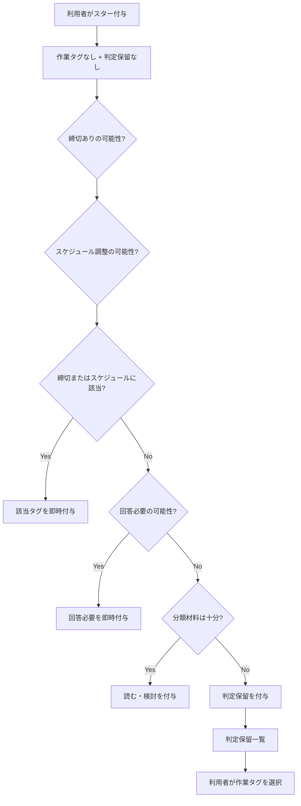
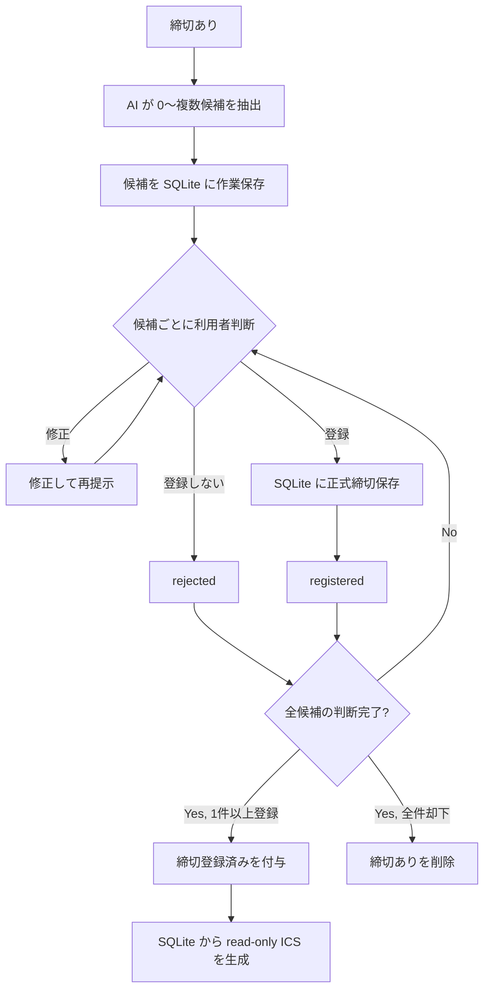
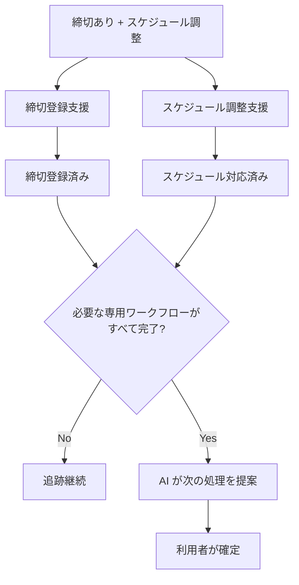

# WorkInBox 設計書

## 概要

WorkInBox は Thunderbird を補完するための業務支援システムである。

Thunderbird のメール運用を変更せず、

- メール分類
- 締切登録支援
- スケジュール調整支援
- 待機案件管理

を行う。

Thunderbird は業務実行環境であり、WorkInBox は業務整理環境である。

WorkInBox は独立した TODO / プロジェクト管理ツールを目指さない。

利用者に新たな仕事入力を強制せず、既に存在するメールから発生する仕事を整理することを目的とする。

---

## 基本方針

### Thunderbird を置き換えない

メールの閲覧、送信、返信、アーカイブは Thunderbird で行う。

WorkInBox は分類、締切登録支援、スケジュール調整支援、待機状態整理などを担当する。

### 正本を用途ごとに分ける

- メール本文・メール日時・Message-ID 等のメール情報はメールサーバ上のメールを正本とする。
- WorkInBox の内部状態と正式登録された締切データは SQLite を正本とする。
- WorkInBox の IMAP 作業タグはメールサーバ上の IMAP keyword を正本とする。
- WorkInBox が対象とする IMAP server / account / mailbox は `config.yaml` の `imap` 設定を正本とする。
- 締切を Thunderbird に表示するための iCalendar (`.ics`) / `VTODO` は SQLite から生成する派生データとする。

v0.2 では Thunderbird は WorkInBox が提供する `.ics` を読み取り専用で購読する。

Thunderbird 側で行った VTODO の変更を WorkInBox へ逆同期することは行わない。CalDAV は v0.2 の対象外とする。

### AI は整理役である

AI は分類や抽出を支援する。

AI による初期作業タグ判定は自動で IMAP タグへ反映するが、最終的な判断・修正は利用者が行う。

特に `締切あり`・`スケジュール調整`・`回答必要` は、重要な対応の見逃しを減らすため再現率を重視して判定する。

通常の曖昧さは重要側へ倒して判定するが、本文欠損、強い文脈依存、添付依存など、分類に必要な材料自体が不足している場合は `判定保留` とする。

---

## メール管理の考え方

WorkInBox は案件を直接管理しない。

利用者が現在注目すべきメールを管理する。

返信や対応により新しいメールが到着した場合、着眼点は新しいメールへ移る。

TriageBox が着眼点を旧メールから新しいメールへ移した場合、原則として旧着眼点へ `一括処理` を付け、スターを外す。新しい着眼点には次の作業を表すタグとスターを付ける。

`一括処理` + スターなしは「現在の作業対象ではなく、Thunderbird で確認後にアーカイブしてよい候補」を表す。利用者がまだ終わっていないと判断した場合はスターを付け直し、アーカイブ対象から外す。

ただし、未完了の専用ワークフローの起点として残す必要があるメールは、会話上の着眼点が移ってもスターを維持し、`一括処理` にしない場合がある。

締切についてはメールとは独立した正式データを SQLite に保持するが、v0.2 では締切と起点メールの関連単位を Message-ID とする。

メールスレッド全体や案件をまとめる Context は将来拡張とする。

---

## システム構成

WorkInBox は大きく TrackingBox と TriageBox から構成される。

### TrackingBox

スター付きメールを対象とする。

主な役割:

- タグ付け支援
- 判定保留の確認
- 締切登録支援
- スケジュール調整支援
- 支援者への依頼メール作成支援

現時点では TrackingBox の対象となるスターは利用者が Thunderbird 上で付与する。

スターが付いている時点で「このメールは放置せず、何らかの形で確認・対応する価値がある」という利用者判断が一段入っているものとする。

### TriageBox

未読メールを対象とする。

主な役割:

- 広告メール判定
- 自分が送信したメールの検出
- 返信メールの検出
- 返信待ち案件の追跡
- 対応待ち案件の追跡
- relation に基づく着眼点移動と旧着眼点の整理

TriageBox はメールを既読にしない。

将来 TriageBox がスター付与まで自動化する場合は、「非スパムならすべて TrackingBox 対象」とせず、TrackingBox へ送るべきメールかどうかの入口判定を別途設計する。

---

## タグ体系

### 参照タグ

- `重要`

`重要` は作業状態ではなく、後から参照する価値があるメールを示す。スターや他の作業タグとは独立し、アーカイブ後も保持してよい。

### 作業タグ

- `締切あり`
- `スケジュール調整`
- `回答必要`
- `読む・検討`

#### 作業タグの重複ルール

- `締切あり` と `スケジュール調整` は重複可能。
- `回答必要` は `締切あり`・`スケジュール調整`・`読む・検討` とは重複させない。
- `読む・検討` は `締切あり`・`スケジュール調整`・`回答必要` とは重複させない。

初期分類として許可する作業タグの組み合わせは原則として以下である。

- `締切あり`
- `スケジュール調整`
- `締切あり` + `スケジュール調整`
- `回答必要`
- `読む・検討`

### 判定状態タグ

- `判定保留`

`判定保留` は AI がメールの作業内容を分類するために必要な材料が不足している場合に用いる例外的なタグである。

通常の曖昧さに対するフォールバックではない。

本文欠損、強い文脈依存、添付を見ないと判断不能など、入力情報だけでは分類そのものが困難な場合に使用する。

`判定保留` は作業タグとは重複させない。利用者が適切な作業タグを確定した時点で外す。

### 処理完了タグ

- `締切登録済み`
  - `締切あり` メールについて、必要な締切候補すべての判断を終え、1 件以上を SQLite に正式登録したことを示す。
- `スケジュール対応済み`
  - `スケジュール調整` メールについて、必要なスケジュール対応が完了したことを示す。

処理完了タグは、対応する作業タグを消す代わりではなく、その専用ワークフローが完了したことを示す。

### 待機タグ

- `返信待ち`
- `対応待ち`

`返信待ち` は利用者が送信したメールに対して相手からの返信を待つ状態、`対応待ち` は支援者へ依頼した作業の結果を待つ状態を表す。

### 履歴タグ

- `依頼済み`

元メールについて、支援者へ作業依頼を送信し、その依頼メールを TriageBox が同期で確認した履歴を示す。完了状態ではなく、通常は解除しない。

### 整理タグ

- `一括処理`

`一括処理` は現在の作業対象から外れたメールをアーカイブ候補として示す。

TriageBox が relation に基づいて着眼点を新しいメールへ移した場合、原則として旧着眼点へ `一括処理` を付けてスターを外す。

`一括処理` が付いていてスターが付いていないメールは Thunderbird で一括アーカイブする対象とする。利用者がまだ処理継続が必要と判断した場合はスターを付け直す。

---

## Thunderbird の役割

Thunderbird は以下を担当する。

- メール閲覧
- メール送信
- メール返信
- アーカイブ
- WorkInBox が提供する読み取り専用 `.ics` の購読
- WorkInBox が登録した締切の閲覧
- WIB 専用 Quick Filter 作業ビューで現在注目すべきメールを一覧処理する

v0.2 では WorkInBox 由来の締切の追加・修正・削除は WorkInBox で行う。

Thunderbird 側の VTODO 編集を WorkInBox へ戻す双方向同期は行わない。

### WIB 専用 Quick Filter 作業ビュー

v0.2 では、通常利用中の INBOX タブの Quick Filter 状態を壊さないため、WIB 専用のメールタブを 1 枚だけ使用する。

WIB 作業ビューが対象とする IMAP account / mailbox は `config.yaml` の `imap` 設定を正本とする。利用者が Thunderbird Extension 側で同じ対象アカウントを選択・保存する必要はない。

作業ビューを開く際、Extension は WIB Web から `host` / `port` / `username` / `mailbox` を取得し、Thunderbird 内の対応する IMAP アカウントを自動解決する。解決できない場合や複数候補になる場合は、別アカウントへ自動フォールバックしない。

WIB 専用タブは作業ビュー間で再利用し、タブを閉じた場合だけ次回利用時に再作成する。

作業ビューは次の 7 種類を基本とする。

- `回答必要` = `wib-answer` AND スター付き
- `締切あり` = `wib-deadline` AND スター付き
- `スケジュール調整` = `wib-schedule` AND スター付き
- `読む・検討` = `wib-review` AND スター付き
- `返信待ち` = `wib-waiting-reply` AND スター付き
- `対応待ち` = `wib-waiting-action` AND スター付き
- `一括処理` = `wib-bulk` AND スターなし

ビューを切り替えると同じ専用タブの Quick Filter 条件を変更し、タブ名も `WIB:回答必要`、`WIB:締切あり` のように現在のビューへ追随させる。

スターは「現在注目すべきメール」を示す。作業タグが履歴として残っていても、同期や TriageBox によりスターが外れれば、そのメールは `タグ AND スター付き` の作業ビューから自然に外れる。

`WIB:一括処理` は例外的にスターなしを対象とし、利用者が確認後にまとめてアーカイブするために使う。まだ終わっていないメールはスターを付け直してこのビューから外す。

Thunderbird 固有の実装詳細は `docs/thunderbird_bridge.md` を参照する。

---

## Thunderbird での利用者の運用フロー

### A. INBOX 内のスターなしメール

1. 未読メールをざっと読んで振り分ける。
   - 対応が必要そうなメールはスターを付ける。
   - それ以外はアーカイブする。
2. 既読かつタグなしのメールも、可能であれば同様に振り分ける。
3. `一括処理` + スターなしのメールは `WIB:一括処理` 等で確認した上でまとめてアーカイブする。
   - 対応がまだ必要な場合はスターを付け直す。

### B. INBOX 内のスター付きメール

日常の一覧処理では WIB 専用 Quick Filter 作業ビューを使い、対象メールを種類ごとに絞り込んで処理する。

1. `判定保留` は TrackingBox の `判定保留` 一覧で利用者が再分類する。
2. `締切あり` / `スケジュール調整` はそれぞれ必要な専用ワークフローを完了させる。
3. `回答必要` は `WIB:回答必要` ビュー等から必要な回答作業を行う。
4. `読む・検討` は `WIB:読む・検討` ビュー等から内容を読んで必要な作業を行う。
5. `返信待ち` かつ一定期間経過したメールは `WIB:返信待ち` ビュー等から必要に応じて催促する。
6. `対応待ち` は `WIB:対応待ち` ビュー等から支援者の対応状況を確認する。

---

## TrackingBox

### 対象

- INBOX 内のスター付き active メール

### 基本動作

作業タグも `判定保留` も付いていないスター付きメールについて AI によるタグ付け支援を行い、その結果を IMAP タグへ自動反映する。

その後、必要に応じて締切登録支援とスケジュール調整支援を行う。

---

## タグ付け支援

AI は以下の順序で判定する。

1. `締切あり` の可能性を判定する。
   - 見逃しコストが高いため再現率を重視する。
2. `スケジュール調整` の可能性を独立して判定する。
   - `締切あり` と同時に付与してよい。
3. 1 または 2 が該当する場合、その結果を IMAP 作業タグとして付与する。
   - この場合 `回答必要` と `読む・検討` は付与しない。
4. `締切あり` と `スケジュール調整` のどちらにも該当しない場合、`回答必要` を判定する。
5. `回答必要` の可能性がある場合は `回答必要` を付与する。
6. いずれにも該当しないと判断できた場合は `読む・検討` を付与する。
7. そもそも分類材料が不足している場合に限り `判定保留` を付与する。

AI の結果についてタグ付与前の利用者確認は必須としない。

すでに作業タグまたは `判定保留` が付いているメールは通常は自動再分類しない。

---

## 判定保留の確認・再分類

TrackingBox に `判定保留` メールだけを集めた一覧を用意する。

利用者は対象メールを確認し、次のいずれかへ分類する。

- `締切あり`
- `スケジュール調整`
- `締切あり` + `スケジュール調整`
- `回答必要`
- `読む・検討`

分類確定後、WorkInBox は IMAP 上で `判定保留` を外し、選択された作業タグを付与する。

---

## 締切登録支援

詳細設計は `docs/deadline_support_discussion_2026-08-10.md` を参照する。

### 対象

- `締切あり` が付いている。
- `締切登録済み` が付いていない。

### 正本

正式登録された締切データは SQLite を正本とする。

Thunderbird 向けの `.ics` / VTODO は SQLite から生成する読み取り専用の派生データである。

### AI 抽出

1 通のメールから 0 件以上の締切候補を抽出する。

1 通に複数の締切が存在する場合は複数候補として扱う。

AI が締切の存在を認識しても日付を特定できない場合は、日付未確定候補として残し、利用者が入力できるようにする。

AI の推定確信度が低い場合は `要確認` を表示する。

### 候補に対する操作

各候補について次の操作を行えるようにする。

#### 登録しない

その候補を却下する。

候補 1 件を却下しただけでは `締切あり` を削除しない。

#### 修正する

タイトル、締切日、時刻等を修正し、修正後の候補提示へ戻る。

#### 登録する

候補を正式な締切として SQLite に保存する。

SQLite への保存成功をもって、その候補を登録済みとする。

### 利用者による締切追加

AI 候補とは別に、対象メールを起点として利用者が締切を追加できるようにする。

v0.2 では追加締切も起点となった Message-ID に紐づける。

### 候補の作業状態

作業中は候補ごとに、少なくとも以下を管理する。

- `pending`
- `registered`
- `rejected`

未確定候補は作業再開のため SQLite に一時保存してよい。

処理完了後、不要な候補作業データは整理・削除してよい。

正式登録された締切は SQLite に長期保持する。

### `締切登録済み` の判定

すべての候補について利用者判断が完了した時点で判定する。

- 1 件以上 `registered` がある場合
  - `締切あり` は残す。
  - `締切登録済み` を自動付与する。
- 全候補が `rejected` で、利用者が登録すべき締切は存在しないと判断した場合
  - `締切あり` を削除する。
  - `締切登録済み` は付けない。

1 件登録した時点ではなく、必要な候補すべての判断が完了してから `締切登録済み` を付ける。

### 日付・時刻

- 日付だけ記載されている場合は日付締切として扱う。
- 時刻が明記されている場合は時刻まで保持する。
- タイムゾーンは設定値を基本とし、通常は JST を想定する。
- 年が省略されている場合は、メール送信日時以後に到来する最初の該当日付として補完する。
- 締切日時は、その時点までに作業を終える必要がある日時を表す。

### Message-ID との関連

v0.2 では締切とメールの関連を Message-ID 単位で保持する。

メールスレッドや案件単位の Context は導入しない。

Context と関連締切一覧は後続バージョンで検討する。

### ICS / VTODO

SQLite の正式締切から読み取り専用 `.ics` を生成する。

各締切は VTODO として表現する。

共通カテゴリ例:

```text
CATEGORIES:WorkInBox,WIB-Deadline
```

元メールを探しやすいよう DESCRIPTION には少なくとも次の情報を含める。

```text
--- WorkInBox Source ---
Message-ID: <abc123@example.com>
Mail-Date: 2026-08-10T08:30:00+09:00
From: sender@example.com
Subject: ○○学会 論文募集
```

機械可読な補助情報として以下を候補とする。

```text
X-WORKINBOX-DEADLINE-ID:123
X-WORKINBOX-MESSAGE-ID:<abc123@example.com>
X-WORKINBOX-MAIL-DATE:2026-08-10T08:30:00+09:00
```

VTODO の `UID` は SQLite の deadline id から安定生成する。

例:

```text
UID:wib-deadline-123@workinbox
```

同じ SQLite 締切から `.ics` を再生成しても同じ UID になるようにする。

---

## スケジュール調整支援

詳細な返信・着眼点遷移は `docs/schedule_reply_workflow_2026-08-12.md` を参照する。

### WIB Web の対象

WIB Web の「スケジュール調整」一覧は、未着手のスケジュール調整について、利用者が「自分で対応する」か「支援者へ依頼する」かを判断・実行する入口とする。

表示条件は次のとおり。

```text
wib-schedule
AND NOT wib-requested
AND NOT wib-schedule-done
```

### 自分で対応する

利用者自身で予定確認、日程調整、予定入力等を行う。

必要なスケジュール対応が完了したら、WIB Web の完了操作によって `スケジュール対応済み` を付ける。

支援者への依頼を行っていないため `依頼済み` は付けない。

### 支援者へ依頼する

1. WorkInBox が支援者への依頼メール作成を支援する。
2. 利用者が Thunderbird で依頼メールを送信する。この時点では元メールへ `依頼済み` を付けない。
3. 自分宛て/Cc の依頼メールが INBOX に到着する。
4. 次回の通常同期で TriageBox が依頼メールを取り込み、起点メールとの relation を確認する。
5. TriageBox が元メールへ `依頼済み` を付ける。
6. TriageBox が依頼メールへスター + `対応待ち` を付ける。
7. `依頼済み` が付いた元メールは WIB Web の「スケジュール調整」一覧から外れるが、スケジュール調整が完了するまではスターを維持する。
8. 支援者から返信が来たら、依頼メールを `一括処理` + スターなしへ移し、最新返信メールを `回答必要` + スターにする。
9. 支援者返信へ `スケジュール調整` は付けない。
10. 支援者からの完了報告を確認した後、利用者が「本来の送信者へ返信する」か「追加返信せず終了する」かを決める。

`依頼済み` は依頼履歴であり、`スケジュール対応済み` の代わりにはならない。

### 支援完了報告後に本来の送信者へ返信する場合

利用者が本来のメール送信者へ通常の返信メールを送る場合、その新しい送信メールを以後の `返信待ち` ワークフローの起点とする。

元の受信メールに `返信待ち` を付けるのではなく、新しく送信した返信メールへ `返信待ち` + スターを付ける。

スケジュール調整として必要な作業が完了した時点で、起点メールへ `スケジュール対応済み` を付ける。役目を終えたスケジュール支援関連メールは relation に基づいて `一括処理` + スターなしへ移す。

以後は通常の `返信待ち` ワークフローに従う。

### 支援完了報告後に追加返信せず終了する場合

起点メールへ `スケジュール対応済み` を付け、relation で把握している当該ワークフローの役目を終えた関連メールを `一括処理` + スターなしへ移す。

WorkInBox/TriageBox は直接アーカイブせず、利用者が Thunderbird の `WIB:一括処理` で確認してまとめてアーカイブする。

---

## 専用ワークフロー完了判定

`締切あり` と `スケジュール調整` は重複する可能性があるため、各専用ワークフローを独立して完了判定する。

- `締切あり` が付いている場合は `締切登録済み` が必要。
- `スケジュール調整` が付いている場合は `スケジュール対応済み` が必要。

必要なすべての処理完了タグが揃うまでは通常作業へ遷移させない。

例:

- `締切あり` + `締切登録済み` → 締切ワークフロー完了
- `スケジュール調整` + `スケジュール対応済み` → スケジュールワークフロー完了
- `締切あり` + `スケジュール調整` + `締切登録済み` → スケジュールワークフロー未完了
- 両作業タグ + 両完了タグ → 必要な専用ワークフローがすべて完了

---

## 専用ワークフロー完了後の遷移

必要な専用ワークフローがすべて完了したら、WorkInBox は元メールの内容を再度 AI に確認させ、次の処理を利用者へ提案する。

主な提案先:

- `回答必要`
- `一括処理`

この段階の AI は自動確定しない。

利用者が提案を確認し、次の処理を確定する。

`締切あり` と `スケジュール調整` の両方が付いている場合も、必要な専用ワークフローがすべて完了した後に一度だけ提案する。

---

## TriageBox

詳細な判定順序と Message-ID 系ヘッダの扱いは `docs/triagebox_decision_flow.md` を参照する。

### 対象

- INBOX 内の未読メール

### 基本動作

TriageBox は未読メールを監視し、

- 自分が送信したメールか
- 既存メールへの返信か
- 新規受信メールか

をヘッダと既存状態から先に判定する。

AI による広告メール判定は、この関係判定の結果として `新規受信メール` と確定したメールだけに行う。

### 自分宛て備忘メール

利用者自身が LINE、Teams、Slack、口頭等から発生した仕事を自分宛てメールとして送る運用を正式な入力経路として扱う。

`From` が利用者自身であることだけを理由に `返信待ち` を付与しない。

### 返信待ちへの返信

新しい未読メールが `返信待ち` メールへの返信である場合、元メールから新しいメールへ着眼点を移す。

元の `返信待ち` メールは待機対象から外し、原則として `一括処理` + スターなしにする。新しい返信メールは `回答必要` + スターとする。

### 対応待ちへの返信

新しい未読メールが `対応待ち` メールへの返信である場合、支援者依頼メールから新しい返信メールへ着眼点を移す。

支援者依頼メールは `対応待ち` を外して `一括処理` + スターなしにし、新しい返信メールは `回答必要` + スターとする。

未完了のスケジュール支援起点メールは例外としてスターを維持し、`一括処理` にはしない。

---

## メールワークフロー

### AI タグ判定



### 締切登録支援



### 締切あり + スケジュール調整



---

## ダッシュボード

ダッシュボードは利用者が現在抱えている仕事の状況を集約表示する。

候補項目:

- `判定保留` 件数
- `締切あり` 件数
  - `締切登録済み` でない件数
- `スケジュール調整` 件数
  - `依頼済み` でも `スケジュール対応済み` でもない件数を WIB の未着手一覧として扱う
- `回答必要` 件数
- `読む・検討` 件数
- `返信待ち` 件数
- `対応待ち` 件数
- `一括処理` + スターなし件数
- 7 日以内の正式締切件数
- 今日の正式締切件数
- 今日の予定

締切件数は IMAP タグだけでなく SQLite の正式締切データを基準に集計する。

---

## v0.2 の締切機能の境界

v0.2 で行う:

- 複数締切候補抽出
- 日付未確定候補
- 利用者による確認・修正・却下
- 利用者主導の締切追加
- SQLite への正式締切保存
- Message-ID との関連保存
- `締切登録済み` の自動付与
- 読み取り専用 `.ics` / VTODO の生成
- Thunderbird からの ICS 購読

v0.2 では行わない:

- CalDAV
- Thunderbird から SQLite への締切逆同期
- メールスレッド / 案件単位の Context
- Context 単位の関連締切一覧
- 独自 TODO / プロジェクト管理 UI

---

## 関連文書

- `docs/triagebox_decision_flow.md`
- `docs/schedule_reply_workflow_2026-08-12.md`
- `docs/deadline_support_discussion_2026-08-10.md`
- `docs/design_notes_tags_and_external_intake.md`
- `docs/thunderbird_bridge.md`
- `docs/roadmap.md`
