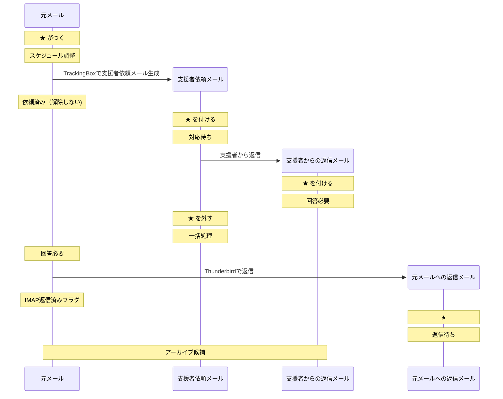

# WorkInBox 設計書

## 概要

WorkInBox は Thunderbird を補完するための業務支援システムである。

Thunderbird のメール運用を変更せず、

- メール分類
- 締切管理
- スケジュール調整支援
- 待機案件管理

を行う。

Thunderbird は業務実行環境であり、WorkInBox は業務整理環境である。

WorkInBox はタスク管理ツールではない。

利用者に新たなタスク入力を要求せず、既に存在するメールから発生する仕事を整理することを目的とする。

---

## 基本方針

### Thunderbird を置き換えない

メールの閲覧、送信、返信、アーカイブは Thunderbird で行う。

### メールを正本とする

メールサーバ上のメールを正本とする。

WorkInBox は補助情報のみを管理する。

### AI は整理役である

AI は分類や抽出を支援する。

最終判断は利用者が行う。

---

## メール管理の考え方

WorkInBox は案件を直接管理しない。

利用者が現在注目すべきメールを管理する。

返信や対応により新しいメールが到着した場合、
着目点は新しいメールへ移る。

その結果、過去のメールは
「一括処理」の対象となる。

---

## システム構成

WorkInBox は以下の 2 つの機能から構成される。

### TrackingBox

スター付きメールを対象とする。

主な役割:

- タグつけ支援
- 締切登録支援
- スケジュールに関する支援者（例：秘書）への依頼メール作成支援

### TriageBox

未読メールを対象とする。

主な役割:

- 広告メール判定
- 自分が送信したメールの検出
- 返信メールの検出
- 返信待ち案件の追跡
- 対応待ち案件の追跡

TriageBox はメールを既読にしない。

---

## タグ体系

### 作業タグ

- 締切あり
- スケジュール調整
- 回答必要
- 読む・検討

### 待機タグ
- 返信待ち
  - 利用者が送信したメールに対して、 相手からの返信を待っている状態を表す。
- 対応待ち
  - 支援者へ依頼した作業に対して、 対応結果を待っている状態を表す。 
  - 対象メールは利用者が送信した支援者への依頼メール（利用者をCCとして送信したメール）である。 

### 履歴タグ
- 依頼済み
  - 支援者へ作業依頼を送信したことを示す。 対象メールは引き続き管理対象であり、 案件自体は完了していない。通常は解除しない。

### 終了タグ
- 一括処理 
  - 一括処理タグが付いていて、スターがついていないメールは Thunderbird にてアーカイブの対象となる。
  - ただし、スターがついているメールは、特例処理が必要なメールである。

---
## Thunderbirdの役割

Thunderbird は以下を担当する。

- メール閲覧
- メール送信
- メール返信
- アーカイブ

## Thunderbirdでの利用者の運用フロー

A. INBOX 内の　スターなしメールについては以下の作業を行う。
  1. 未読メールに関して、ざっと読んで振り分ける。
      - 対応が必要そうなメールは　スターを付ける。（TrackingBoxの対象となる）
      - それ以外のメールはアーカイブする。

  2. 既読メール and タグなし に関しても、可能であれば、ざっと読んで振り分ける。
   - 対応が必要そうなメールは　スターを付ける。（TrackingBoxの対象となる）
   - それ以外のメールはアーカイブする。

  3. 「一括処理」（旧　終了）タグ付き については、目を通した上でアーカイブする。（時間がある時に実施）
　　- 対応が必要な場合はすたーを付ける。（TrackingBoxの対象となる）

B. INBOX 内の スター付きメールについては以下の作業を行う。
　1. 「回答必要」タグ付き について、作業を行う。
   - 催促メールが「回答必要」と判断された場合は「返信待ち」タグに付け替える。
   - 支援者からの回答メールはそのメールをアーカイブする。
   - 返信が必要な場合はそのメールを対象に返信する。(TrackingBoxの対象となる)
   - 返信が不要な場合はそのメールをアーカイブする。

  2 「読む・検討」タグ付き　については、作業を行う。
   - 返信が必要な場合、返信をする。（TracingBoXの対象となる）
   - 対応が完了した場合は、そのメールをアーカイブする。

　3. 「返信待ち」タグ付き　かつ受信後７日間以上　については、催促メールを出す。

--- 
## TrackingBox

### 対象

- INBOX内のスター付きメール

### 基本動作

TrackingBox は利用者が現在注目すべきメールを整理する。

タグの付いていないスター付きメールに対して
作業タグを付与する。

必要に応じて

- 締切登録支援
- 支援者依頼支援

を行う。

### 処理

#### タグ付け支援
- 作業タグ（「締切あり」「スケジュール調整」「回答必要」「読む・検討」）のいずれかを付ける。
  - タグがついてないメールについては、AIに判定させて、タグを付ける。
  - すでにタグがついている処理については何もしない。

#### 締切登録支援
- 「締切あり」タグがついたメールの各々について、締め切り登録の確認する。その後、利用者に以下のいずれかの処理を選択させる。
  - 回答処理：「回答必要」タグを付ける
  - 終了処理：「一括処理」タグをつけて、スターを外す。

#### スケジュール関連依頼支援
- 「スケジュール調整」タグがあり、「依頼済み」のタグがついていないメールの各々について、 利用者に以下の処理のいずれかを選択させる。
  - 依頼処理：支援者にメール転送をして、「 依頼済み」タグを付ける。
  - 終了処理：「一括処理」タグをつけて、スターを外す。（自分でスケジュール入力作業をする場合）
  - 回答処理：「回答必要」タグを付ける。（自分でスケジュール確認作業をする場合）

---

## TriageBox

### 対象

- INBOX 内の未読メール

### 基本動作

TriageBox は未読メールを監視する。

新しい未読メールが到着した際に、

- 広告メールか
- 自分が送信したメールか
- 既存案件への返信メールか

を判定する。

判定結果に応じて、
必要であれば既存メールのタグを更新する。

### 処理

#### スパムメール判定

- スパムメールと判定されたものは「一括処理」のタグを付ける。

#### 返信待ち案件への返信判定

新しい未読メールが、
「返信待ち」タグ付きメールへの返信であると判定された場合、

- 元メールのスターを外す
- 元メールに「一括処理」タグを付ける
- 新しいメールにスターを付ける

さらに、

- 差出人が自分の場合は「返信待ち」タグを付ける
- 差出人が自分以外の場合は「回答必要」タグを付ける

#### 対応待ち案件への返信判定

新しい未読メールが、
「対応待ち」タグ付きメールへの返信であると判定された場合、

- 元メールのスターを外す
- 元メールに「一括処理」タグを付ける
- 対応する「依頼済み」メールに「回答必要」タグを付ける
- 新しいメールにスターを付ける

#### 支援者依頼メール判定

新しい未読メールが支援者への依頼メール（利用者をCCとして送信したメール）であると判定された場合、

- スターを付ける
- 「対応待ち」タグを付ける

----

##メールワークフロー

### スケジュール調整

## ダッシュボード

ダッシュボードは利用者が毎朝最初に確認する画面である。
ダッシュボードは現在抱えている仕事の状況を集約表示する。

- 「締切」のタグがついたメールの総数
- 「スケジュール調整」のタグがついたメールの総数
  - そのうち「依頼済み」のタグがついたメールの総数
-「回答必要」タグがついたメールの件数
  - そのうち「スケジュール調整」タグがついたメールの件数
- 「読む・検討」タグがついたメールの件数
- 「返信待ち」タグがついたメールの件数
 - そのうち受信後７日以上たったメールの件数）
- 「対応待ち」タグがついたメールの件数
  - そのうち受信後７日以上たったメールの件数）
- 「一括処理」のタグがついたメールの件数（これは特別対応が必要な事例）
- 7日以内の締め切りの総数
  - そのうち今日が締め切りの総数
- 今日の予定

`「一括処理」タグが付いているメールについて`
通常は一括処理メールはスターが外される。スターが付いている場合は、 利用者がアーカイブせずに保留した 特別対応案件である。

---

## 締切管理

締切はメールとは独立して管理する。

締切状態:

- Active
- Completed

Completed の締切は一定期間保持した後に削除する。

将来的な VTODO 出力を考慮する。

---
