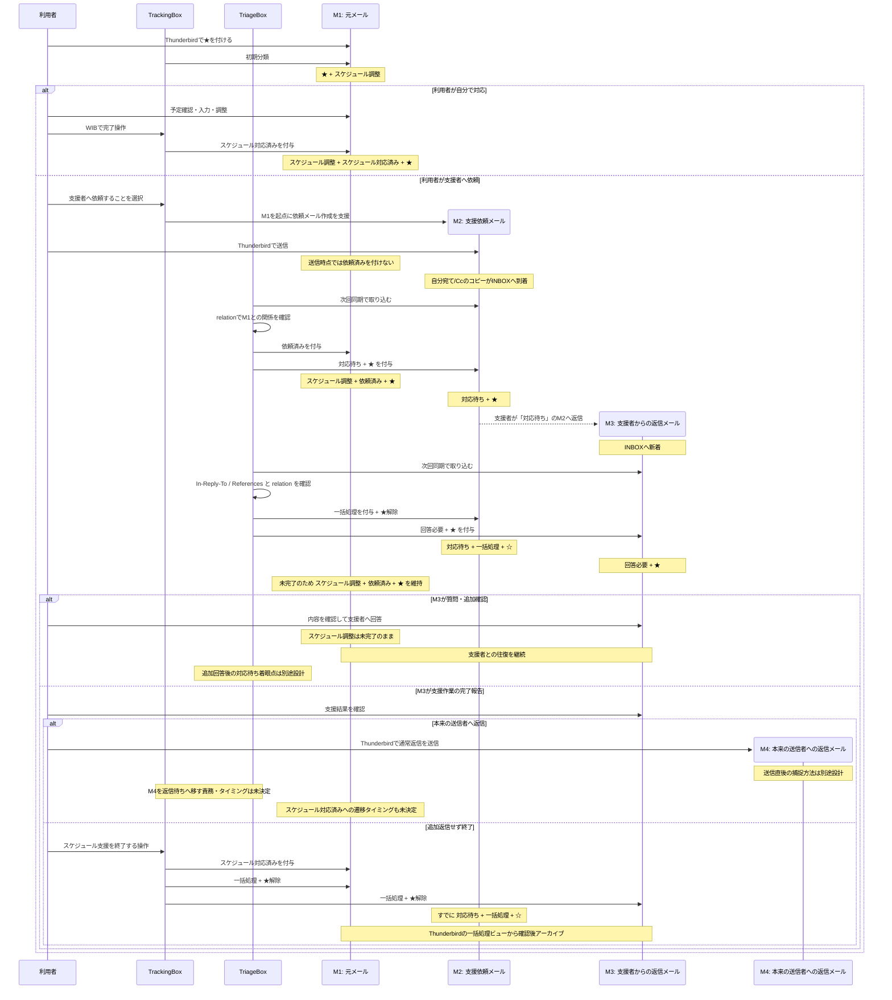

# スケジュール支援と返信時の着眼点遷移

更新日: 2026-08-12

この文書は、スケジュール調整支援の実機 E2E テスト中に確認した運用上の問題と、その議論で合意した状態遷移をまとめる。

対象は主に次の三点である。

- WorkInBox Web の「スケジュール調整」一覧に何を表示するか。
- 自分が送ったメールへの返信が到着したとき、どのメールを現在の作業対象としてスター・作業タグを付けるか。
- 着眼点が移った過去メールをどのように `一括処理` とアーカイブへつなげるか。

本文では、締切登録やスケジュール調整のように専用の画面・状態遷移を持つ処理を **専用ワークフロー** と呼ぶ。`特殊処理` という語は、分類不能等の例外対応と紛らわしいため使用しない。

---

## 1. 基本原則

WorkInBox は案件やスレッド全体ではなく、「現在利用者が作業すべきメール」を整理する。

通常のメール往復では、相手から返信が到着したら会話上の着眼点を最新の返信メールへ移す。

TriageBox が着眼点を旧メールから新メールへ移した場合、原則として次の状態遷移を行う。

1. 旧着眼点メールへ `一括処理` を付ける。
2. 旧着眼点メールのスターを外す。
3. 新しい返信メールへ、次の作業を表すタグを付ける。
4. 新しい返信メールへスターを付ける。

相手からの返信によって利用者の回答が必要になった場合、新しい返信メールは `回答必要` + スターとする。

`一括処理` + スターなしは「WorkInBox として現在の作業対象ではなく、アーカイブ候補である」ことを示す。TriageBox が直接アーカイブするのではなく、利用者が Thunderbird の `一括処理` + スターなしのビューで確認し、まとめてアーカイブする。

利用者が一覧を確認して「まだ終わっていない」と判断したメールにはスターを付け直す。スターが付いた `一括処理` メールはアーカイブ対象から外れる。

この仕組みにより、TriageBox は強いアーカイブ判断をせず、着眼点移動とアーカイブ候補化までを担当する。

---

## 2. `一括処理` は返信系全般の共通後処理

`一括処理` の付与はスケジュール調整専用ではない。

通常の `回答必要`、`返信待ち`、`対応待ち` など、relation で前後関係を確認できる返信系ワークフロー全般で、着眼点が新しいメールへ移った場合に旧着眼点へ適用する。

このとき、旧着眼点に付いていた `返信待ち` や `対応待ち` のタグは履歴として残す。Quick Filter の現在作業対象から外す責務は、`一括処理` の付与とスター解除で担う。

例:

```text
旧メール
  返信待ち
  ★

        ↓ 新しい返信を Triage

旧メール
  返信待ち
  一括処理
  ☆

最新返信
  回答必要
  ★
```

relation でつながるメールを無条件にすべて `一括処理` にするのではない。現在の着眼点や、未完了の専用ワークフローの起点として残る必要があるメールは除外する。

---

## 3. スケジュール調整の起点メールは通常返信と異なる

`スケジュール調整` が付いた起点メールは、会話上の着眼点だけでなく、未完了のスケジュール調整専用ワークフローそのものを表す。

そのため、支援者とのメール往復で新しい返信が到着しても、スケジュール調整が未完了である限り、起点メールからスターを外してはならず、`一括処理` にもしない。

スケジュール支援では、専用ワークフロー上の作業点と、会話上の作業点が同時に存在してよい。

---

## 4. 支援者からの `対応待ち` メールへの返信メールの扱い

ここで扱う「支援者からの返信メール」は、支援者から届いたメール一般ではない。

**WorkInBox が `対応待ち` + スターで追跡している支援依頼メールに対する、支援者からの返信メール** に限定する。

この条件は `In-Reply-To` / `References` と relation を使って確認する。支援者から届いたという送信者情報だけで、この状態遷移を適用してはならない。

この条件を満たす返信メールには `スケジュール調整` を付けない。

返信内容は主に次のどちらかである。

- 作業を進めるために利用者へ追加確認が必要な質問。
- 支援作業が完了したことの報告。

どちらも「この返信メール自体について利用者がスケジュール調整を行う」という意味ではない。

したがって、`対応待ち` の支援依頼メールへの返信を検出した場合は、最新返信メールを `回答必要` + スターとして現在の会話上の着眼点にする。

質問と完了報告を別タグへ自動分類することは現時点では行わない。

ただし、支援作業の完了報告を受け取った段階では、スケジュール調整専用ワークフローは自動では終了しない。利用者が次のアクションを決める必要がある。

主な次アクションは次の二つである。

1. 本来のメール送信者へ返信する。
2. 追加の返信は不要として案件を終了する。

---

## 5. WIB Web「スケジュール調整」一覧の役割

WIB Web の「スケジュール調整」一覧は、スケジュール案件全体や支援者との会話履歴を表示する場所ではない。

この一覧の役割を次のように定義する。

> 利用者が、未着手のスケジュール調整について「自分で対応する」か「支援者へ依頼する」かを判断・実行する入口。

したがって表示対象は次の条件をすべて満たすメールとする。

```text
wib-schedule
AND NOT wib-requested
AND NOT wib-schedule-done
```

### 支援者へ依頼する場合

依頼メールを Thunderbird で送信した瞬間には、元メールへ `依頼済み` を付けない。

状態遷移は次の順序とする。

1. TrackingBox が元メールを起点として支援依頼メールの作成を支援する。
2. 利用者が Thunderbird で依頼メールを送信する。
3. 自分宛て/Cc の依頼メールが INBOX に到着する。
4. 次回の通常同期で TriageBox がその依頼メールを取り込む。
5. TriageBox が起点メールとの relation を確認する。
6. TriageBox が起点メールへ `依頼済み` を付ける。
7. TriageBox が支援依頼メールへ `対応待ち` + スターを付ける。
8. `依頼済み` が付いた結果、起点メールは WIB Web の「スケジュール調整」一覧から外れる。

`依頼済み` は送信操作の推測ではなく、TriageBox が同期で依頼メールを確認したことに基づいて付与する。

### 自分で対応する場合

利用者自身で予定確認、日程調整、予定入力等を終えた後、WIB Web の完了操作を行う。

完了ボタンを押した時点で TrackingBox/WIB が起点メールへ `スケジュール対応済み` を付ける。

その結果、起点メールは WIB Web の「スケジュール調整」一覧から外れる。

---

## 6. スケジュール支援のメールフロー

以下の図をスケジュール支援フローの基準とする。

図では、一つの処理を通して同じメールを追跡できるよう、メールごとに participant を固定し、状態変更を担当する TrackingBox / TriageBox も participant として明示する。

- `TB` = TrackingBox。M1 の分類、スケジュール支援の入口、支援依頼メール作成支援を担当する。
- `TR` = TriageBox。INBOX に実際に現れたメールを relation と返信ヘッダで判定し、タグ・スターの状態遷移を担当する。
- `M1` = 元メール。スケジュール調整専用ワークフローの起点。
- `M2` = 利用者が支援者へ送信した支援依頼メール。自分宛て/Cc のコピーを TriageBox が取り込む。
- `M3` = `対応待ち` の M2 に対する支援者からの返信メール。
- `M4` = 支援完了後、利用者が本来の送信者へ送る通常の返信メール。



### 図の読み方

#### TrackingBox

TrackingBox は、利用者がスターを付けた M1 の初期分類と、スケジュール調整専用ワークフローの入口を担当する。

支援者へ依頼する場合は M1 を起点とした依頼メール作成を支援するが、**送信したという事実だけで M1 に `依頼済み` を付けない**。

自分で対応するルートでは、利用者の明示的な完了操作を受けて M1 に `スケジュール対応済み` を付ける。

#### TriageBox

TriageBox は、通常同期で INBOX に実際に現れたメールを観測して状態遷移を行う。

M2 を取り込んだときは relation を確認し、M1 に `依頼済み`、M2 に `対応待ち` + スターを付ける。

M3 を取り込んだときは `In-Reply-To` / `References` と relation から、M3 が `対応待ち` の M2 への返信であることを確認する。その上で M2 に `一括処理` を付けてスターを外し、M3 に `回答必要` + スターを付ける。

#### M1: 元メール

M1 はスケジュール調整専用ワークフローの起点である。

支援依頼後に会話上の着眼点が M2、M3 へ移っても、スケジュール調整が未完了である間は `スケジュール調整` + `依頼済み` + スターを維持する。

M1 は、支援作業が完了したというだけでは自動完了しない。利用者が支援結果を確認し、本来の送信者への返信または案件終了を判断した後に完了へ進む。

#### M2: 支援依頼メール

M2 は TriageBox が同期で取り込んだ時点で `対応待ち` + スターとなる。

M3 が到着したら `対応待ち` は履歴として残し、TriageBox が `一括処理` を付けてスターを外す。これにより `WIB:対応待ち` から外れる。

#### M3: 支援者からの返信メール

M3 は、支援者からのメール一般ではなく、`対応待ち` の M2 に対する返信であることを relation と `In-Reply-To` / `References` で確認できたメールに限定する。

TriageBox は M3 に `スケジュール調整` を付けず、`回答必要` + スターを付ける。

質問か完了報告かは現時点では自動分類しない。利用者が内容を読んで次の行動を決める。

#### M4: 本来の送信者への返信メール

支援完了後に本来の送信者へ返信した場合は、その新しく送信した M4 が通常の `返信待ち` ワークフローの起点になる想定である。

元メール M1 に `返信待ち` を付けない。

ただし、M4 をいつ・どの方法で `返信待ち` + スターとして取り込むか、またその時点で M1/M2/M3 をどの責務が完了処理するかは未決定であり、通常の Thunderbird 返信送信をどう捕捉するかの設計で決定する。

---

## 7. TriageBox による着眼点移動

図の M2 → M3 は、通常の `返信待ち` メールへの返信と同じ原則で扱う。

```text
旧着眼点
  待機タグ
  ★

        ↓ そのメールへの返信を Triage

旧着眼点
  待機タグ
  一括処理
  ☆

新着眼点
  回答必要
  ★
```

待機タグそのものを外す必要はない。現在作業の Quick Filter は「タグ + スター」で見るため、スター解除で現在作業から外れる。

`一括処理` は、Thunderbird で後からまとめてアーカイブする候補であることを示す。

ただし M1 のように、別の未完了の専用ワークフローの起点として現在性を持つメールは、この共通ルールの対象外とする。

---

## 8. Quick Filter と WIB Web の責務分担

### WIB Web

専用ワークフローの入口や、利用者判断が必要な段階を担当する。

「スケジュール調整」一覧は、まだ依頼も完了もしていない M1 だけを表示し、利用者が自分対応か支援依頼かを選ぶ入口とする。

支援者から完了報告が来た後に、利用者が「本来の送信者へ返信する」か「終了する」かを見落とさないための表示方法は別途実装設計で決める。

### Thunderbird Quick Filter

現在実際に処理すべきメールを担当する。

- `WIB:スケジュール調整` = `wib-schedule` + スター。
- `WIB:対応待ち` = `wib-waiting-action` + スター。
- `WIB:回答必要` = `wib-answer` + スター。
- `WIB:返信待ち` = `wib-waiting-reply` + スター。
- `WIB:一括処理` = `wib-bulk` + スターなし。

M2 に M3 が到着すると、M2 は `対応待ち` を残したまま `一括処理` + スターなしとなり `WIB:対応待ち` から外れる。M3 が `WIB:回答必要` に現れる。

---

## 9. 一般返信フローへの適用

スケジュール支援で採用した「旧着眼点を `一括処理` + スターなしにし、新着眼点へ作業タグ + スターを付ける」という原則は、返信系全般に適用する。

### `返信待ち` への返信

```text
自分が送った追跡メール
  返信待ち
  ★

        ↓ 相手から返信

自分が送った追跡メール
  返信待ち
  一括処理
  ☆

最新返信
  回答必要
  ★
```

### `対応待ち` への返信

```text
支援依頼メール
  対応待ち
  ★

        ↓ 支援者から返信

支援依頼メール
  対応待ち
  一括処理
  ☆

最新返信
  回答必要
  ★
```

待機タグは履歴として残す。現在の作業対象かどうかはスターで判定する。

---

## 10. 今回未決定の事項

次は別途議論・実装設計する。

- 支援者からの `対応待ち` メールへの返信を「質問」と「完了報告」に自動分類するか。
- 支援完了報告後の利用者判断を WIB Web 上でどのように表示・操作させるか。
- 通常の Thunderbird 返信送信をどの時点で `返信待ち` として relation に取り込むか。
- 支援者への追加回答を送信した後、どのメールを `対応待ち` の新しい着眼点とするか。
- スレッド / 案件単位の Context を導入するか。

`一括処理` の基本ルールについては、TriageBox が着眼点を移した旧メールへ付与し、スターを外す方針とする。利用者は `一括処理` + スターなしを確認して一括アーカイブし、未完了と判断したメールにはスターを戻す。
