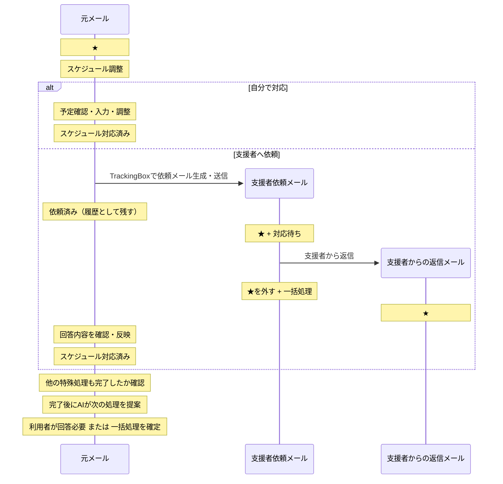

# スケジュール支援と返信時の着眼点遷移

更新日: 2026-08-12

この文書は、スケジュール調整支援の実機 E2E テスト中に確認した運用上の問題と、その議論で合意した状態遷移をまとめる。

対象は主に次の三点である。

- WorkInBox Web の「スケジュール調整」一覧に何を表示するか。
- 自分が送ったメールへの返信が到着したとき、どのメールを現在の作業対象としてスター・作業タグを付けるか。
- 着眼点が移った過去メールをどのように `一括処理` とアーカイブへつなげるか。

本文では、締切登録やスケジュール調整のように専用の画面・状態遷移を持つ処理を **専用ワークフロー** と呼ぶ。`特殊処理` という語は、分類不能等の例外対応と紛らわしいため使用しない。

---

## 1. 基本原則

WorkInBox は案件やスレッド全体ではなく、「現在利用者が作業すべきメール」を整理する。

通常のメール往復では、相手から返信が到着したら会話上の着眼点を最新の返信メールへ移す。

TriageBox が着眼点を旧メールから新メールへ移した場合、原則として次の状態遷移を行う。

1. 旧着眼点メールへ `一括処理` を付ける。
2. 旧着眼点メールのスターを外す。
3. 新しい返信メールへ、次の作業を表すタグを付ける。
4. 新しい返信メールへスターを付ける。

相手からの返信によって利用者の回答が必要になった場合、新しい返信メールは `回答必要` + スターとする。

`一括処理` + スターなしは「WorkInBox として現在の作業対象ではなく、アーカイブ候補である」ことを示す。TriageBox が直接アーカイブするのではなく、利用者が Thunderbird の `一括処理` + スターなしのビューで確認し、まとめてアーカイブする。

利用者が一覧を確認して「まだ終わっていない」と判断したメールにはスターを付け直す。スターが付いた `一括処理` メールはアーカイブ対象から外れる。

この仕組みにより、TriageBox は強いアーカイブ判断をせず、着眼点移動とアーカイブ候補化までを担当する。

---

## 2. `一括処理` は返信系全般の共通後処理

`一括処理` の付与はスケジュール調整専用ではない。

通常の `回答必要`、`返信待ち`、`対応待ち` など、relation で前後関係を確認できる返信系ワークフロー全般で、着眼点が新しいメールへ移った場合に旧着眼点へ適用する。

このとき、旧着眼点に付いていた `返信待ち` や `対応待ち` のタグは、履歴として残してよい。Quick Filter の現在作業対象から外す責務は、`一括処理` の付与とスター解除で担う。

例:

```text
旧メール
  返信待ち
  ★

        ↓ 新しい返信を Triage

旧メール
  返信待ち
  一括処理
  ☆

最新返信
  回答必要
  ★
```

relation でつながるメールを無条件にすべて `一括処理` にするのではない。現在の着眼点や、未完了の専用ワークフローの起点として残る必要があるメールは除外する。

---

## 3. スケジュール調整の起点メールは通常返信と異なる

`スケジュール調整` が付いた起点メールは、会話上の着眼点だけでなく、未完了のスケジュール調整専用ワークフローそのものを表す。

そのため、支援者とのメール往復で新しい返信が到着しても、スケジュール調整が未完了である限り、起点メールからスターを外してはならず、`一括処理` にもしない。

スケジュール支援では、専用ワークフロー上の作業点と、会話上の作業点が同時に存在してよい。

例:

```text
起点メール
  スケジュール調整
  依頼済み
  ★        <- スケジュール対応が未完了なので維持

支援依頼メール
  対応待ち
  一括処理
  ☆        <- 支援者から返信が来たので旧着眼点

支援者からの最新返信
  回答必要
  ★        <- 現在の会話上の作業対象
```

この例外は単純に「`スケジュール調整` タグが付いているメールなら常にスターを残す」と判定するのではなく、relation と起点メールの状態を使い、そのメールが未完了のスケジュール支援フローの起点であることを確認して適用する。

---

## 4. 支援者からの `対応待ち` メールへの返信メールの扱い

ここで扱う「支援者からの返信メール」は、支援者から届いたメール一般ではない。

**WorkInBox が `対応待ち` + スターで追跡している支援依頼メールに対する、支援者からの返信メール** に限定する。

この条件は `In-Reply-To` / `References` と relation を使って確認する。支援者から届いたという送信者情報だけで、この状態遷移を適用してはならない。

この条件を満たす返信メールには `スケジュール調整` を付けない。

返信内容は主に次のどちらかである。

- 作業を進めるために利用者へ追加確認が必要な質問。
- 支援作業が完了したことの報告。

どちらも「この返信メール自体について利用者がスケジュール調整を行う」という意味ではない。

したがって、`対応待ち` の支援依頼メールへの返信を検出した場合は、最新返信メールを `回答必要` + スターとして現在の会話上の着眼点にする。

質問と完了報告を別タグへ自動分類することは現時点では行わない。

ただし、支援作業の完了報告を受け取った段階では、スケジュール調整専用ワークフローは自動では終了しない。利用者が次のアクションを決める必要がある。

主な次アクションは次の二つである。

1. 本来のメール送信者へ返信する。
2. 追加の返信は不要として案件を終了する。

---

## 5. WIB Web「スケジュール調整」一覧の役割

WIB Web の「スケジュール調整」一覧は、スケジュール案件全体や支援者との会話履歴を表示する場所ではない。

この一覧の役割を次のように定義する。

> 利用者が、未着手のスケジュール調整について「自分で対応する」か「支援者へ依頼する」かを判断・実行する入口。

したがって表示対象は次の条件をすべて満たすメールとする。

```text
wib-schedule
AND NOT wib-requested
AND NOT wib-schedule-done
```

意味は次のとおり。

- `スケジュール調整` が付いている。
- まだ支援者への依頼を同期で確認していない。
- まだ利用者自身によるスケジュール対応を完了していない。

### 支援者へ依頼する場合

依頼メールを Thunderbird で送信した瞬間には、元メールへ `依頼済み` を付けない。

状態遷移は次の順序とする。

1. WIB が元メールを起点として支援依頼メールの作成を支援する。
2. 利用者が Thunderbird で依頼メールを送信する。
3. 自分宛て/Cc の依頼メールが INBOX に到着する。
4. 次回の通常同期で TriageBox がその依頼メールを取り込む。
5. TriageBox が起点メールとの relation を確認する。
6. 起点メールへ `依頼済み` を付ける。
7. 支援依頼メールへ `対応待ち` + スターを付ける。
8. `依頼済み` が付いた結果、起点メールは WIB Web の「スケジュール調整」一覧から外れる。

`依頼済み` は送信操作の推測ではなく、同期で依頼メールを確認したことに基づいて付与する。

### 自分で対応する場合

利用者自身で予定確認、日程調整、予定入力等を終えた後、WIB Web の完了操作を行う。

完了ボタンを押した時点で起点メールへ `スケジュール対応済み` を付ける。

その結果、起点メールは WIB Web の「スケジュール調整」一覧から外れる。

一覧から外れるタイミングは二系統ある。

- 支援依頼ルート: 依頼メールを次回同期で取り込んで `依頼済み` が付いた時点。
- 自分対応ルート: 利用者が完了ボタンを押して `スケジュール対応済み` が付いた時点。

---

## 6. `対応待ち` メールへの支援者返信時の状態遷移

支援依頼メールが `対応待ち` + スターの状態で、その支援依頼メールに対する支援者からの返信が到着した場合は次のように処理する。

1. TriageBox が `In-Reply-To` / `References` と relation から、`対応待ち` の支援依頼メールへの返信であることを確認する。
2. 支援依頼メールへ `一括処理` を付ける。
3. 支援依頼メールのスターを外す。
4. 支援依頼メールの `対応待ち` タグは残す。
5. 新しい返信メールへ `回答必要` を付ける。
6. 新しい返信メールへスターを付ける。
7. スケジュール支援フローの起点メールは、`スケジュール対応済み` になるまでスターを維持し、`一括処理` にしない。
8. 起点メールの `依頼済み` は履歴として維持する。

`対応待ち` タグを残しても、支援依頼メールはスターが外れるため `WIB:対応待ち` (`wib-waiting-action` AND スター付き) から外れる。

この動作は、通常の `返信待ち` メールに返信が到着した場合と同じ考え方である。旧着眼点の状態タグは履歴として残し、`一括処理` + スターなしにすることで現在作業から外す。

支援者返信メールへ `スケジュール調整` は付けない。

### スケジュール調整



上の図は `adaef39255924be533fd65d210b1136a689a3c38` 時点の `docs/design_workflow.md` にあった図をそのまま復元したものである。

---

## 7. 支援者の完了報告後の分岐

`対応待ち` の支援依頼メールに対する支援者返信のうち、「支援作業が完了した」という内容のメールを受けた後、利用者が次のアクションを決める。

### 7-1. 本来の送信者へ返信する

支援結果を本来のメール送信者へ返す必要がある場合、利用者は Thunderbird で通常の返信メールを送る。

この新しく送信したメールが、以後の通常の `返信待ち` ワークフローの起点になる。

状態の考え方は次のとおり。

```text
スケジュール起点メール
  スケジュール調整
  依頼済み
  ★

支援者完了報告
  回答必要
  ★

        ↓ 利用者が本来の送信者へ返信

旧スケジュール関連メール
  一括処理
  ☆

新しく送信した返信メール
  返信待ち
  ★
```

新しい送信メールに `返信待ち` を付ける。元の受信メールへ `返信待ち` を付けない。

この時点でスケジュール調整として必要な作業が完了しているため、起点メールへ `スケジュール対応済み` を付ける。

その後は通常の `返信待ち` ワークフローへ移行し、相手から返信が来れば TriageBox が新しい返信へ着眼点を移す。

### 7-2. 追加返信せず終了する

支援結果を確認した時点で案件を終了できる場合、スケジュール調整専用ワークフローを完了する。

起点メールへ `スケジュール対応済み` を付け、relation で把握している当該ワークフローの役目を終えた関連メールを `一括処理` + スターなしにする。

TriageBox/WIB が直接アーカイブはしない。利用者が Thunderbird の `一括処理` + スターなしのビューで確認し、まとめてアーカイブする。

---

## 8. Quick Filter と WIB Web の責務分担

WIB Web と Thunderbird Quick Filter は同じ一覧を複製しない。

### WIB Web

専用ワークフローの入口や、利用者判断が必要な段階を担当する。

「スケジュール調整」では、まだ依頼も完了もしていない起点メールだけを表示し、利用者が自分対応か支援依頼かを選ぶ。

支援者から回答が来た後に、利用者が「元の送信者へ返信する」か「終了する」かを見落とさないための表示方法は別途実装設計で決める。relation から導出できる「支援回答あり」の状態を WIB 側で表示する案を候補とする。

### Thunderbird Quick Filter

現在実際に処理すべきメールを担当する。

- `WIB:スケジュール調整` は `wib-schedule` + スター。
- `WIB:対応待ち` は `wib-waiting-action` + スター。
- `WIB:回答必要` は `wib-answer` + スター。
- `WIB:一括処理` は `wib-bulk` + スターなしを基本とし、まとめてアーカイブするために使う。

支援依頼後も未完了の起点メールは `WIB:スケジュール調整` に残り得る。

`対応待ち` の支援依頼メールへ支援者から返信が来ると、支援依頼メールには `対応待ち` を残したまま `一括処理` を付けてスターを外す。そのため `WIB:対応待ち` からは外れ、最新返信メールが `WIB:回答必要` に現れる。

Thunderbird のスレッド表示によって、最新返信を入口として過去の依頼メールや起点メールを参照できる。

---

## 9. 一般返信フローへの適用

TriageBox の一般的な返信処理について次の原則を採用する。

### 通常の自分発メールへの返信

```text
自分が送った追跡メール
  返信待ち
  ★

        ↓ 相手から返信

自分が送った追跡メール
  返信待ち
  一括処理
  ☆

最新返信
  回答必要
  ★
```

最新返信を現在作業点とする。`返信待ち` タグは旧メールに履歴として残し、スターが外れることで `WIB:返信待ち` から外れる。

### 未完了のスケジュール支援フロー

```text
スケジュール起点メール
  スケジュール調整
  依頼済み
  ★

支援依頼メール
  対応待ち
  ★

        ↓ 支援者から返信

スケジュール起点メール
  スケジュール調整
  依頼済み
  ★        <- 専用ワークフローが未完了なので維持

支援依頼メール
  対応待ち
  一括処理
  ☆

最新返信
  回答必要
  ★
```

通常の「旧着眼点を `一括処理` + スターなしにする」規則に対して、未完了のスケジュール支援起点メールは例外となる。

---

## 10. 今回未決定の事項

次は別途議論・実装設計する。

- 支援者からの `対応待ち` メールへの返信を「質問」と「完了報告」に自動分類するか。
- 「支援回答あり」を WIB Web 上でどのように表示・操作させるか。
- 通常の Thunderbird 返信送信をどの時点で `返信待ち` として relation に取り込むか。
- スレッド / 案件単位の Context を導入するか。

`一括処理` の基本ルールについては、TriageBox が着眼点を移した旧メールへ付与し、スターを外す方針とする。利用者は `一括処理` + スターなしを確認して一括アーカイブし、未完了と判断したメールにはスターを戻す。
