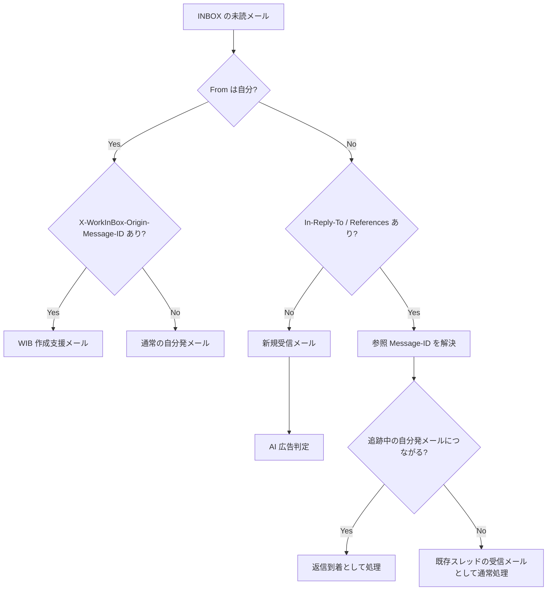
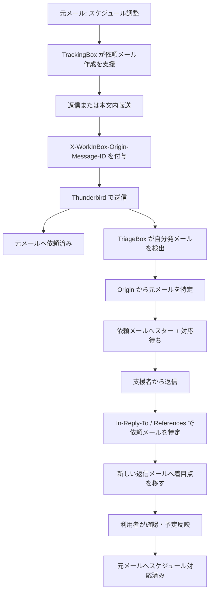

# TriageBox 判定フロー設計

## 目的

TriageBox は、未読メールについて「誰が送ったか」と「どの過去メールに関連するか」をまず機械的に整理し、その結果を待機状態の追跡や通常の受信分類につなげる。

本文や件名から関係を推測する前に、メールアドレスと Message-ID 系ヘッダを優先して利用する。

本設計では、メールの関係を案件やスレッド全体の Context として管理するのではなく、v0.2 の方針どおり Message-ID を基本単位とする。

---

## 前提

### 対象

現行の TriageBox の対象は INBOX 内の未読メールとする。

したがって、自分が送信者のメールでも、TriageBox が扱うのは自分宛てメールや自分を Cc に入れたメールなど、INBOX に到着するコピーである。

Sent フォルダ自体を TriageBox が走査するかどうかは別途検討する。

### 自分の判定

`From` が自分かどうかは、設定された代表アドレスと自己アドレス群を正規化して判定する。

表示名だけでは判定せず、メールアドレスを主とする。

### 関係判定に使うヘッダ

主に次を利用する。

- `Message-ID`
- `In-Reply-To`
- `References`
- `X-WorkInBox-Origin-Message-ID`

`In-Reply-To` / `References` は標準のメールスレッド関係を表す。

`X-WorkInBox-Origin-Message-ID` は、WorkInBox がメール作成を支援した際に、その処理の起点となった元メールの Message-ID を明示する補助ヘッダとする。

返信形式・本文内転送形式のどちらであっても、WorkInBox が作成支援したメールには同じルールで `X-WorkInBox-Origin-Message-ID` を付与してよい。

標準ヘッダと WorkInBox 拡張ヘッダは競合しない。

- 標準ヘッダ: メールクライアント上の返信・スレッド関係
- WorkInBox 拡張ヘッダ: WorkInBox の処理上の起点

---

## 基本判定軸

TriageBox は最初に `From` が自分かどうかで大きく分岐する。

この段階では、「ヘッダがある」という事実だけで最終タグを決めない。

Message-ID の参照先と、そのメールの現在の WorkInBox 状態まで確認して処理を決める。

AI による広告メール判定は、この機械的な関係判定の結果として `新規受信メール` と判断されたメールだけに行う。

---

## 1. 送信者が自分の場合

### 1-1. `X-WorkInBox-Origin-Message-ID` がある

WorkInBox が元メールを起点として作成支援した送信メールであると判断する。

ヘッダ値から元メールを Message-ID で特定できる。

現行 v0.2 で想定する主な例は、スケジュール調整支援から支援者へ送る依頼メールである。

この場合の責務は次のように分ける。

#### TrackingBox / Thunderbird Extension

- 元メールを起点に依頼メールの作成を支援する。
- 返信・転送のどちらでも `X-WorkInBox-Origin-Message-ID` を付ける。
- 実際の送信は Thunderbird で行う。
- 送信成功を確認したら、元メールへ `依頼済み` を付ける。

#### TriageBox

- 自分が送信者であることを検出する。
- `X-WorkInBox-Origin-Message-ID` から WIB 作成支援メールであることと元メールを特定する。
- 元メールの状態と現在のワークフローを確認し、必要な待機状態へ遷移させる。
- スケジュール調整の支援依頼であれば、依頼メールを追跡対象としてスター + `対応待ち` にする。

送信直後に Thunderbird Extension が依頼メールへスター + `対応待ち` を直接付けるのではなく、この状態判定は TriageBox の責務とする。

なお、将来 WorkInBox が支援者依頼以外の送信メール作成も支援するようになった場合、`X-WorkInBox-Origin-Message-ID` の存在だけで常に `対応待ち` と決めてはならない。

Origin は「WIB 作成支援メールであること」と「起点メール」を示し、具体的な状態遷移は起点メール側の状態・ワークフローと組み合わせて判断する。

### 1-2. `X-WorkInBox-Origin-Message-ID` がない

通常の Thunderbird 操作で送信された自分発メール、または自分宛て備忘メールとして扱う。

`From` が自分であることだけを理由に `返信待ち` を付けない。

特に、自分宛てメールは LINE、Teams、Slack、口頭等から発生した仕事の入力経路として利用するため、通常の受信仕事として扱う必要がある。

一方、他者へ送った通常メールについては、返信を待つ必要があるかを別途判定し、必要であれば `返信待ち` とする。

「通常の自分発メールをどの条件で `返信待ち` にするか」は、From 判定とは分離した判定とする。

---

## 2. 送信者が自分ではない場合

### 2-1. `In-Reply-To` / `References` がない

既存メールとの Message-ID 上の返信関係が確認できないため、新規に開始された受信メールとして扱う。

この `新規受信メール` に限って AI による広告メール判定を行い、広告でない場合は TrackingBox へ送るべきかどうかを判断する。

### 2-2. `In-Reply-To` / `References` がある

「返信メールである」と即断するのではなく、参照されている Message-ID を解決する。

優先的には直接の返信先を表す `In-Reply-To` を確認し、必要に応じて `References` をたどる。

参照先が見つかった場合、そのメールが自分発メールか、またどの待機状態にあるかを確認する。

#### `返信待ち` メールにつながる場合

自分が通常の Thunderbird 操作で送ったメールに対する返信到着として扱う。

着目点を元の `返信待ち` メールから新しく届いた返信メールへ移す。

新しい返信メールは、その内容に応じて TrackingBox の通常処理へつなげる。

#### `対応待ち` メールにつながる場合

支援者への依頼に対する回答候補として扱う。

着目点を支援依頼メールから新しく届いた返信メールへ移す。

スケジュール調整支援の場合は、利用者が回答内容を確認し、必要な予定確認・反映が完了した時点で、`X-WorkInBox-Origin-Message-ID` で関連付けられた元メールの `スケジュール対応済み` を更新する。

#### 参照先はあるが追跡中の自分発メールではない場合

既存メールスレッドの一部ではあるが、WorkInBox が追跡している待機メールへの返信とは限らない。

この場合は既存スレッドの受信メールとして通常処理する。

`In-Reply-To` / `References` の存在だけを理由に `返信待ち` や `対応待ち` の解除・遷移を行わない。

このメールは `新規受信メール` ではないため、AI による広告メール判定の対象にはしない。

### 2-3. 参照先 Message-ID がローカルで見つからない場合

`In-Reply-To` / `References` が存在しても、参照先メールを現在取得できないことがある。

この場合は関係を推測で確定せず、既存スレッド由来の可能性がある受信メールとして通常処理する。

`新規受信メール` と確定できないため、AI による広告メール判定の対象にはしない。

必要であれば将来、参照先の追加検索や Message-ID インデックスの拡張を検討する。

---

## 3. 広告メール判定との関係

AI による広告メール判定は、TriageBox のヘッダ解析と関係判定の結果、`新規受信メール` と判断されたメールだけに実行する。

次のメールには広告判定を行わない。

- `From` が自分のメール
- `返信待ち` / `対応待ち` など追跡中メールへの返信
- `In-Reply-To` / `References` があり、既存スレッドの一部と判断されたメール
- `In-Reply-To` / `References` はあるが、参照先を解決できず新規受信と確定できないメール

これにより、自分発メールや重要な返信を AI が広告と誤判定して処理対象から外すことを避ける。

広告判定は関係判定より後に置き、広告でない `新規受信メール` だけを TrackingBox の入口判定へ進める。

---

## 4. TriageBox の処理優先順位

概念上は次の順序とする。

1. ヘッダを解析し、アドレスと Message-ID を正規化する。
2. `From` が自分か判定する。
3. 自分発なら `X-WorkInBox-Origin-Message-ID` の有無と起点メールを確認する。
4. 自分発でなければ `In-Reply-To` / `References` を解析し、参照先メールを解決する。
5. 既存の `返信待ち` / `対応待ち` との関係を判定する。
6. 関係がなく `新規受信メール` と確定したメールだけに AI 広告判定を行う。
7. 広告でない新規受信メールについて TrackingBox 入口判定を行う。
8. 必要なスター・IMAP タグを更新する。

AI による本文分類より前に、可能な限りヘッダと既存状態だけで確定できる関係を確定する。

---

## 5. 状態遷移の考え方

TriageBox は「案件」を管理するのではなく、現在注目すべきメールを移動させる。

返信が到着した場合は、新しい返信メールが新しい着目点となる。

元の送信メールは、返信・回答が到着したという事実を踏まえて待機対象から外れ、必要に応じて `一括処理` 等の終了処理へ進む。

ただし、具体的なタグの解除・付与順序は各ワークフローで定義し、Message-ID 関係を検出しただけで一律に状態を変更しない。

---

## 6. スケジュール調整支援との接続

支援者へ依頼する場合の流れは次のように整理する。

この構成では、TrackingBox は「依頼メールを作るところまで」、TriageBox は「送信されたメールと、その後の返信を追跡するところ」を担当する。

---

## 7. 実装上の原則

- 関係判定は件名一致より Message-ID を優先する。
- `In-Reply-To` / `References` は標準スレッド関係として尊重する。
- `X-WorkInBox-Origin-Message-ID` は WIB 作成支援メールの処理起点を示すために使う。
- WIB 作成支援メールには、返信・転送を問わず同じ Origin ヘッダを付与する。
- Origin ヘッダの存在だけで将来すべてのメールを `対応待ち` にしない。
- From 自己判定は設定済みアドレスを正規化して行い、表示名だけで判定しない。
- ヘッダから関係を確定できない場合は推測で待機状態を変更しない。
- AI 広告判定は `新規受信メール` と確定したメールだけに行う。
- Thunderbird Extension は送信操作を支援するが、待機状態の判定責務を持たせない。

---

## 今後の検討事項

- 通常の自分発メールを `返信待ち` とする具体的な判定条件
- Sent フォルダを TriageBox の監視対象に含めるか
- `返信待ち` / `対応待ち` への返信到着時に、旧メールへ付ける終了タグの詳細
- `References` に複数 Message-ID がある場合の探索優先順位と探索範囲
- 参照先 Message-ID がローカルにない場合の追加検索方法
- 将来、WIB が支援者依頼以外の送信メール作成支援を追加した場合のワークフロー識別方法
