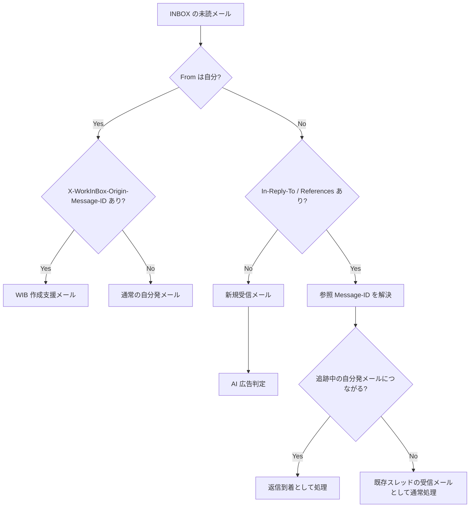
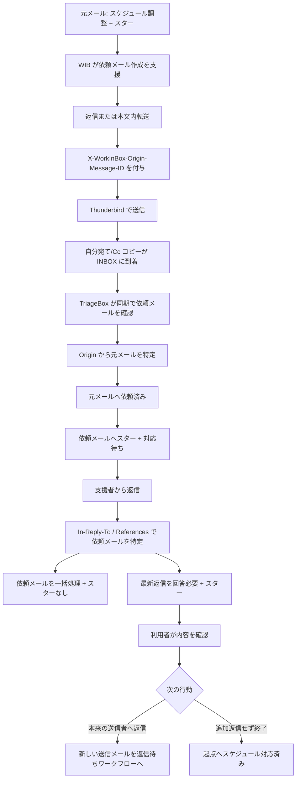

# TriageBox 判定フロー設計

## 目的

TriageBox は、未読メールについて「誰が送ったか」と「どの過去メールに関連するか」をまず機械的に整理し、その結果を待機状態の追跡や通常の受信分類につなげる。

本文や件名から関係を推測する前に、メールアドレスと Message-ID 系ヘッダを優先して利用する。

本設計では、メールの関係を案件やスレッド全体の Context として管理するのではなく、v0.2 の方針どおり Message-ID を基本単位とする。

---

## 前提

### 対象

現行の TriageBox の対象は INBOX 内の未読メールとする。

したがって、自分が送信者のメールでも、TriageBox が扱うのは自分宛てメールや自分を Cc に入れたメールなど、INBOX に到着するコピーである。

Sent フォルダ自体を TriageBox が走査するかどうかは別途検討する。

### 自分の判定

`From` が自分かどうかは、設定された代表アドレスと自己アドレス群を正規化して判定する。

表示名だけでは判定せず、メールアドレスを主とする。

### 関係判定に使うヘッダ

主に次を利用する。

- `Message-ID`
- `In-Reply-To`
- `References`
- `X-WorkInBox-Origin-Message-ID`

`In-Reply-To` / `References` は標準のメールスレッド関係を表す。

`X-WorkInBox-Origin-Message-ID` は、WorkInBox がメール作成を支援した際に、その処理の起点となった元メールの Message-ID を明示する補助ヘッダとする。

返信形式・本文内転送形式のどちらであっても、WorkInBox が作成支援したメールには同じルールで `X-WorkInBox-Origin-Message-ID` を付与してよい。

標準ヘッダと WorkInBox 拡張ヘッダは競合しない。

- 標準ヘッダ: メールクライアント上の返信・スレッド関係
- WorkInBox 拡張ヘッダ: WorkInBox の処理上の起点

---

## 基本判定軸

TriageBox は最初に `From` が自分かどうかで大きく分岐する。

この段階では、「ヘッダがある」という事実だけで最終タグを決めない。

Message-ID の参照先と、そのメールの現在の WorkInBox 状態まで確認して処理を決める。

AI による広告メール判定は、この機械的な関係判定の結果として `新規受信メール` と判断されたメールだけに行う。

---

## 1. 送信者が自分の場合

### 1-1. `X-WorkInBox-Origin-Message-ID` がある

WorkInBox が元メールを起点として作成支援した送信メールであると判断する。

ヘッダ値から元メールを Message-ID で特定できる。

現行 v0.2 で想定する主な例は、スケジュール調整支援から支援者へ送る依頼メールである。

この場合の責務は次のように分ける。

#### TrackingBox / Thunderbird Extension

- 元メールを起点に依頼メールの作成を支援する。
- 返信・転送のどちらでも `X-WorkInBox-Origin-Message-ID` を付ける。
- 実際の送信は Thunderbird で行う。
- 送信成功だけを理由に元メールへ `依頼済み` を付けない。

#### TriageBox

- 自分が送信者であることを検出する。
- `X-WorkInBox-Origin-Message-ID` から WIB 作成支援メールであることと元メールを特定する。
- 元メールの状態と現在のワークフローを確認し、必要な待機状態へ遷移させる。
- スケジュール調整の支援依頼であれば、同期で依頼メールを確認した時点で元メールへ `依頼済み` を付ける。
- 同じ時点で依頼メールを追跡対象としてスター + `対応待ち` にする。

`依頼済み` は Thunderbird の送信操作を推測して付けるのではなく、TriageBox が自分宛て/Cc の依頼メールを INBOX で確認した事実に基づいて付与する。

なお、将来 WorkInBox が支援者依頼以外の送信メール作成も支援するようになった場合、`X-WorkInBox-Origin-Message-ID` の存在だけで常に `対応待ち` と決めてはならない。

Origin は「WIB 作成支援メールであること」と「起点メール」を示し、具体的な状態遷移は起点メール側の状態・ワークフローと組み合わせて判断する。

### 1-2. `X-WorkInBox-Origin-Message-ID` がない

通常の Thunderbird 操作で送信された自分発メール、または自分宛て備忘メールとして扱う。

`From` が自分であることだけを理由に `返信待ち` を付けない。

特に、自分宛てメールは LINE、Teams、Slack、口頭等から発生した仕事の入力経路として利用するため、通常の受信仕事として扱う必要がある。

一方、他者へ送った通常メールについては、返信を待つ必要があるかを別途判定し、必要であれば `返信待ち` とする。

「通常の自分発メールをどの条件で `返信待ち` にするか」は、From 判定とは分離した判定とする。

---

## 2. 送信者が自分ではない場合

### 2-1. `In-Reply-To` / `References` がない

既存メールとの Message-ID 上の返信関係が確認できないため、新規に開始された受信メールとして扱う。

この `新規受信メール` に限って AI による広告メール判定を行い、広告でない場合は TrackingBox へ送るべきかどうかを判断する。

### 2-2. `In-Reply-To` / `References` がある

「返信メールである」と即断するのではなく、参照されている Message-ID を解決する。

優先的には直接の返信先を表す `In-Reply-To` を確認し、必要に応じて `References` をたどる。

参照先が見つかった場合、そのメールが自分発メールか、またどの待機状態にあるかを確認する。

#### `返信待ち` メールにつながる場合

自分が通常の Thunderbird 操作で送ったメールに対する返信到着として扱う。

着眼点を元の `返信待ち` メールから新しく届いた返信メールへ移す。

原則として元の `返信待ち` メールは `返信待ち` を外し、`一括処理` を付け、スターを外す。

新しい返信メールは `回答必要` + スターとする。

#### `対応待ち` メールにつながる場合

支援者への依頼に対する回答候補として扱う。

着眼点を支援依頼メールから新しく届いた返信メールへ移す。

支援依頼メールは `対応待ち` を外し、`一括処理` を付け、スターを外す。

新しい返信メールは `回答必要` + スターとする。支援者返信へ `スケジュール調整` は付けない。

スケジュール調整支援の場合、起点メールは会話上の着眼点とは別に未完了の専用ワークフローの作業点である。そのため、起点メールは `スケジュール対応済み` になるまでスターを維持し、支援者から返信が来ただけでは `一括処理` にしない。

支援者からの返信が質問か完了報告かは、現時点では TriageBox が自動分類しない。利用者が内容を確認して次の行動を決める。

#### 参照先はあるが追跡中の自分発メールではない場合

既存メールスレッドの一部ではあるが、WorkInBox が追跡している待機メールへの返信とは限らない。

この場合は既存スレッドの受信メールとして通常処理する。

`In-Reply-To` / `References` の存在だけを理由に `返信待ち` や `対応待ち` の解除・遷移を行わない。

このメールは `新規受信メール` ではないため、AI による広告メール判定の対象にはしない。

### 2-3. 参照先 Message-ID がローカルで見つからない場合

`In-Reply-To` / `References` が存在しても、参照先メールを現在取得できないことがある。

この場合は関係を推測で確定せず、既存スレッド由来の可能性がある受信メールとして通常処理する。

`新規受信メール` と確定できないため、AI による広告メール判定の対象にはしない。

必要であれば将来、参照先の追加検索や Message-ID インデックスの拡張を検討する。

---

## 3. 着眼点移動と `一括処理`

TriageBox は「案件」を直接管理するのではなく、現在注目すべきメールを移動させる。

relation によって、追跡中のメールへの返信が到着したことを確定できた場合は、新しい返信メールへ着眼点を移す。

このときの原則は次のとおり。

1. 旧着眼点の待機タグを外す。
2. 旧着眼点へ `一括処理` を付ける。
3. 旧着眼点のスターを外す。
4. 新しい返信メールへ次の作業を示すタグを付ける。
5. 新しい返信メールへスターを付ける。

通常の返信では、新しい返信メールは `回答必要` + スターとなる。

`一括処理` + スターなしは、Thunderbird で確認後に一括アーカイブする候補を表す。利用者がまだ処理継続が必要と判断した場合はスターを付け直すことでアーカイブ対象から外せる。

このルールはスケジュール調整専用ではなく、`回答必要` への返信、`返信待ち` への返信、`対応待ち` への返信など、relation により旧着眼点と新着眼点を確定できる返信処理全般に適用する。

ただし、旧メールが別の未完了の専用ワークフローの作業点でもある場合は例外とする。代表例は、未完了のスケジュール支援フローの起点メールである。このメールは会話上の着眼点が別メールへ移ってもスターを維持し、`一括処理` にしない。

---

## 4. 広告メール判定との関係

AI による広告メール判定は、TriageBox のヘッダ解析と関係判定の結果、`新規受信メール` と判断されたメールだけに実行する。

次のメールには広告判定を行わない。

- `From` が自分のメール
- `返信待ち` / `対応待ち` など追跡中メールへの返信
- `In-Reply-To` / `References` があり、既存スレッドの一部と判断されたメール
- `In-Reply-To` / `References` はあるが、参照先を解決できず新規受信と確定できないメール

これにより、自分発メールや重要な返信を AI が広告と誤判定して処理対象から外すことを避ける。

広告判定は関係判定より後に置き、広告でない `新規受信メール` だけを TrackingBox の入口判定へ進める。

---

## 5. TriageBox の処理優先順位

概念上は次の順序とする。

1. ヘッダを解析し、アドレスと Message-ID を正規化する。
2. `From` が自分か判定する。
3. 自分発なら `X-WorkInBox-Origin-Message-ID` の有無と起点メールを確認する。
4. 自分発でなければ `In-Reply-To` / `References` を解析し、参照先メールを解決する。
5. 既存の `返信待ち` / `対応待ち` との関係を判定する。
6. relation に基づく着眼点移動が確定した場合、旧着眼点の待機解除・`一括処理`・スター解除と、新着眼点の作業タグ・スター付与を行う。
7. 関係がなく `新規受信メール` と確定したメールだけに AI 広告判定を行う。
8. 広告でない新規受信メールについて TrackingBox 入口判定を行う。

AI による本文分類より前に、可能な限りヘッダと既存状態だけで確定できる関係を確定する。

---

## 6. スケジュール調整支援との接続

支援者へ依頼する場合の流れは次のように整理する。

元のスケジュール調整メールは、支援者から返信が来ても未完了の専用ワークフローの起点としてスターを維持する。

支援者から完了報告を受けた後、本来のメール送信者へ返信する場合は、その新しい送信メールを以後の `返信待ち` ワークフローの起点とする。元の受信メールへ `返信待ち` を付けない。

スケジュール支援フローの詳細は `docs/schedule_reply_workflow_2026-08-12.md` を参照する。

---

## 7. 実装上の原則

- 関係判定は件名一致より Message-ID を優先する。
- `In-Reply-To` / `References` は標準スレッド関係として尊重する。
- `X-WorkInBox-Origin-Message-ID` は WIB 作成支援メールの処理起点を示すために使う。
- WIB 作成支援メールには、返信・転送を問わず同じ Origin ヘッダを付与する。
- Origin ヘッダの存在だけで将来すべてのメールを `対応待ち` にしない。
- From 自己判定は設定済みアドレスを正規化して行い、表示名だけで判定しない。
- ヘッダから関係を確定できない場合は推測で待機状態を変更しない。
- AI 広告判定は `新規受信メール` と確定したメールだけに行う。
- TriageBox が着眼点移動を確定した場合は、原則として旧着眼点を `一括処理` + スターなしにする。
- 未完了の専用ワークフローの作業点は、着眼点移動の整理対象から除外できる。
- Thunderbird Extension は依頼メール作成や Origin ヘッダ付与を支援するが、同期で確定すべき待機状態を先取りして変更しない。

---

## 今後の検討事項

- 通常の自分発メールを `返信待ち` とする具体的な判定条件
- 通常の Thunderbird 返信送信後、新しい送信メールをどの時点・方法で `返信待ち` として追跡開始するか
- Sent フォルダを TriageBox の監視対象に含めるか
- `References` に複数 Message-ID がある場合の探索優先順位と探索範囲
- 参照先 Message-ID がローカルにない場合の追加検索方法
- 将来、WIB が支援者依頼以外の送信メール作成支援を追加した場合のワークフロー識別方法
