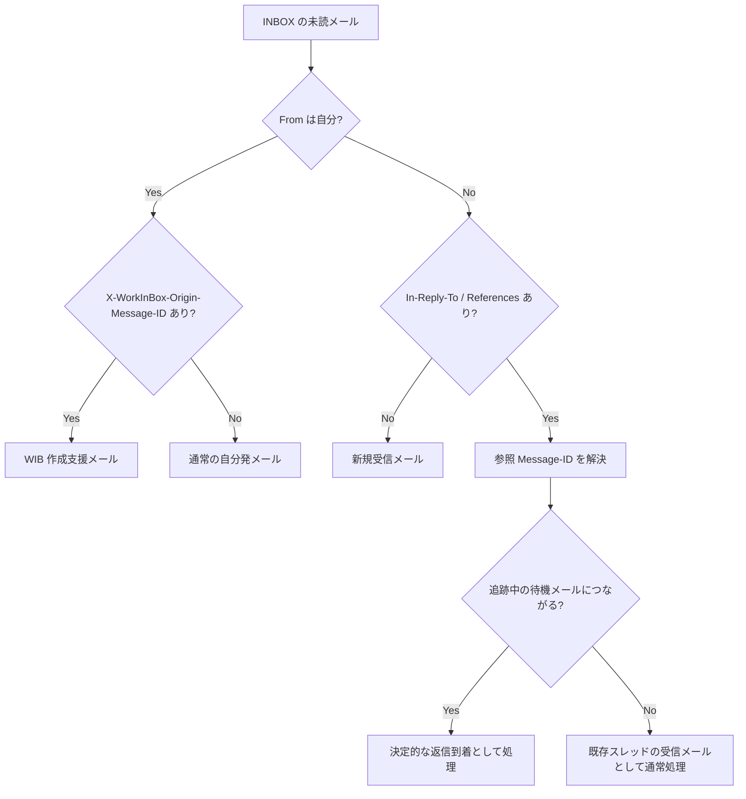
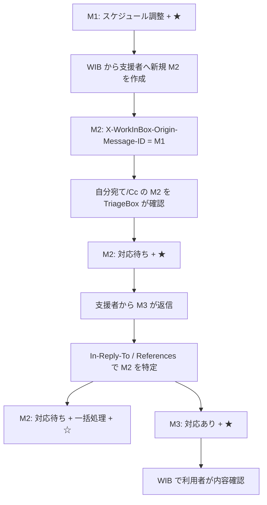

# TriageBox 判定フロー設計

## 目的

TriageBox は、INBOX の未読メールについて「誰が送ったか」と「どの過去メールに関連するか」を先に機械的に整理し、その結果を待機状態や決定的な状態遷移へ反映する。

本文や件名から関係を推測する前に、メールアドレスと Message-ID 系ヘッダを優先する。

正式な現行設計は `docs/design.md` を正本とし、この文書は TriageBox 実装の詳細を補足する。

---

## 前提

### 対象

TriageBox の対象は INBOX 内の未読メールとする。

自分が送信者のメールでも、自分宛てメールや自分を Cc に入れたメールなど、INBOX に到着するコピーは対象になる。

TriageBox はメールを既読にしない。

### 自分の判定

`From` が自分かどうかは、設定された代表アドレスと自己アドレス群を正規化して判定する。

表示名だけでは判定せず、メールアドレスを主とする。

### 関係判定に使うヘッダ

主に次を利用する。

- `Message-ID`
- `In-Reply-To`
- `References`
- `X-WorkInBox-Origin-Message-ID`

`In-Reply-To` / `References` は標準メールスレッド関係を表す。

`X-WorkInBox-Origin-Message-ID` は、専用ワークフローの起点メール M1 から通常 Reply ではない新規メール M2 を作成したとき、その起点を示す WorkInBox 拡張ヘッダである。

M2 は M1 とは別スレッドとして新規作成する。M1/M2 の WorkInBox 固有 relation は `X-WorkInBox-Origin-Message-ID` と SQLite に保存し、M2 に対する M3 以降の返信は標準 `In-Reply-To` / `References` と SQLite relation で追跡する。

---

## 基本判定軸

TriageBox は最初に `From` が自分かどうかで分岐する。



ヘッダの存在だけで最終タグを決めず、参照先 Message-ID と既存の WorkInBox 状態を確認する。

---

## 1. 送信者が自分の場合

### 1-1. `X-WorkInBox-Origin-Message-ID` がある

WIB を起点として作成した専用ワークフロー関連メール候補として扱う。

現行実装の代表例は、スケジュール調整支援で支援者へ送る依頼メールである。

M1 から支援者へ作る M2 は、M1 への Reply / Forward ではなく Thunderbird の新規メール作成として開始する。M2 の `X-WorkInBox-Origin-Message-ID` に M1 の Message-ID を入れ、自分宛て/Cc の M2 が INBOX に到着した時点で TriageBox が M1/M2 relation を確定する。

スケジュール調整の起点メール M1 と、自分宛て/Cc で INBOX に到着した支援依頼メール M2 の relation が確定した場合、M2 は次の状態になる。

```text
M2 = 対応待ち + ★
```

M1/M2 relation は SQLite に保存する。

`依頼済み` の付与タイミングと Thunderbird Extension / TriageBox の責務境界は Issue #11 で正式設計へ最終整合する。この relation 設計では付与責務を決め直さない。

### 1-2. `X-WorkInBox-Origin-Message-ID` がない

通常の Thunderbird 操作で送信された自分発メール、または自分宛て備忘メールとして扱う。

`From` が自分であることだけを理由に `返信待ち` を付けない。

---

## 2. 送信者が自分ではない場合

### 2-1. `In-Reply-To` / `References` がない

既存メールとの標準返信関係が確認できない新規受信メールとして扱う。

この場合に relation による決定的状態遷移は行わない。

### 2-2. `In-Reply-To` / `References` がある

直接の返信先を表す `In-Reply-To` を優先し、必要に応じて `References` を新しい側から確認する。

参照先が見つかった場合、そのメールの現在の WorkInBox 状態まで確認して処理を決める。

#### `対応待ち` メール M2 につながる場合

支援者への依頼 M2 に対する返信 M3 と決定できた場合、TriageBox が状態を確定する。

```text
M2: 対応待ち + ★
↓ 支援者返信 M3
M2: 対応待ち + 一括処理 + ☆
M3: 対応あり + ★
```

ここで重要なのは次の点である。

- M2 の `対応待ち` は、支援者へ依頼して待っていた履歴として残す。
- M2 へ `一括処理` を付け、スターを外す。
- M3 へ `対応あり` を付け、スターを付ける。
- M3 へ `スケジュール調整` を付けない。
- M3 は TriageBox が決定的状態を付けたメールなので、通常の AI 初期分類・再分類対象から除外する。
- M2/M3 は専用ワークフローに関連する支援者スレッドであり、起点メールの標準メールスレッド上の `current_focus_message_id` を移動させない。

`current_focus_message_id` 自体の永続化は Issue #12 の範囲とし、ここでは新しい状態テーブルを導入しない。

M1 は未完了の専用ワークフローの起点としてそのまま維持する。M3 が届いたことだけで M1 を `一括処理` にしたり、専用ワークフローを完了させたりしない。

#### `返信待ち` メールにつながる場合

通常の返信待ちへの返信処理は別の状態遷移であり、この詳細設計の対象外とする。

#### 参照先はあるが追跡中の待機メールではない場合

既存スレッド由来の受信メールとして扱う。

`In-Reply-To` / `References` の存在だけを理由に `対応待ち` 等の状態を変更しない。

### 2-3. 参照先 Message-ID が見つからない場合

関係を推測で確定しない。

既存スレッド由来の可能性がある受信メールとして通常処理へ残す。

---

## 3. `対応待ち` 返信時の `一括処理`

`対応待ち` への返信では、「待機タグを新着へ移す」のではなく、旧依頼メールに履歴を残したまま現在の注意だけを新着返信へ移す。

```text
M2
対応待ち + ★

      ↓ M3 到着

M2
対応待ち + 一括処理 + ☆

M3
対応あり + ★
```

`一括処理 + ☆` は、旧依頼メール自体を active な着眼対象から外したことを表す。

`対応待ち` が残っていても、スターが無いため active メールではない。

---

## 4. TrackingBox との境界

TriageBox が relation から `対応あり` を確定した M3 は、通常の意味分類へ送らない。

理由は、M3 が通常ワークフローの新規着眼メールではなく、既存の専用ワークフローで支援者から回答が到着したという決定的状態だからである。

TrackingBox の通常 AI 判定除外には少なくとも次を含める。

- `返信待ち`
- `対応待ち`
- `対応あり`

利用者は M3 を WIB の専用ワークフロー上で確認し、その内容に応じて次の操作を決める。

---

## 5. スケジュール調整支援との接続

この文書では次の記号を使う。

- M1 = スケジュール調整専用ワークフローの起点メール
- M2 = WIB を起点として支援者へ作成した、M1 とは別スレッドの新規依頼メール
- M3 = M2 に対する支援者返信



M2/M3 は M1 の専用ワークフローに関連する別スレッドであり、M3 到着によって M1 の標準メールスレッド上の着眼点は移動しない。

---

## 6. relation の永続化

支援依頼 M2 を確認した時点で、少なくとも M2 と M1 の relation を保存する。

M3 を確認した時点では、M3 が M2 への返信であることと、同じ M1 に関連することを保存する。

現在の relation kind:

```text
schedule_support_request
schedule_support_request_replied
schedule_support_reply
```

M2 が `schedule_support_request_replied` に更新された後は、同じ未読メールを再走査しても M2 を新しい `対応待ち` として再活性化しない。

---

## 7. 実装上の原則

- M2 は M1 への Reply / Forward ではなく新規 compose で作成する。
- M1/M2 の専用 relation は `X-WorkInBox-Origin-Message-ID` と SQLite で保持する。
- M2→M3 は標準 `In-Reply-To` / `References` を優先し、SQLite relation で専用ワークフローの起点 M1 へ結び直す。
- 関係判定は件名一致より Message-ID を優先する。
- `In-Reply-To` を直接返信先として優先し、`References` は新しい側から補助的に確認する。
- From 自己判定は設定済みアドレスを正規化して行う。
- ヘッダから関係を確定できない場合は推測で待機状態を変更しない。
- `対応待ち` への支援者返信では M2 の `対応待ち` を履歴として残す。
- M2 へ `一括処理` を付け、スターを外す。
- M3 へ `対応あり` とスターを付ける。
- M3 へ `スケジュール調整` や通常ワークフロータグを TriageBox から付けない。
- `対応あり` は通常 AI 判定から除外する。
- M2/M3 の支援者スレッドは専用ワークフローの `current_focus_message_id` を移動させない。

---

## 今後の別 Issue

- `依頼済み` の付与責務: Issue #11
- `current_focus_message_id` の永続化: Issue #12
- 通常の `返信待ち` への返信遷移の追加整理
